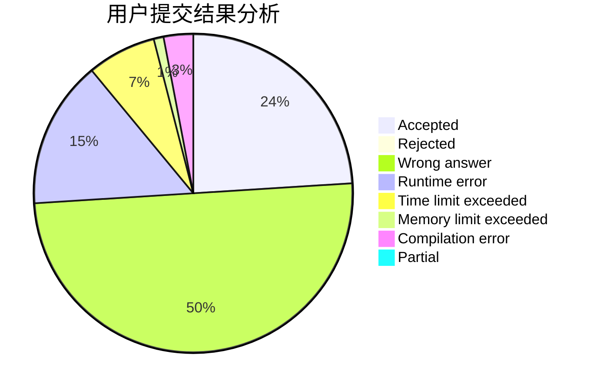
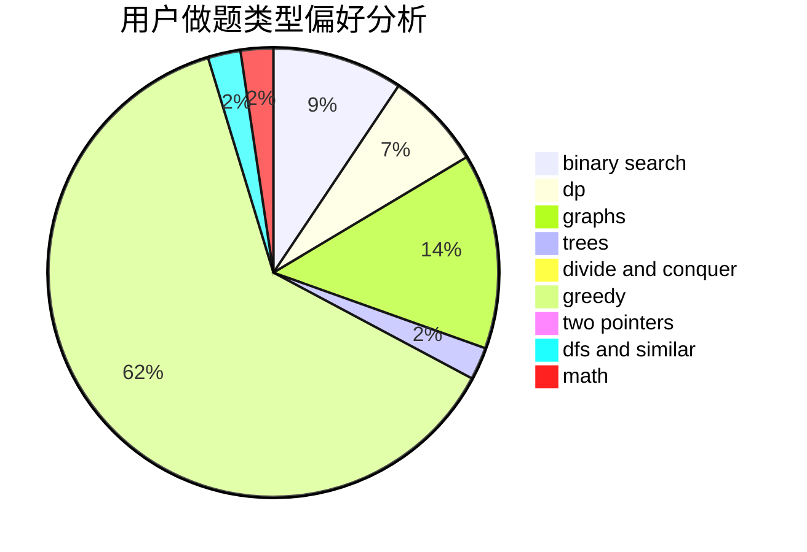

# bottomcoder

<!-- tabs:start -->

#### **用户提交结果分析**

#### **用户做题类型偏好分析**

<!-- tabs:end -->
# 推荐题目
[584C](https://codeforces.com/contest/584/problem/C)
[478B](https://codeforces.com/contest/478/problem/B)
[1223F](https://codeforces.com/contest/1223/problem/F)
[1345E](https://codeforces.com/contest/1345/problem/E)
[1172A](https://codeforces.com/contest/1172/problem/A)
[871E](https://codeforces.com/contest/871/problem/E)
[1201D](https://codeforces.com/contest/1201/problem/D)
[1181A](https://codeforces.com/contest/1181/problem/A)
[946F](https://codeforces.com/contest/946/problem/F)
[25C](https://codeforces.com/contest/25/problem/C)
