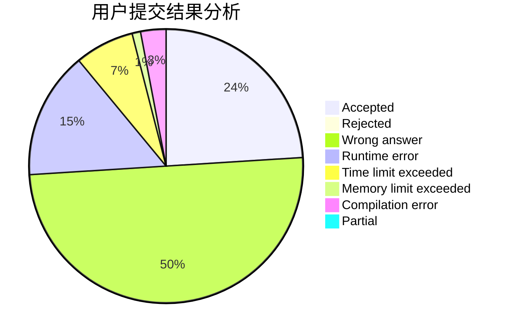
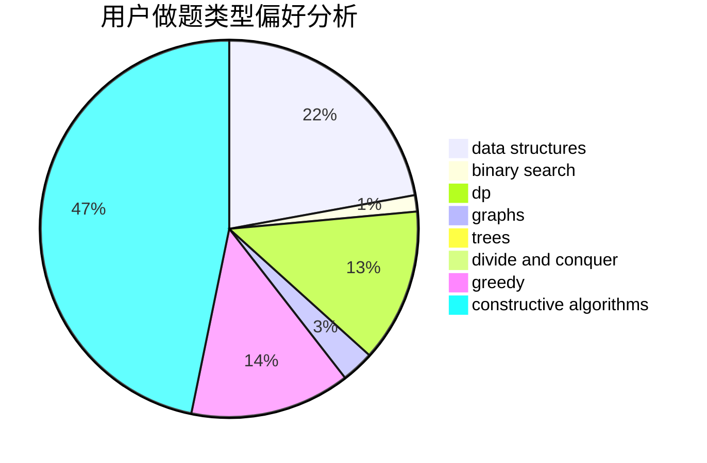
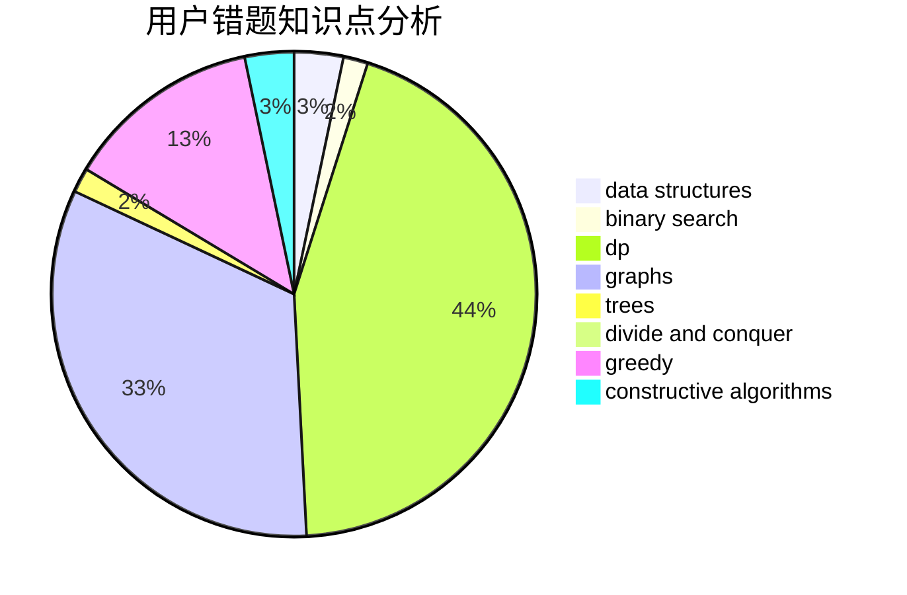

# bottomcoder

<!-- tabs:start -->

#### **用户提交结果分析**

#### **用户做题类型偏好分析**

#### **用户错题知识点分析**

<!-- tabs:end -->
# 推荐题目
[560A](https://codeforces.com/contest/560/problem/A)		implementation,
                        sortings		  
[459C](https://codeforces.com/contest/459/problem/C)		combinatorics,
                        constructive algorithms,
                        math		  
[1217B](https://codeforces.com/contest/1217/problem/B)		greedy,
                        math		  
[1338D](https://codeforces.com/contest/1338/problem/D)		constructive algorithms,
                        dfs and similar,
                        dp,
                        math,
                        trees		  
[1167D](https://codeforces.com/contest/1167/problem/D)		constructive algorithms,
                        greedy		  
[853C](https://codeforces.com/contest/853/problem/C)		data structures		  
[1198B](https://codeforces.com/contest/1198/problem/B)		binary search,
                        brute force,
                        data structures,
                        sortings		  
[1178F1](https://codeforces.com/contest/1178F/problem/1)		combinatorics,
                        dfs and similar,
                        dp		  
[923A](https://codeforces.com/contest/923/problem/A)		math,
                        number theory		  
[237C](https://codeforces.com/contest/237/problem/C)		binary search,
                        number theory,
                        two pointers		  
