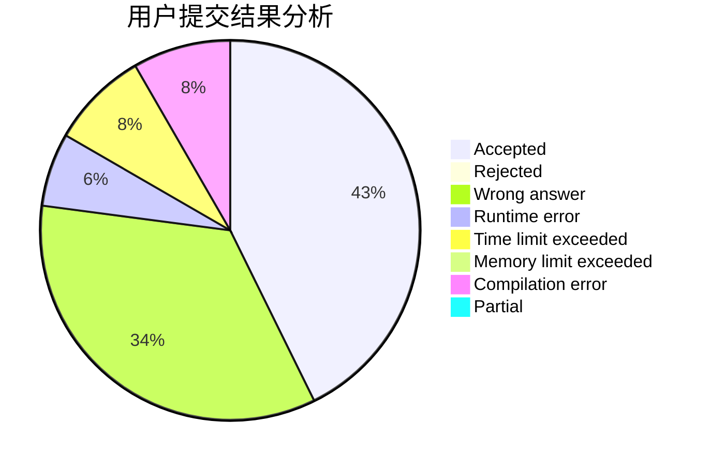
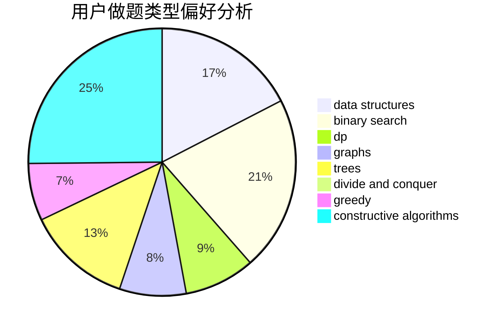

# bp_ZHD_qd
<!-- tabs:start -->
#### **用户提交结果分析**

#### **用户做题类型偏好分析**

#### **用户错题知识点分析**

<!-- tabs:end -->
# 推荐题目
[Omkar and Last Class of Math](http://codeforces.com/problemset/problem/1372/B)		greedy,
                        math,
                        number theory		  
[Jamie and Alarm Snooze](http://codeforces.com/problemset/problem/916/A)		brute force,
                        implementation,
                        math		  
[The Queue](http://codeforces.com/problemset/problem/767/B)		brute force,
                        greedy		  
[Moon Craters](http://codeforces.com/problemset/problem/39/C)		dp,
                        sortings		  
[Information Reform](http://codeforces.com/problemset/problem/70/E)		dp,
                        implementation,
                        trees		  
[Company Income Growth](http://codeforces.com/problemset/problem/39/B)		greedy		  
[Beauty Pageant](http://codeforces.com/problemset/problem/246/C)		brute force,
                        constructive algorithms,
                        greedy		  
[Memory and Casinos](http://codeforces.com/problemset/problem/712/E)		data structures,
                        math,
                        probabilities		  
[Toy Army](http://codeforces.com/problemset/problem/84/A)		math,
                        number theory		  
[Stairs and Elevators](https://codeforces.com/contest/966/problem/A)		binary search		  
<!-- tabs:start -->
#### **data structures**
[Omkar and Last Class of Math](http://codeforces.com/problemset/problem/712/E)		data structures,
                        math,
                        probabilities		  
[Jamie and Alarm Snooze](http://codeforces.com/problemset/problem/1252/C)		data structures,
                        implementation		  
[The Queue](http://codeforces.com/problemset/problem/1492/C)		binary search,
                        data structures,
                        dp,
                        greedy,
                        two pointers		  
[Moon Craters](http://codeforces.com/problemset/problem/1490/G)		binary search,
                        data structures,
                        math		  
[Information Reform](http://codeforces.com/problemset/problem/1479/D)		binary search,
                        bitmasks,
                        brute force,
                        data structures,
                        probabilities,
                        trees		  
[Company Income Growth](http://codeforces.com/problemset/problem/1497/A)		brute force,
                        data structures,
                        greedy,
                        sortings		  
[Beauty Pageant](http://codeforces.com/problemset/problem/1491/C)		brute force,
                        data structures,
                        dp,
                        greedy,
                        implementation		  
[Memory and Casinos](http://codeforces.com/problemset/problem/1492/B)		data structures,
                        greedy,
                        math		  
[Toy Army](http://codeforces.com/problemset/problem/1436/E)		binary search,
                        data structures,
                        two pointers		  
[Stairs and Elevators](http://codeforces.com/problemset/problem/1461/D)		binary search,
                        brute force,
                        data structures,
                        divide and conquer,
                        implementation,
                        sortings		  
#### **binary search**
[Omkar and Last Class of Math](https://codeforces.com/contest/966/problem/A)		binary search		  
[Jamie and Alarm Snooze](http://codeforces.com/problemset/problem/762/C)		binary search,
                        hashing,
                        strings,
                        two pointers		  
[The Queue](http://codeforces.com/problemset/problem/939/E)		binary search,
                        greedy,
                        ternary search,
                        two pointers		  
[Moon Craters](http://codeforces.com/problemset/problem/1492/C)		binary search,
                        data structures,
                        dp,
                        greedy,
                        two pointers		  
[Information Reform](http://codeforces.com/problemset/problem/1463/D)		binary search,
                        constructive algorithms,
                        greedy,
                        two pointers		  
[Company Income Growth](http://codeforces.com/problemset/problem/1490/G)		binary search,
                        data structures,
                        math		  
[Beauty Pageant](http://codeforces.com/problemset/problem/1479/D)		binary search,
                        bitmasks,
                        brute force,
                        data structures,
                        probabilities,
                        trees		  
[Memory and Casinos](http://codeforces.com/problemset/problem/1436/E)		binary search,
                        data structures,
                        two pointers		  
[Toy Army](http://codeforces.com/problemset/problem/1461/D)		binary search,
                        brute force,
                        data structures,
                        divide and conquer,
                        implementation,
                        sortings		  
[Stairs and Elevators](http://codeforces.com/problemset/problem/1493/C)		binary search,
                        brute force,
                        constructive algorithms,
                        greedy,
                        strings		  
#### **dp**
[Omkar and Last Class of Math](http://codeforces.com/problemset/problem/39/C)		dp,
                        sortings		  
[Jamie and Alarm Snooze](http://codeforces.com/problemset/problem/70/E)		dp,
                        implementation,
                        trees		  
[The Queue](https://codeforces.com/contest/1058/problem/E)		bitmasks,
                        dp		  
[Moon Craters](https://codeforces.com/contest/1074/problem/C)		dp,
                        geometry		  
[Information Reform](http://codeforces.com/problemset/problem/1292/F)		bitmasks,
                        combinatorics,
                        dp		  
[Company Income Growth](http://codeforces.com/problemset/problem/938/F)		bitmasks,
                        dp,
                        greedy		  
[Beauty Pageant](http://codeforces.com/problemset/problem/1005/D)		dp,
                        greedy,
                        number theory		  
[Memory and Casinos](http://codeforces.com/problemset/problem/512/D)		dp,
                        trees		  
[Toy Army](http://codeforces.com/problemset/problem/1492/C)		binary search,
                        data structures,
                        dp,
                        greedy,
                        two pointers		  
[Stairs and Elevators](https://codeforces.com/contest/1457/problem/C)		brute force,
                        dp,
                        implementation		  
#### **graph**
[Omkar and Last Class of Math](http://codeforces.com/problemset/problem/466/E)		dfs and similar,
                        dsu,
                        graphs,
                        trees		  
[Jamie and Alarm Snooze](http://codeforces.com/problemset/problem/34/D)		dfs and similar,
                        graphs		  
[The Queue](http://codeforces.com/problemset/problem/1250/N)		dfs and similar,
                        graphs,
                        greedy		  
[Moon Craters](http://codeforces.com/problemset/problem/1242/E)		constructive algorithms,
                        graphs		  
[Information Reform](http://codeforces.com/problemset/problem/1284/G)		graphs		  
[Company Income Growth](http://codeforces.com/problemset/problem/744/A)		dfs and similar,
                        graphs		  
[Beauty Pageant](http://codeforces.com/problemset/problem/1487/C)		brute force,
                        constructive algorithms,
                        dfs and similar,
                        graphs,
                        greedy,
                        implementation,
                        math		  
[Memory and Casinos](http://codeforces.com/problemset/problem/1437/C)		dp,
                        flows,
                        graph matchings,
                        greedy,
                        math,
                        sortings		  
[Toy Army](http://codeforces.com/problemset/problem/1470/D)		constructive algorithms,
                        dfs and similar,
                        graph matchings,
                        graphs,
                        greedy		  
[Stairs and Elevators](http://codeforces.com/problemset/problem/1476/C)		dp,
                        graphs,
                        greedy		  
#### **trees**
[Omkar and Last Class of Math](http://codeforces.com/problemset/problem/70/E)		dp,
                        implementation,
                        trees		  
[Jamie and Alarm Snooze](http://codeforces.com/problemset/problem/466/E)		dfs and similar,
                        dsu,
                        graphs,
                        trees		  
[The Queue](http://codeforces.com/problemset/problem/512/D)		dp,
                        trees		  
[Moon Craters](http://codeforces.com/problemset/problem/1479/D)		binary search,
                        bitmasks,
                        brute force,
                        data structures,
                        probabilities,
                        trees		  
[Information Reform](http://codeforces.com/problemset/problem/1511/C)		brute force,
                        data structures,
                        implementation,
                        trees		  
[Company Income Growth](http://codeforces.com/problemset/problem/1499/F)		combinatorics,
                        dfs and similar,
                        dp,
                        trees		  
[Beauty Pageant](http://codeforces.com/problemset/problem/1491/E)		brute force,
                        dfs and similar,
                        divide and conquer,
                        number theory,
                        trees		  
[Memory and Casinos](http://codeforces.com/problemset/problem/1466/D)		data structures,
                        greedy,
                        sortings,
                        trees		  
[Toy Army](http://codeforces.com/problemset/problem/1495/D)		combinatorics,
                        dfs and similar,
                        graphs,
                        math,
                        shortest paths,
                        trees		  
[Stairs and Elevators](http://codeforces.com/problemset/problem/1303/G)		data structures,
                        divide and conquer,
                        geometry,
                        trees		  
#### **divide and conquer**
[Omkar and Last Class of Math](http://codeforces.com/problemset/problem/364/E)		divide and conquer,
                        two pointers		  
[Jamie and Alarm Snooze](http://codeforces.com/problemset/problem/1461/D)		binary search,
                        brute force,
                        data structures,
                        divide and conquer,
                        implementation,
                        sortings		  
[The Queue](http://codeforces.com/problemset/problem/1466/G)		combinatorics,
                        divide and conquer,
                        hashing,
                        math,
                        string suffix structures,
                        strings		  
[Moon Craters](http://codeforces.com/problemset/problem/1490/D)		dfs and similar,
                        divide and conquer,
                        implementation		  
[Information Reform](https://codeforces.com/contest/1483/problem/C)		data structures,
                        divide and conquer,
                        dp		  
[Company Income Growth](http://codeforces.com/problemset/problem/1491/E)		brute force,
                        dfs and similar,
                        divide and conquer,
                        number theory,
                        trees		  
[Beauty Pageant](http://codeforces.com/problemset/problem/1303/G)		data structures,
                        divide and conquer,
                        geometry,
                        trees		  
[Memory and Casinos](http://codeforces.com/problemset/problem/1494/D)		constructive algorithms,
                        data structures,
                        dfs and similar,
                        divide and conquer,
                        dsu,
                        greedy,
                        sortings,
                        trees		  
[Toy Army](http://codeforces.com/problemset/problem/1482/E)		data structures,
                        divide and conquer,
                        dp		  
[Stairs and Elevators](http://codeforces.com/problemset/problem/566/C)		dfs and similar,
                        divide and conquer,
                        trees		  
#### **greedy**
[Omkar and Last Class of Math](http://codeforces.com/problemset/problem/1372/B)		greedy,
                        math,
                        number theory		  
[Jamie and Alarm Snooze](http://codeforces.com/problemset/problem/767/B)		brute force,
                        greedy		  
[The Queue](http://codeforces.com/problemset/problem/39/B)		greedy		  
[Moon Craters](http://codeforces.com/problemset/problem/246/C)		brute force,
                        constructive algorithms,
                        greedy		  
[Information Reform](http://codeforces.com/problemset/problem/231/B)		constructive algorithms,
                        greedy		  
[Company Income Growth](http://codeforces.com/problemset/problem/734/B)		brute force,
                        greedy,
                        implementation,
                        math		  
[Beauty Pageant](http://codeforces.com/problemset/problem/1250/N)		dfs and similar,
                        graphs,
                        greedy		  
[Memory and Casinos](https://codeforces.com/contest/1435/problem/E)		greedy,
                        math,
                        ternary search		  
[Toy Army](http://codeforces.com/problemset/problem/939/E)		binary search,
                        greedy,
                        ternary search,
                        two pointers		  
[Stairs and Elevators](http://codeforces.com/problemset/problem/574/A)		greedy,
                        implementation		  
#### **constructive algorithms**
[Omkar and Last Class of Math](http://codeforces.com/problemset/problem/246/C)		brute force,
                        constructive algorithms,
                        greedy		  
[Jamie and Alarm Snooze](http://codeforces.com/problemset/problem/509/D)		constructive algorithms,
                        math		  
[The Queue](http://codeforces.com/problemset/problem/231/B)		constructive algorithms,
                        greedy		  
[Moon Craters](http://codeforces.com/problemset/problem/894/B)		combinatorics,
                        constructive algorithms,
                        math,
                        number theory		  
[Information Reform](http://codeforces.com/problemset/problem/347/A)		constructive algorithms,
                        implementation,
                        sortings		  
[Company Income Growth](http://codeforces.com/problemset/problem/1242/E)		constructive algorithms,
                        graphs		  
[Beauty Pageant](http://codeforces.com/problemset/problem/1325/A)		constructive algorithms,
                        greedy,
                        number theory		  
[Memory and Casinos](https://codeforces.com/contest/1330/problem/C)		constructive algorithms,
                        greedy,
                        implementation,
                        math		  
[Toy Army](http://codeforces.com/problemset/problem/1493/A)		constructive algorithms,
                        greedy		  
[Stairs and Elevators](http://codeforces.com/problemset/problem/1463/D)		binary search,
                        constructive algorithms,
                        greedy,
                        two pointers		  
#### **sortings**
[Omkar and Last Class of Math](http://codeforces.com/problemset/problem/39/C)		dp,
                        sortings		  
[Jamie and Alarm Snooze](http://codeforces.com/problemset/problem/53/D)		sortings		  
[The Queue](http://codeforces.com/problemset/problem/347/A)		constructive algorithms,
                        implementation,
                        sortings		  
[Moon Craters](https://codeforces.com/contest/1496/problem/C)		geometry,
                        greedy,
                        math,
                        sortings		  
[Information Reform](http://codeforces.com/problemset/problem/1495/A)		geometry,
                        greedy,
                        math,
                        sortings		  
[Company Income Growth](http://codeforces.com/problemset/problem/1497/A)		brute force,
                        data structures,
                        greedy,
                        sortings		  
[Beauty Pageant](http://codeforces.com/problemset/problem/1427/A)		math,
                        sortings		  
[Memory and Casinos](http://codeforces.com/problemset/problem/1461/D)		binary search,
                        brute force,
                        data structures,
                        divide and conquer,
                        implementation,
                        sortings		  
[Toy Army](http://codeforces.com/problemset/problem/1437/C)		dp,
                        flows,
                        graph matchings,
                        greedy,
                        math,
                        sortings		  
[Stairs and Elevators](http://codeforces.com/problemset/problem/1473/A)		greedy,
                        implementation,
                        math,
                        sortings		  
<!-- tabs:end -->
