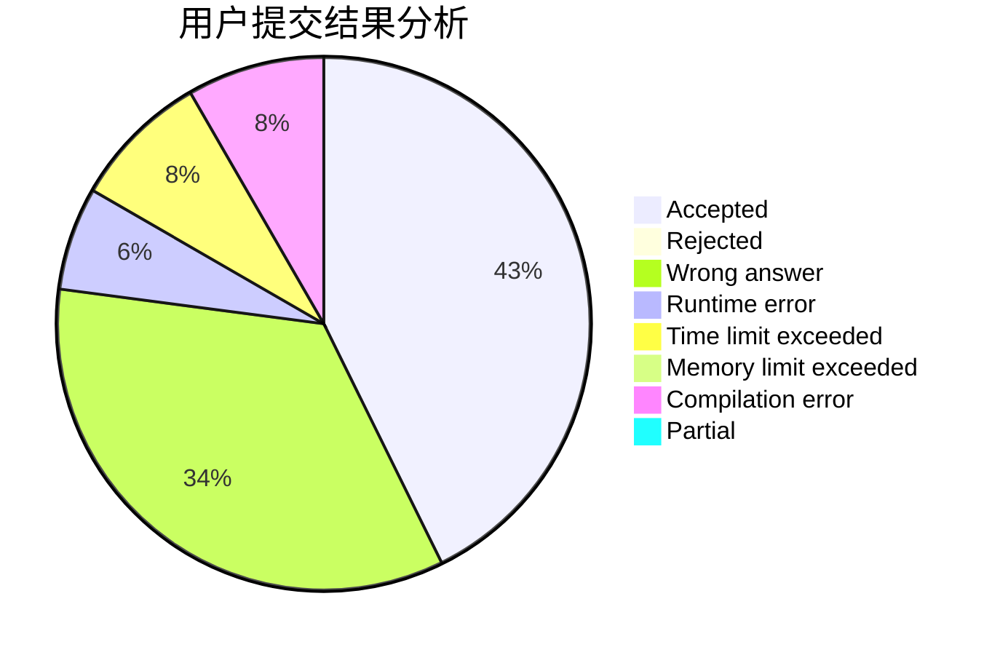
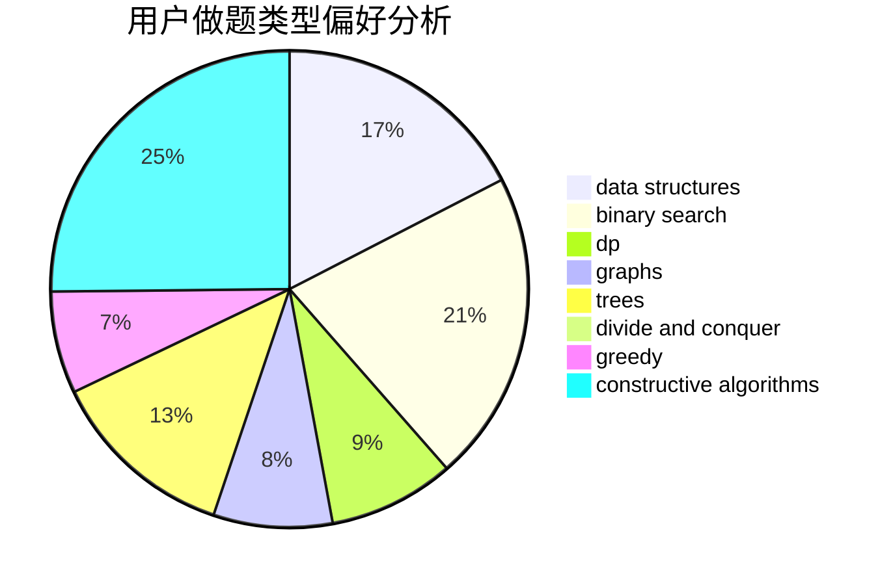

# bp_ZHD_qd

<!-- tabs:start -->

#### **用户提交结果分析**

#### **用户做题类型偏好分析**

#### **用户错题知识点分析**

<!-- tabs:end -->
# 推荐题目
[767B](https://codeforces.com/contest/767/problem/B)		brute force,
                        greedy		  
[916A](https://codeforces.com/contest/916/problem/A)		brute force,
                        implementation,
                        math		  
[39C](https://codeforces.com/contest/39/problem/C)		dp,
                        sortings		  
[70E](https://codeforces.com/contest/70/problem/E)		dp,
                        implementation,
                        trees		  
[1372B](https://codeforces.com/contest/1372/problem/B)		greedy,
                        math,
                        number theory		  
[231B](https://codeforces.com/contest/231/problem/B)		constructive algorithms,
                        greedy		  
[246C](https://codeforces.com/contest/246/problem/C)		brute force,
                        constructive algorithms,
                        greedy		  
[966A](https://codeforces.com/contest/966/problem/A)		dsu,graphs,sortings,trees		  
[1292F](https://codeforces.com/contest/1292/problem/F)		bitmasks,
                        combinatorics,
                        dp		  
[712E](https://codeforces.com/contest/712/problem/E)		data structures,
                        math,
                        probabilities		  
