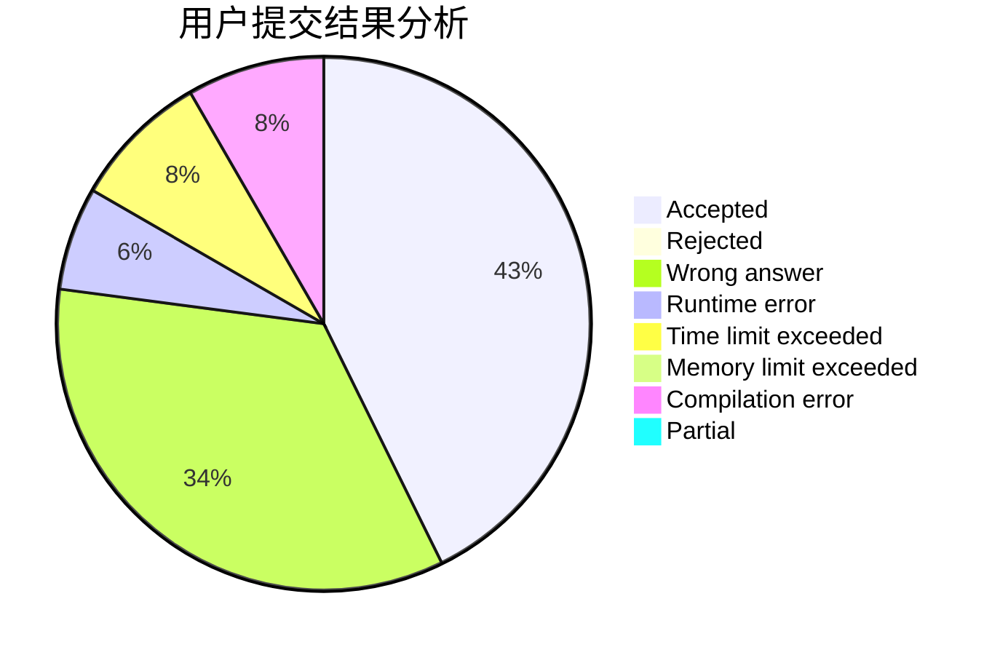
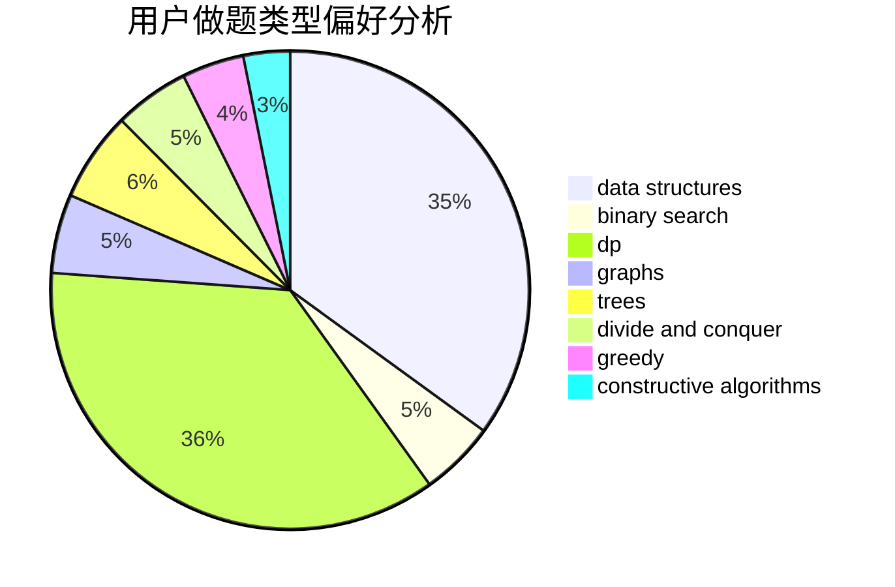

# bp_ZHD_qd

<!-- tabs:start -->

#### **用户提交结果分析**

#### **用户做题类型偏好分析**

#### **用户错题知识点分析**

<!-- tabs:end -->
# 推荐题目
[786D](https://codeforces.com/contest/786/problem/D)		data structures,
                        dfs and similar,
                        hashing,
                        strings,
                        trees		  
[936A](https://codeforces.com/contest/936/problem/A)		binary search,
                        implementation,
                        math		  
[425E](https://codeforces.com/contest/425/problem/E)		dp		  
[730C](https://codeforces.com/contest/730/problem/C)		binary search,
                        dfs and similar		  
[1380G](https://codeforces.com/contest/1380/problem/G)		greedy,
                        math,
                        probabilities		  
[252A](https://codeforces.com/contest/252/problem/A)		brute force,
                        implementation		  
[266E](https://codeforces.com/contest/266/problem/E)		data structures,
                        math		  
[987F](https://codeforces.com/contest/987/problem/F)		dsu,graphs,sortings,trees		  
[12A](https://codeforces.com/contest/12/problem/A)		implementation		  
[732A](https://codeforces.com/contest/732/problem/A)		brute force,
                        constructive algorithms,
                        implementation,
                        math		  
