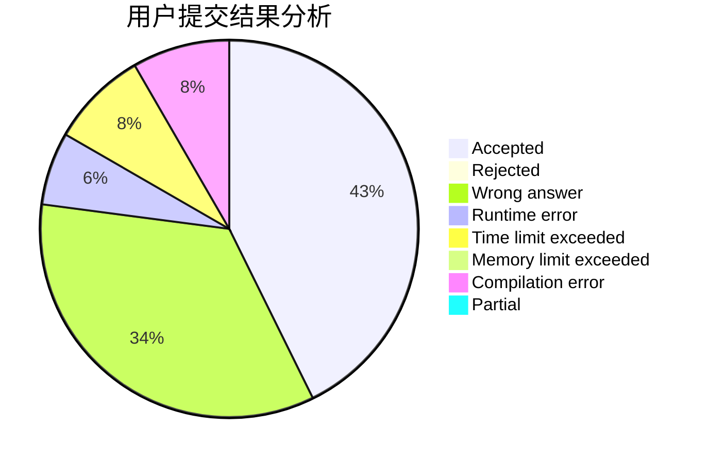
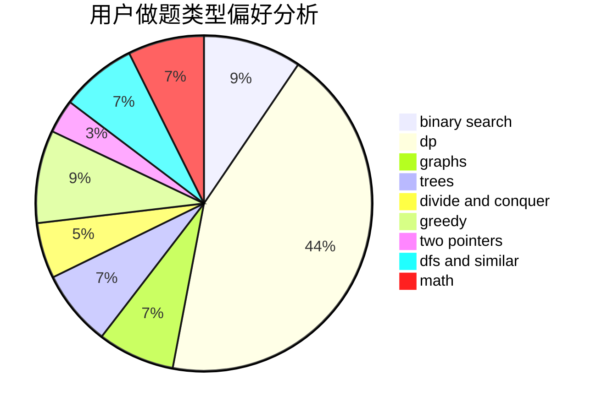

# bp_ZHD_qd

<!-- tabs:start -->

#### **用户提交结果分析**

#### **用户做题类型偏好分析**

<!-- tabs:end -->
# 推荐题目
[786D](https://codeforces.com/contest/786/problem/D)
[936A](https://codeforces.com/contest/936/problem/A)
[425E](https://codeforces.com/contest/425/problem/E)
[730C](https://codeforces.com/contest/730/problem/C)
[1380G](https://codeforces.com/contest/1380/problem/G)
[252A](https://codeforces.com/contest/252/problem/A)
[266E](https://codeforces.com/contest/266/problem/E)
[987F](https://codeforces.com/contest/987/problem/F)
[12A](https://codeforces.com/contest/12/problem/A)
[732A](https://codeforces.com/contest/732/problem/A)
