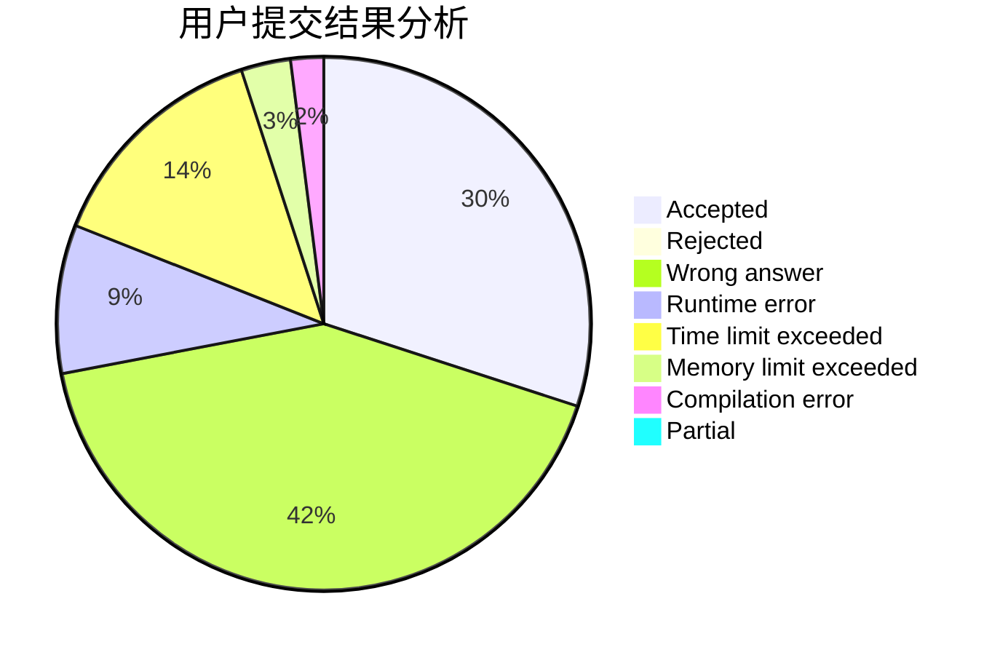
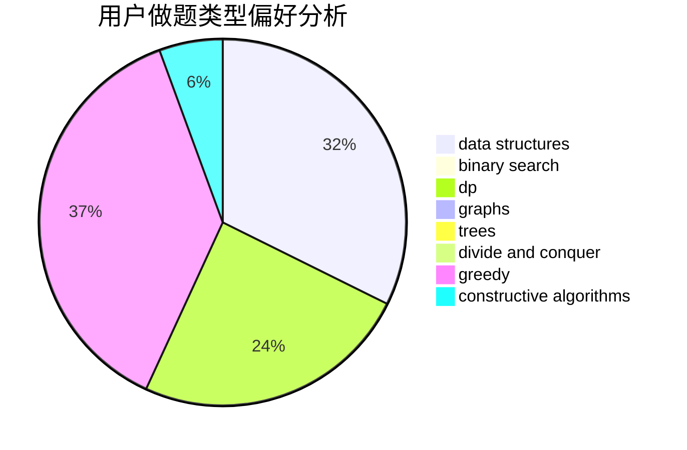
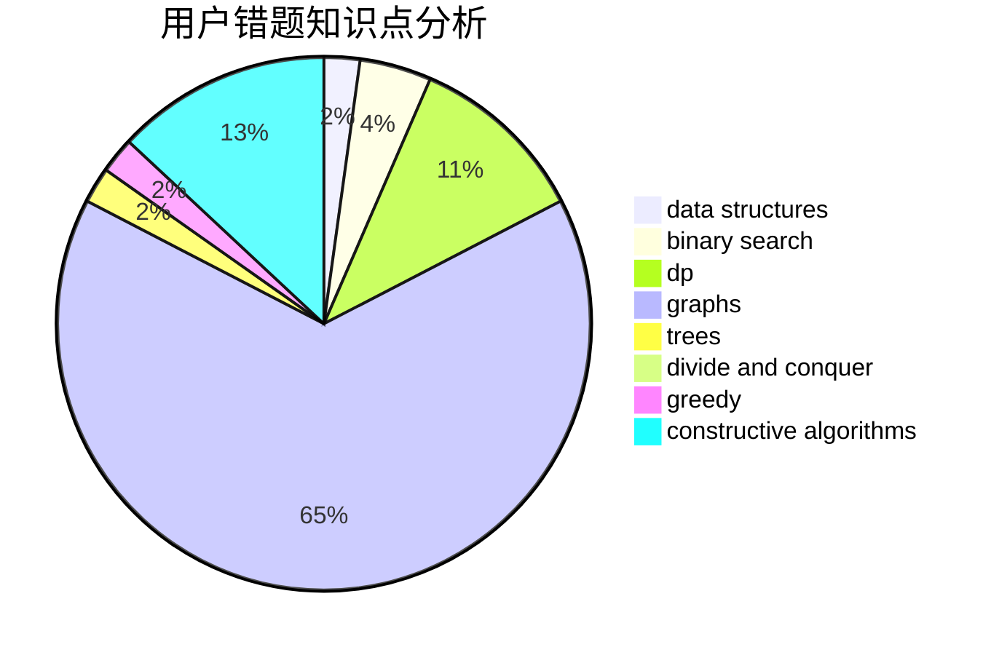

# bqq

<!-- tabs:start -->

#### **用户提交结果分析**

#### **用户做题类型偏好分析**

#### **用户错题知识点分析**

<!-- tabs:end -->
# 推荐题目
[1408B](https://codeforces.com/contest/1408/problem/B)		constructive algorithms,
                        greedy,
                        math		  
[865D](https://codeforces.com/contest/865/problem/D)		constructive algorithms,
                        data structures,
                        greedy		  
[1391B](https://codeforces.com/contest/1391/problem/B)		brute force,
                        greedy,
                        implementation		  
[1291A](https://codeforces.com/contest/1291/problem/A)		greedy,
                        math,
                        strings		  
[13E](https://codeforces.com/contest/13/problem/E)		data structures,
                        dsu		  
[557B](https://codeforces.com/contest/557/problem/B)		constructive algorithms,
                        implementation,
                        math,
                        sortings		  
[681A](https://codeforces.com/contest/681/problem/A)		implementation		  
[717I](https://codeforces.com/contest/717/problem/I)		geometry		  
[802D](https://codeforces.com/contest/802/problem/D)		math		  
[510E](https://codeforces.com/contest/510/problem/E)		flows		  
