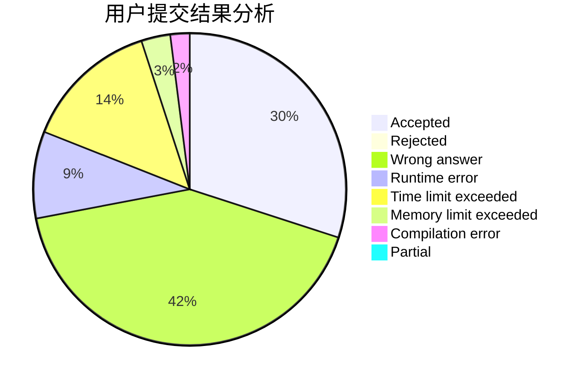
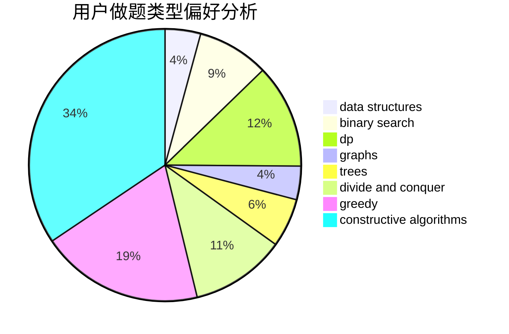
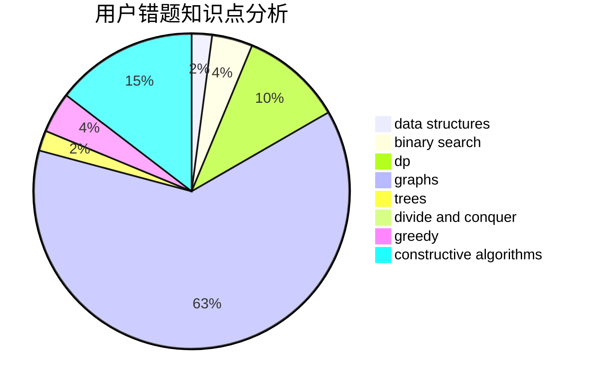

# bqq

<!-- tabs:start -->

#### **用户提交结果分析**

#### **用户做题类型偏好分析**

#### **用户错题知识点分析**

<!-- tabs:end -->
# 推荐题目
[1399A](https://codeforces.com/contest/1399/problem/A)		greedy,
                        sortings		  
[847E](https://codeforces.com/contest/847/problem/E)		binary search,
                        dp		  
[1381A1](https://codeforces.com/contest/1381A/problem/1)		constructive algorithms,
                        data structures,
                        strings		  
[1284A](https://codeforces.com/contest/1284/problem/A)		implementation,
                        strings		  
[1392C](https://codeforces.com/contest/1392/problem/C)		greedy,
                        implementation		  
[534F](https://codeforces.com/contest/534/problem/F)		bitmasks,
                        dp,
                        hashing,
                        meet-in-the-middle		  
[660C](https://codeforces.com/contest/660/problem/C)		binary search,
                        dp,
                        two pointers		  
[6E](https://codeforces.com/contest/6/problem/E)		binary search,
                        data structures,
                        dsu,
                        trees,
                        two pointers		  
[785A](https://codeforces.com/contest/785/problem/A)		implementation,
                        strings		  
[490F](https://codeforces.com/contest/490/problem/F)		data structures,
                        dfs and similar,
                        dp,
                        trees		  
