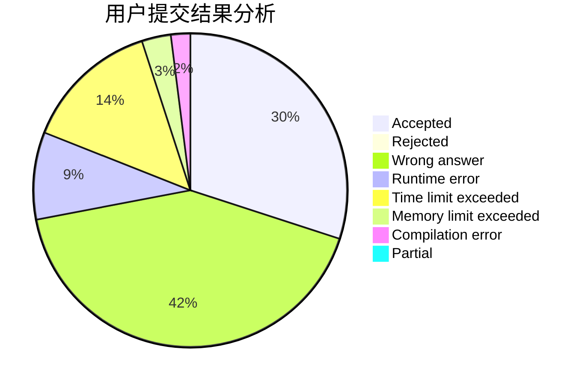
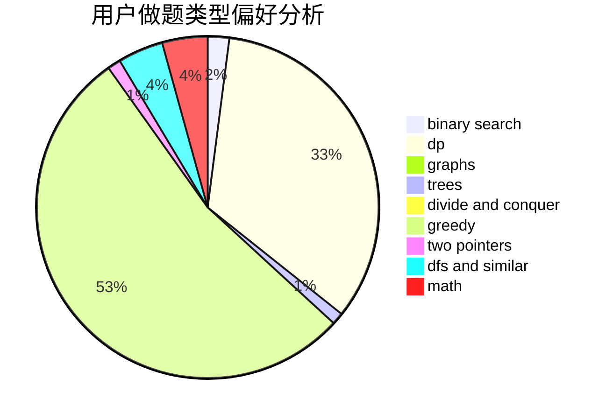

# bqq

<!-- tabs:start -->

#### **用户提交结果分析**

#### **用户做题类型偏好分析**

<!-- tabs:end -->
# 推荐题目
[1408B](https://codeforces.com/contest/1408/problem/B)
[865D](https://codeforces.com/contest/865/problem/D)
[1391B](https://codeforces.com/contest/1391/problem/B)
[1291A](https://codeforces.com/contest/1291/problem/A)
[13E](https://codeforces.com/contest/13/problem/E)
[557B](https://codeforces.com/contest/557/problem/B)
[681A](https://codeforces.com/contest/681/problem/A)
[717I](https://codeforces.com/contest/717/problem/I)
[802D](https://codeforces.com/contest/802/problem/D)
[510E](https://codeforces.com/contest/510/problem/E)
