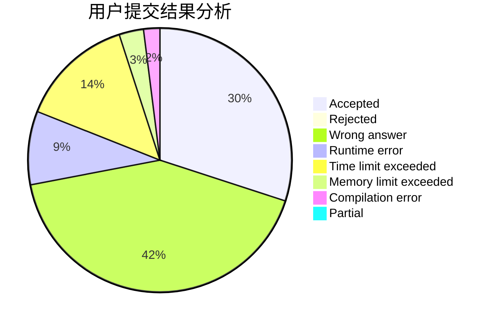
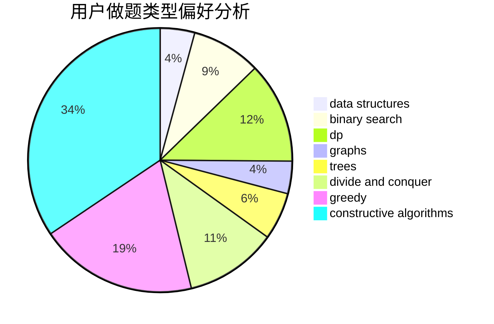
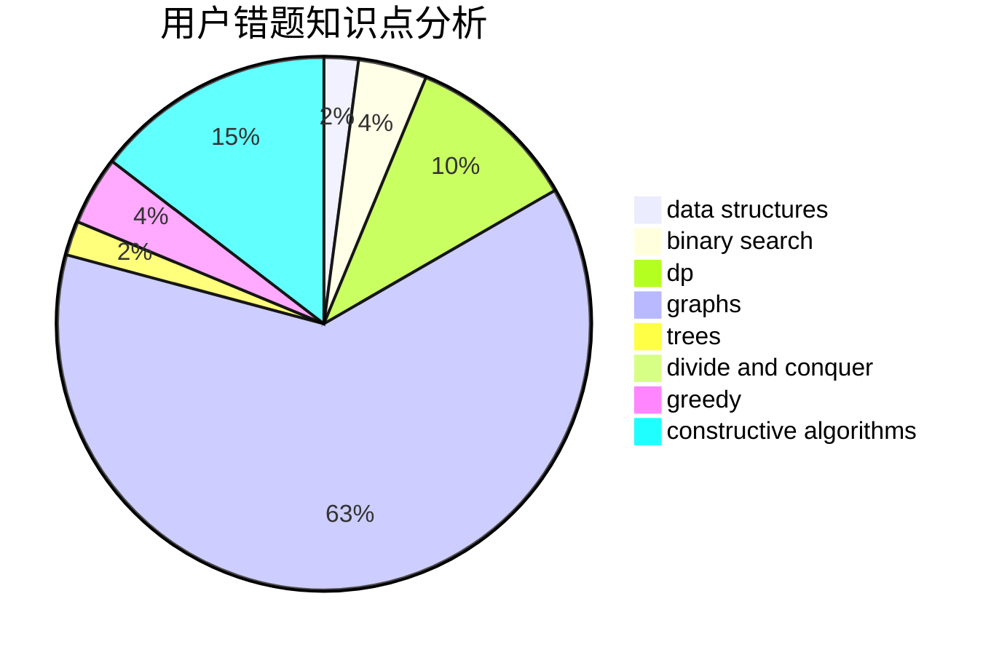

# bqq
<!-- tabs:start -->
#### **用户提交结果分析**

#### **用户做题类型偏好分析**

#### **用户错题知识点分析**

<!-- tabs:end -->
# 推荐题目
[Prefix Flip (Easy Version)](http://codeforces.com/problemset/problem/1381/A1)		constructive algorithms,
                        data structures,
                        strings		  
[Packmen](http://codeforces.com/problemset/problem/847/E)		binary search,
                        dp		  
[Exposition](http://codeforces.com/problemset/problem/6/E)		binary search,
                        data structures,
                        dsu,
                        trees,
                        two pointers		  
[The Values You Can Make](http://codeforces.com/problemset/problem/687/C)		dp		  
[Array](http://codeforces.com/problemset/problem/300/A)		brute force,
                        constructive algorithms,
                        implementation		  
[Hard Process](http://codeforces.com/problemset/problem/660/C)		binary search,
                        dp,
                        two pointers		  
[Double Matrix](http://codeforces.com/problemset/problem/1162/B)		brute force,
                        greedy		  
[Minimal Labels](http://codeforces.com/problemset/problem/825/E)		data structures,
                        dfs and similar,
                        graphs,
                        greedy		  
[Build From Suffixes](http://codeforces.com/problemset/problem/1488/H)		*special problem,
                        combinatorics,
                        data structures		  
[Important Exam](http://codeforces.com/problemset/problem/1201/A)		implementation,
                        strings		  
<!-- tabs:start -->
#### **data structures**
[Prefix Flip (Easy Version)](http://codeforces.com/problemset/problem/1381/A1)		constructive algorithms,
                        data structures,
                        strings		  
[Packmen](http://codeforces.com/problemset/problem/6/E)		binary search,
                        data structures,
                        dsu,
                        trees,
                        two pointers		  
[Exposition](http://codeforces.com/problemset/problem/825/E)		data structures,
                        dfs and similar,
                        graphs,
                        greedy		  
[The Values You Can Make](http://codeforces.com/problemset/problem/1488/H)		*special problem,
                        combinatorics,
                        data structures		  
[Array](http://codeforces.com/problemset/problem/282/E)		bitmasks,
                        data structures,
                        trees		  
[Hard Process](http://codeforces.com/problemset/problem/1083/D)		data structures,
                        implementation		  
[Double Matrix](https://codeforces.com/contest/879/problem/D)		data structures,
                        implementation		  
[Minimal Labels](http://codeforces.com/problemset/problem/490/F)		data structures,
                        dfs and similar,
                        dp,
                        trees		  
[Build From Suffixes](http://codeforces.com/problemset/problem/909/D)		data structures,
                        greedy,
                        implementation		  
[Important Exam](http://codeforces.com/problemset/problem/1373/F)		binary search,
                        constructive algorithms,
                        data structures,
                        greedy		  
#### **binary search**
[Prefix Flip (Easy Version)](http://codeforces.com/problemset/problem/847/E)		binary search,
                        dp		  
[Packmen](http://codeforces.com/problemset/problem/6/E)		binary search,
                        data structures,
                        dsu,
                        trees,
                        two pointers		  
[Exposition](http://codeforces.com/problemset/problem/660/C)		binary search,
                        dp,
                        two pointers		  
[The Values You Can Make](http://codeforces.com/problemset/problem/1373/F)		binary search,
                        constructive algorithms,
                        data structures,
                        greedy		  
[Array](http://codeforces.com/problemset/problem/466/C)		binary search,
                        brute force,
                        data structures,
                        dp,
                        two pointers		  
[Hard Process](http://codeforces.com/problemset/problem/553/B)		binary search,
                        combinatorics,
                        constructive algorithms,
                        greedy,
                        implementation,
                        math		  
[Double Matrix](http://codeforces.com/problemset/problem/1354/C1)		binary search,
                        geometry,
                        math,
                        ternary search		  
[Minimal Labels](http://codeforces.com/problemset/problem/1492/C)		binary search,
                        data structures,
                        dp,
                        greedy,
                        two pointers		  
[Build From Suffixes](http://codeforces.com/problemset/problem/1463/D)		binary search,
                        constructive algorithms,
                        greedy,
                        two pointers		  
[Important Exam](http://codeforces.com/problemset/problem/1490/G)		binary search,
                        data structures,
                        math		  
#### **dp**
[Prefix Flip (Easy Version)](http://codeforces.com/problemset/problem/847/E)		binary search,
                        dp		  
[Packmen](http://codeforces.com/problemset/problem/687/C)		dp		  
[Exposition](http://codeforces.com/problemset/problem/660/C)		binary search,
                        dp,
                        two pointers		  
[The Values You Can Make](http://codeforces.com/problemset/problem/534/F)		bitmasks,
                        dp,
                        hashing,
                        meet-in-the-middle		  
[Array](http://codeforces.com/problemset/problem/38/E)		dp,
                        sortings		  
[Hard Process](http://codeforces.com/problemset/problem/623/B)		dp,
                        greedy,
                        number theory		  
[Double Matrix](http://codeforces.com/problemset/problem/490/F)		data structures,
                        dfs and similar,
                        dp,
                        trees		  
[Minimal Labels](http://codeforces.com/problemset/problem/526/E)		dp,
                        implementation		  
[Build From Suffixes](http://codeforces.com/problemset/problem/1479/B2)		constructive algorithms,
                        data structures,
                        dp,
                        greedy,
                        implementation		  
[Important Exam](http://codeforces.com/problemset/problem/466/C)		binary search,
                        brute force,
                        data structures,
                        dp,
                        two pointers		  
#### **graph**
[Prefix Flip (Easy Version)](http://codeforces.com/problemset/problem/825/E)		data structures,
                        dfs and similar,
                        graphs,
                        greedy		  
[Packmen](http://codeforces.com/problemset/problem/755/C)		dfs and similar,
                        dsu,
                        graphs,
                        interactive,
                        trees		  
[Exposition](http://codeforces.com/problemset/problem/418/D)		data structures,
                        graphs,
                        trees		  
[The Values You Can Make](http://codeforces.com/problemset/problem/962/F)		dfs and similar,
                        graphs,
                        trees		  
[Array](http://codeforces.com/problemset/problem/132/E)		flows,
                        graphs		  
[Hard Process](http://codeforces.com/problemset/problem/1019/C)		constructive algorithms,
                        graphs		  
[Double Matrix](http://codeforces.com/problemset/problem/1369/D)		dp,
                        graphs,
                        greedy,
                        math,
                        trees		  
[Minimal Labels](http://codeforces.com/problemset/problem/1487/C)		brute force,
                        constructive algorithms,
                        dfs and similar,
                        graphs,
                        greedy,
                        implementation,
                        math		  
[Build From Suffixes](http://codeforces.com/problemset/problem/1437/C)		dp,
                        flows,
                        graph matchings,
                        greedy,
                        math,
                        sortings		  
[Important Exam](http://codeforces.com/problemset/problem/1470/D)		constructive algorithms,
                        dfs and similar,
                        graph matchings,
                        graphs,
                        greedy		  
#### **trees**
[Prefix Flip (Easy Version)](http://codeforces.com/problemset/problem/6/E)		binary search,
                        data structures,
                        dsu,
                        trees,
                        two pointers		  
[Packmen](http://codeforces.com/problemset/problem/282/E)		bitmasks,
                        data structures,
                        trees		  
[Exposition](http://codeforces.com/problemset/problem/755/C)		dfs and similar,
                        dsu,
                        graphs,
                        interactive,
                        trees		  
[The Values You Can Make](http://codeforces.com/problemset/problem/913/B)		implementation,
                        trees		  
[Array](http://codeforces.com/problemset/problem/490/F)		data structures,
                        dfs and similar,
                        dp,
                        trees		  
[Hard Process](http://codeforces.com/problemset/problem/418/D)		data structures,
                        graphs,
                        trees		  
[Double Matrix](http://codeforces.com/problemset/problem/962/F)		dfs and similar,
                        graphs,
                        trees		  
[Minimal Labels](http://codeforces.com/problemset/problem/1369/D)		dp,
                        graphs,
                        greedy,
                        math,
                        trees		  
[Build From Suffixes](http://codeforces.com/problemset/problem/1479/D)		binary search,
                        bitmasks,
                        brute force,
                        data structures,
                        probabilities,
                        trees		  
[Important Exam](http://codeforces.com/problemset/problem/1511/C)		brute force,
                        data structures,
                        implementation,
                        trees		  
#### **divide and conquer**
[Prefix Flip (Easy Version)](http://codeforces.com/problemset/problem/97/B)		constructive algorithms,
                        divide and conquer		  
[Packmen](http://codeforces.com/problemset/problem/848/C)		data structures,
                        divide and conquer		  
[Exposition](http://codeforces.com/problemset/problem/1461/D)		binary search,
                        brute force,
                        data structures,
                        divide and conquer,
                        implementation,
                        sortings		  
[The Values You Can Make](http://codeforces.com/problemset/problem/1466/G)		combinatorics,
                        divide and conquer,
                        hashing,
                        math,
                        string suffix structures,
                        strings		  
[Array](http://codeforces.com/problemset/problem/1490/D)		dfs and similar,
                        divide and conquer,
                        implementation		  
[Hard Process](https://codeforces.com/contest/1483/problem/C)		data structures,
                        divide and conquer,
                        dp		  
[Double Matrix](http://codeforces.com/problemset/problem/1491/E)		brute force,
                        dfs and similar,
                        divide and conquer,
                        number theory,
                        trees		  
[Minimal Labels](http://codeforces.com/problemset/problem/1303/G)		data structures,
                        divide and conquer,
                        geometry,
                        trees		  
[Build From Suffixes](http://codeforces.com/problemset/problem/1494/D)		constructive algorithms,
                        data structures,
                        dfs and similar,
                        divide and conquer,
                        dsu,
                        greedy,
                        sortings,
                        trees		  
[Important Exam](http://codeforces.com/problemset/problem/1482/E)		data structures,
                        divide and conquer,
                        dp		  
#### **greedy**
[Prefix Flip (Easy Version)](http://codeforces.com/problemset/problem/1162/B)		brute force,
                        greedy		  
[Packmen](http://codeforces.com/problemset/problem/825/E)		data structures,
                        dfs and similar,
                        graphs,
                        greedy		  
[Exposition](http://codeforces.com/problemset/problem/1220/C)		games,
                        greedy,
                        strings		  
[The Values You Can Make](http://codeforces.com/problemset/problem/1455/E)		brute force,
                        constructive algorithms,
                        flows,
                        geometry,
                        greedy,
                        implementation,
                        math,
                        ternary search		  
[Array](https://codeforces.com/contest/1298/problem/C)		greedy,
                        strings		  
[Hard Process](http://codeforces.com/problemset/problem/1203/D1)		greedy,
                        implementation		  
[Double Matrix](http://codeforces.com/problemset/problem/623/B)		dp,
                        greedy,
                        number theory		  
[Minimal Labels](http://codeforces.com/problemset/problem/909/D)		data structures,
                        greedy,
                        implementation		  
[Build From Suffixes](http://codeforces.com/problemset/problem/388/A)		greedy,
                        sortings		  
[Important Exam](http://codeforces.com/problemset/problem/1373/F)		binary search,
                        constructive algorithms,
                        data structures,
                        greedy		  
#### **constructive algorithms**
[Prefix Flip (Easy Version)](http://codeforces.com/problemset/problem/1381/A1)		constructive algorithms,
                        data structures,
                        strings		  
[Packmen](http://codeforces.com/problemset/problem/300/A)		brute force,
                        constructive algorithms,
                        implementation		  
[Exposition](http://codeforces.com/problemset/problem/1455/E)		brute force,
                        constructive algorithms,
                        flows,
                        geometry,
                        greedy,
                        implementation,
                        math,
                        ternary search		  
[The Values You Can Make](http://codeforces.com/problemset/problem/820/B)		constructive algorithms,
                        geometry,
                        math		  
[Array](http://codeforces.com/problemset/problem/97/B)		constructive algorithms,
                        divide and conquer		  
[Hard Process](http://codeforces.com/problemset/problem/1373/F)		binary search,
                        constructive algorithms,
                        data structures,
                        greedy		  
[Double Matrix](http://codeforces.com/problemset/problem/1479/B2)		constructive algorithms,
                        data structures,
                        dp,
                        greedy,
                        implementation		  
[Minimal Labels](http://codeforces.com/problemset/problem/1019/C)		constructive algorithms,
                        graphs		  
[Build From Suffixes](http://codeforces.com/problemset/problem/553/B)		binary search,
                        combinatorics,
                        constructive algorithms,
                        greedy,
                        implementation,
                        math		  
[Important Exam](http://codeforces.com/problemset/problem/1443/A)		constructive algorithms,
                        math		  
#### **sortings**
[Prefix Flip (Easy Version)](http://codeforces.com/problemset/problem/38/E)		dp,
                        sortings		  
[Packmen](http://codeforces.com/problemset/problem/388/A)		greedy,
                        sortings		  
[Exposition](http://codeforces.com/problemset/problem/1399/A)		greedy,
                        sortings		  
[The Values You Can Make](https://codeforces.com/contest/1496/problem/C)		geometry,
                        greedy,
                        math,
                        sortings		  
[Array](http://codeforces.com/problemset/problem/1495/A)		geometry,
                        greedy,
                        math,
                        sortings		  
[Hard Process](http://codeforces.com/problemset/problem/1497/A)		brute force,
                        data structures,
                        greedy,
                        sortings		  
[Double Matrix](http://codeforces.com/problemset/problem/1427/A)		math,
                        sortings		  
[Minimal Labels](http://codeforces.com/problemset/problem/1461/D)		binary search,
                        brute force,
                        data structures,
                        divide and conquer,
                        implementation,
                        sortings		  
[Build From Suffixes](http://codeforces.com/problemset/problem/1437/C)		dp,
                        flows,
                        graph matchings,
                        greedy,
                        math,
                        sortings		  
[Important Exam](http://codeforces.com/problemset/problem/1473/A)		greedy,
                        implementation,
                        math,
                        sortings		  
<!-- tabs:end -->
