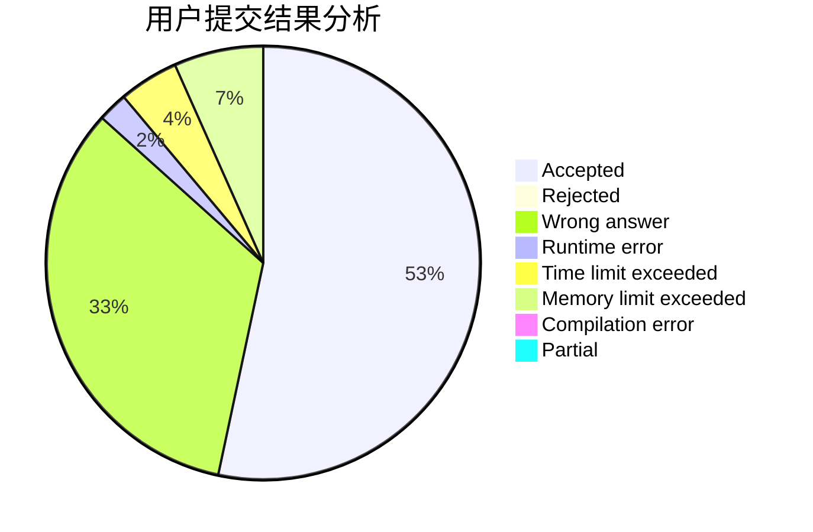
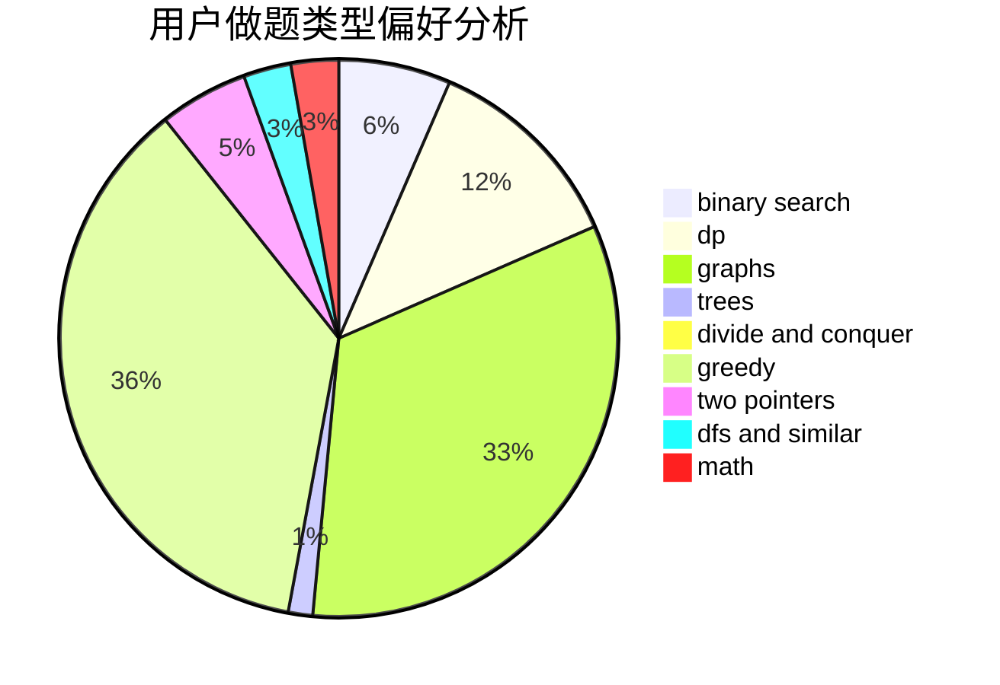

# brabbit

<!-- tabs:start -->

#### **用户提交结果分析**

#### **用户做题类型偏好分析**

<!-- tabs:end -->
# 推荐题目
[442B](https://codeforces.com/contest/442/problem/B)
[109A](https://codeforces.com/contest/109/problem/A)
[290C](https://codeforces.com/contest/290/problem/C)
[770C](https://codeforces.com/contest/770/problem/C)
[1106A](https://codeforces.com/contest/1106/problem/A)
[1427H](https://codeforces.com/contest/1427/problem/H)
[822B](https://codeforces.com/contest/822/problem/B)
[746F](https://codeforces.com/contest/746/problem/F)
[804C](https://codeforces.com/contest/804/problem/C)
[93C](https://codeforces.com/contest/93/problem/C)
