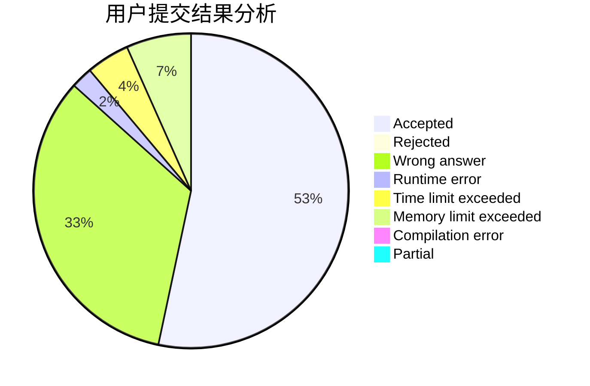
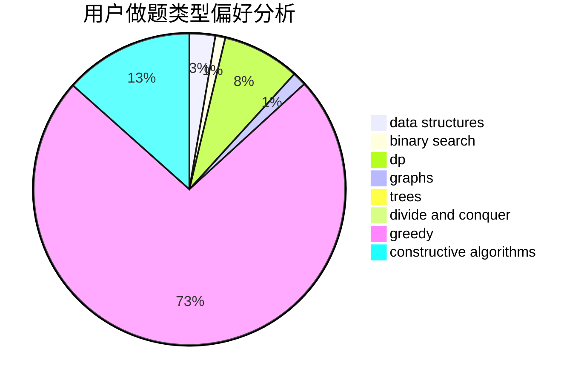
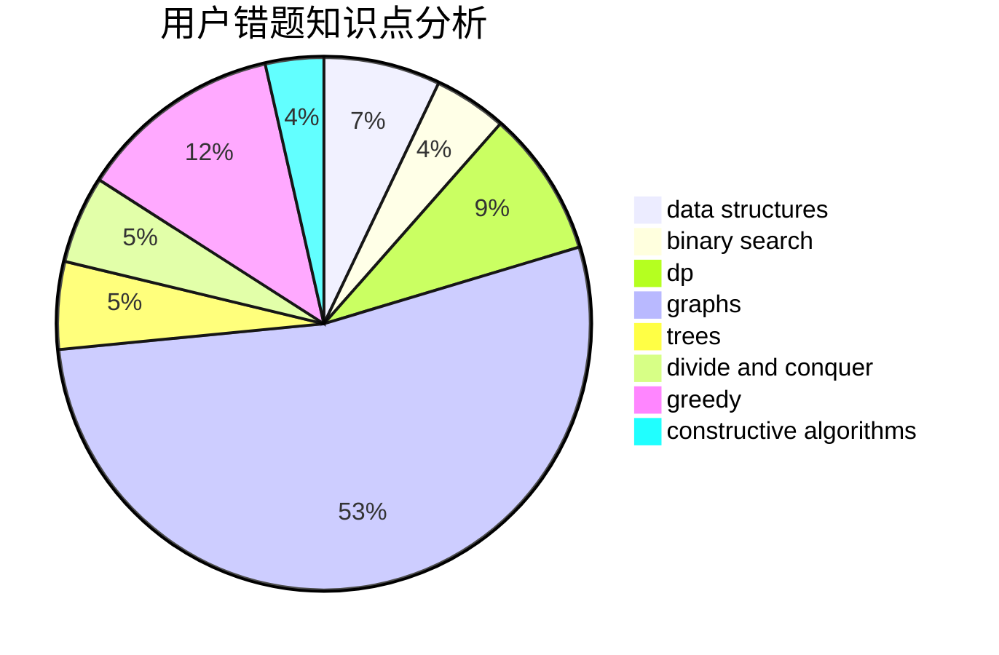

# brabbit

<!-- tabs:start -->

#### **用户提交结果分析**

#### **用户做题类型偏好分析**

#### **用户错题知识点分析**

<!-- tabs:end -->
# 推荐题目
[417C](https://codeforces.com/contest/417/problem/C)		constructive algorithms,
                        graphs,
                        implementation		  
[1099D](https://codeforces.com/contest/1099/problem/D)		dsu,graphs,sortings,trees		  
[276C](https://codeforces.com/contest/276/problem/C)		data structures,
                        greedy,
                        implementation,
                        sortings		  
[750F](https://codeforces.com/contest/750/problem/F)		constructive algorithms,
                        implementation,
                        interactive,
                        trees		  
[1105C](https://codeforces.com/contest/1105/problem/C)		combinatorics,
                        dp,
                        math		  
[1420A](https://codeforces.com/contest/1420/problem/A)		math,
                        sortings		  
[807A](https://codeforces.com/contest/807/problem/A)		implementation,
                        sortings		  
[729F](https://codeforces.com/contest/729/problem/F)		dp		  
[789A](https://codeforces.com/contest/789/problem/A)		implementation,
                        math		  
[91A](https://codeforces.com/contest/91/problem/A)		greedy,
                        strings		  
