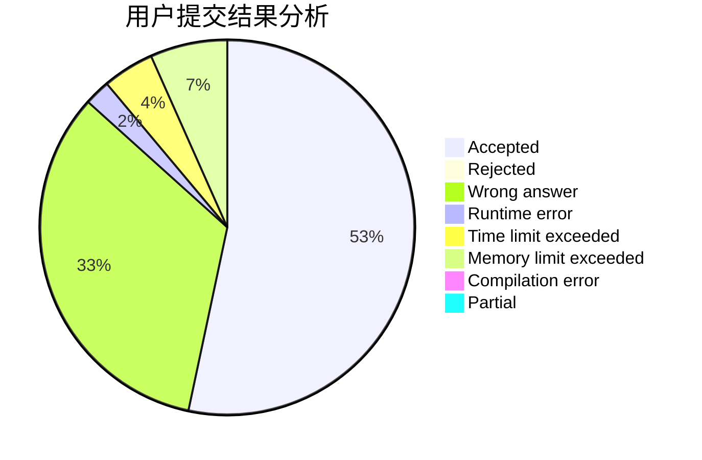
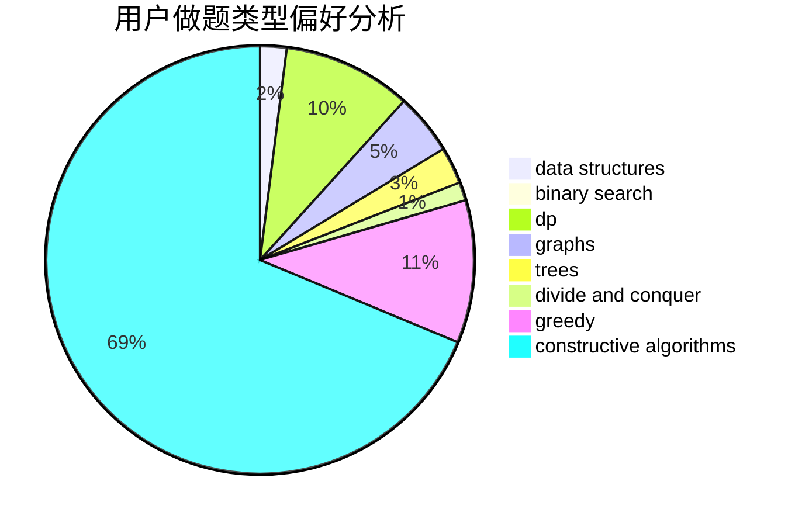
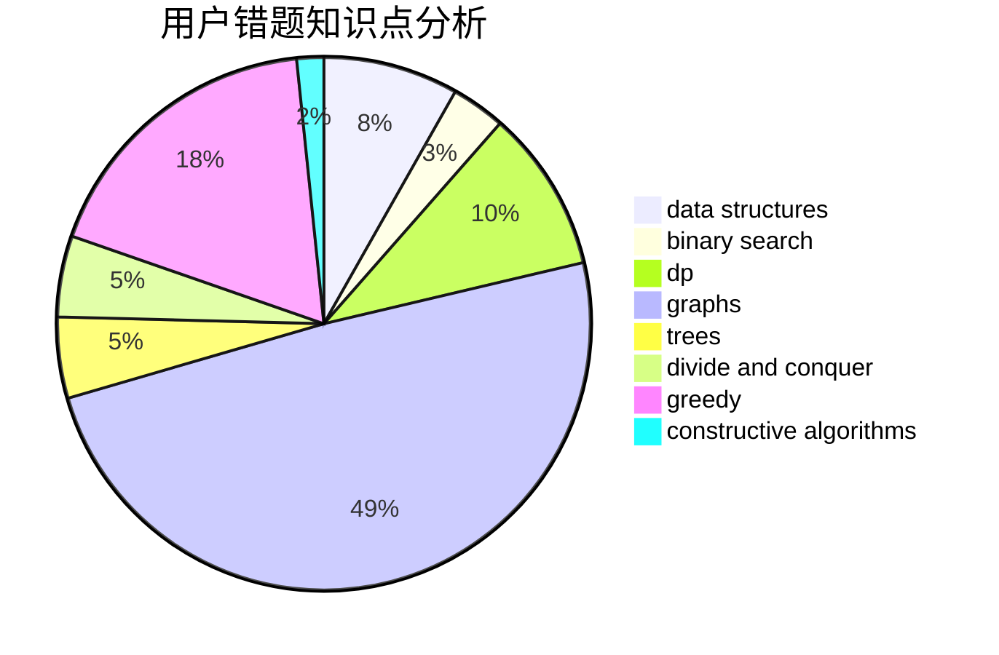

# brabbit

<!-- tabs:start -->

#### **用户提交结果分析**

#### **用户做题类型偏好分析**

#### **用户错题知识点分析**

<!-- tabs:end -->
# 推荐题目
[442B](https://codeforces.com/contest/442/problem/B)		greedy,
                        math,
                        probabilities		  
[109A](https://codeforces.com/contest/109/problem/A)		brute force,
                        implementation		  
[290C](https://codeforces.com/contest/290/problem/C)		*special problem,
                        graph matchings,
                        implementation,
                        trees		  
[770C](https://codeforces.com/contest/770/problem/C)		*special problem,
                        dfs and similar,
                        graphs,
                        implementation		  
[1106A](https://codeforces.com/contest/1106/problem/A)		implementation		  
[1427H](https://codeforces.com/contest/1427/problem/H)		binary search,
                        games,
                        geometry,
                        ternary search		  
[822B](https://codeforces.com/contest/822/problem/B)		brute force,
                        implementation,
                        strings		  
[746F](https://codeforces.com/contest/746/problem/F)		data structures,
                        greedy,
                        two pointers		  
[804C](https://codeforces.com/contest/804/problem/C)		constructive algorithms,
                        dfs and similar,
                        greedy		  
[93C](https://codeforces.com/contest/93/problem/C)		brute force,
                        implementation		  
