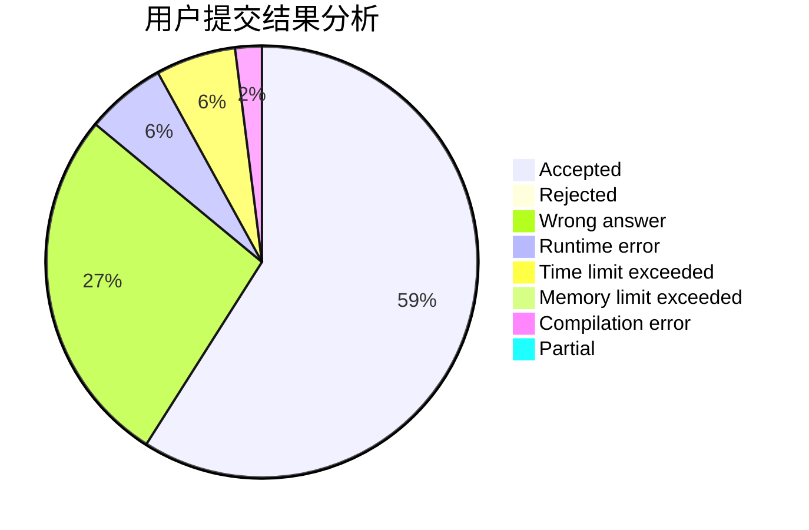
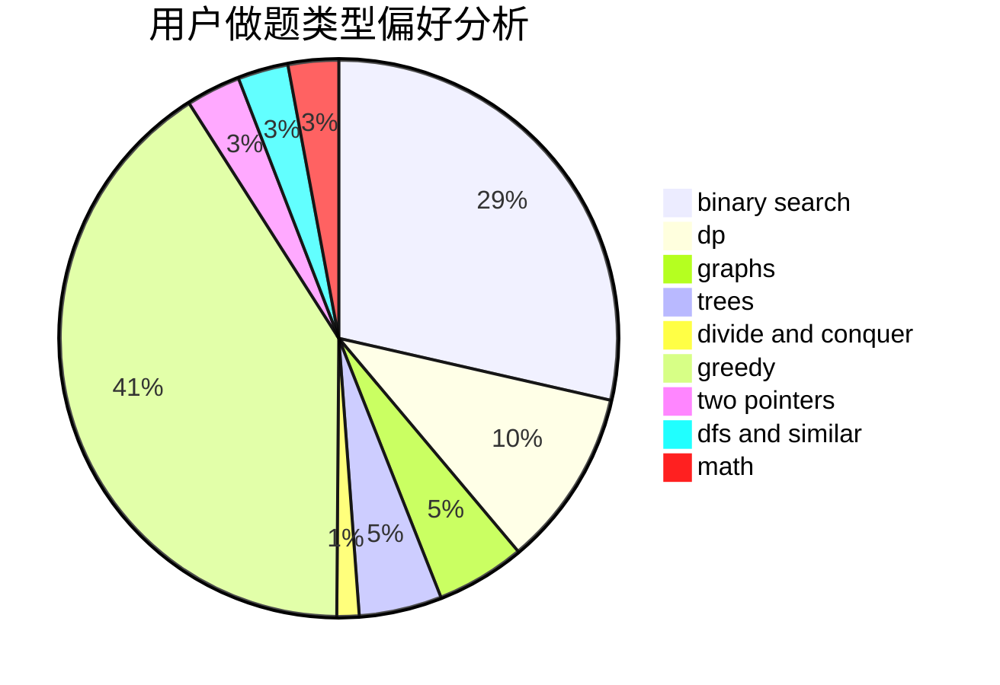

# brav0

<!-- tabs:start -->

#### **用户提交结果分析**

#### **用户做题类型偏好分析**

<!-- tabs:end -->
# 推荐题目
[478B](https://codeforces.com/contest/478/problem/B)
[1039B](https://codeforces.com/contest/1039/problem/B)
[1197B](https://codeforces.com/contest/1197/problem/B)
[869E](https://codeforces.com/contest/869/problem/E)
[567E](https://codeforces.com/contest/567/problem/E)
[1059B](https://codeforces.com/contest/1059/problem/B)
[127A](https://codeforces.com/contest/127/problem/A)
[1166D](https://codeforces.com/contest/1166/problem/D)
[426B](https://codeforces.com/contest/426/problem/B)
[1000C](https://codeforces.com/contest/1000/problem/C)
