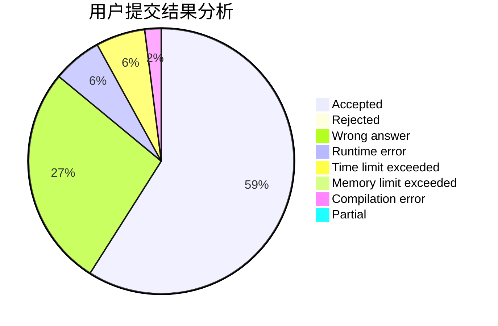
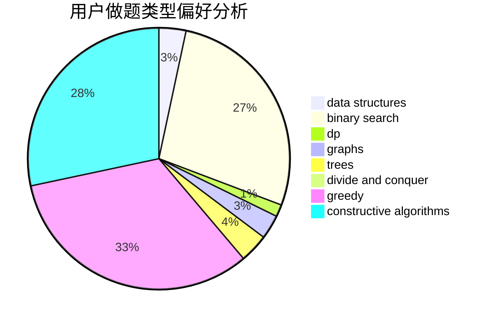
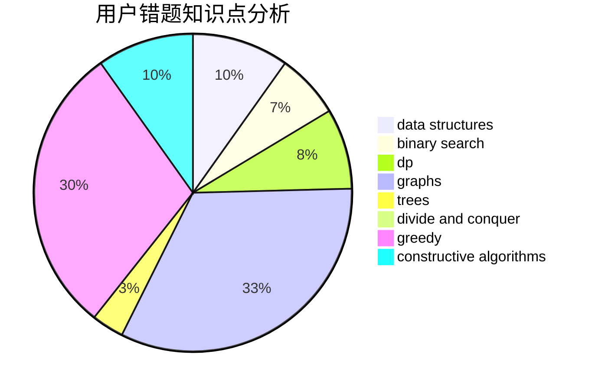

# brav0

<!-- tabs:start -->

#### **用户提交结果分析**

#### **用户做题类型偏好分析**

#### **用户错题知识点分析**

<!-- tabs:end -->
# 推荐题目
[478B](https://codeforces.com/contest/478/problem/B)		combinatorics,
                        constructive algorithms,
                        greedy,
                        math		  
[1039B](https://codeforces.com/contest/1039/problem/B)		binary search,
                        interactive,
                        probabilities		  
[1197B](https://codeforces.com/contest/1197/problem/B)		greedy,
                        implementation		  
[869E](https://codeforces.com/contest/869/problem/E)		data structures,
                        hashing		  
[567E](https://codeforces.com/contest/567/problem/E)		dfs and similar,
                        graphs,
                        hashing,
                        shortest paths		  
[1059B](https://codeforces.com/contest/1059/problem/B)		implementation		  
[127A](https://codeforces.com/contest/127/problem/A)		geometry		  
[1166D](https://codeforces.com/contest/1166/problem/D)		binary search,
                        brute force,
                        greedy,
                        math		  
[426B](https://codeforces.com/contest/426/problem/B)		implementation		  
[1000C](https://codeforces.com/contest/1000/problem/C)		data structures,
                        implementation,
                        sortings		  
