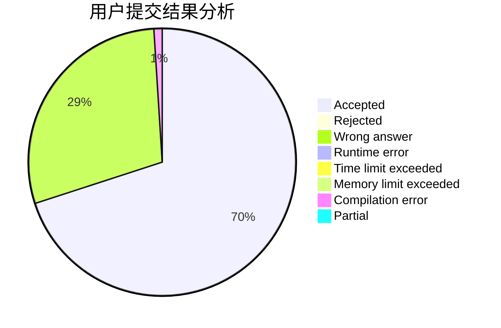
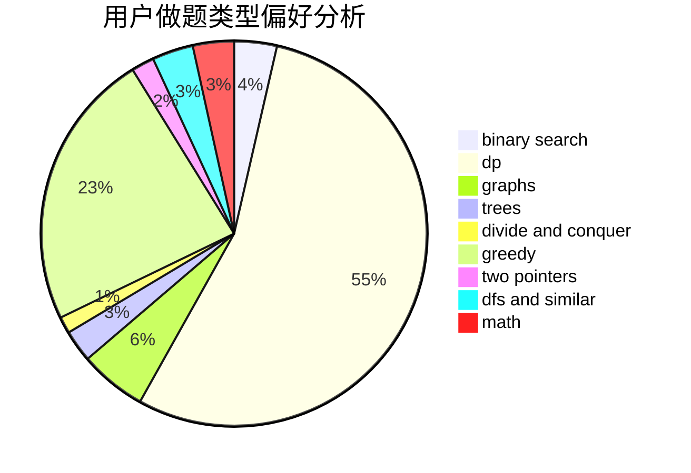

# bruce1114

<!-- tabs:start -->

#### **用户提交结果分析**

#### **用户做题类型偏好分析**

<!-- tabs:end -->
# 推荐题目
[999E](https://codeforces.com/contest/999/problem/E)
[759D](https://codeforces.com/contest/759/problem/D)
[22E](https://codeforces.com/contest/22/problem/E)
[1077A](https://codeforces.com/contest/1077/problem/A)
[653A](https://codeforces.com/contest/653/problem/A)
[1370C](https://codeforces.com/contest/1370/problem/C)
[948A](https://codeforces.com/contest/948/problem/A)
[175B](https://codeforces.com/contest/175/problem/B)
[1078D](https://codeforces.com/contest/1078/problem/D)
[547A](https://codeforces.com/contest/547/problem/A)
