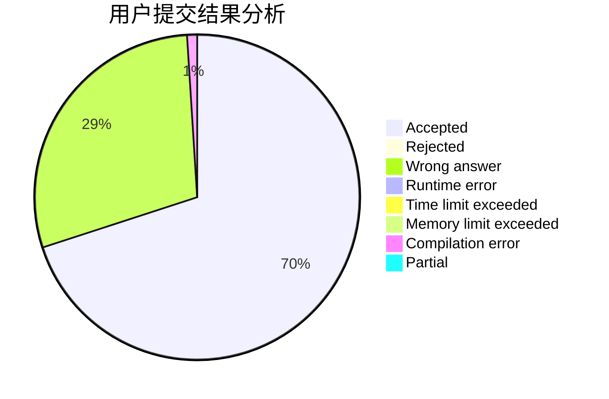
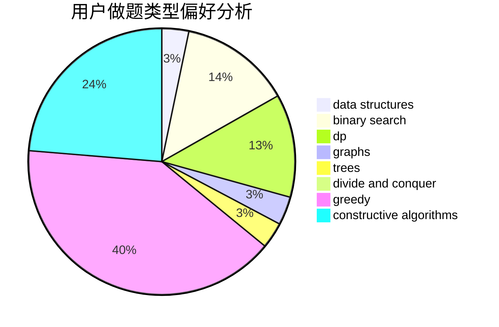

# bruce1114

<!-- tabs:start -->

#### **用户提交结果分析**

#### **用户做题类型偏好分析**

#### **用户错题知识点分析**

<!-- tabs:end -->
# 推荐题目
[984A](https://codeforces.com/contest/984/problem/A)		sortings		  
[738D](https://codeforces.com/contest/738/problem/D)		dsu,graphs,sortings,trees		  
[208C](https://codeforces.com/contest/208/problem/C)		dp,
                        graphs,
                        shortest paths		  
[1076F](https://codeforces.com/contest/1076/problem/F)		dp,
                        greedy		  
[626F](https://codeforces.com/contest/626/problem/F)		dp		  
[1363D](https://codeforces.com/contest/1363/problem/D)		binary search,
                        implementation,
                        interactive,
                        math		  
[924C](https://codeforces.com/contest/924/problem/C)		data structures,
                        dp,
                        greedy		  
[152E](https://codeforces.com/contest/152/problem/E)		bitmasks,
                        dp,
                        graphs,
                        trees		  
[1078A](https://codeforces.com/contest/1078/problem/A)		dsu,graphs,sortings,trees		  
[521B](https://codeforces.com/contest/521/problem/B)		dsu,graphs,sortings,trees		  
