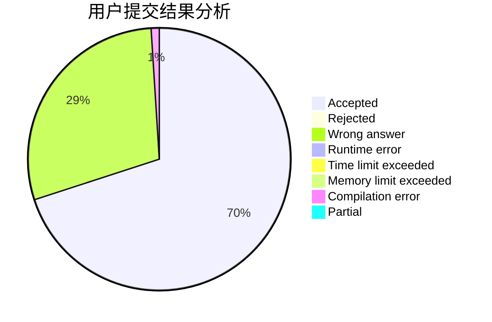
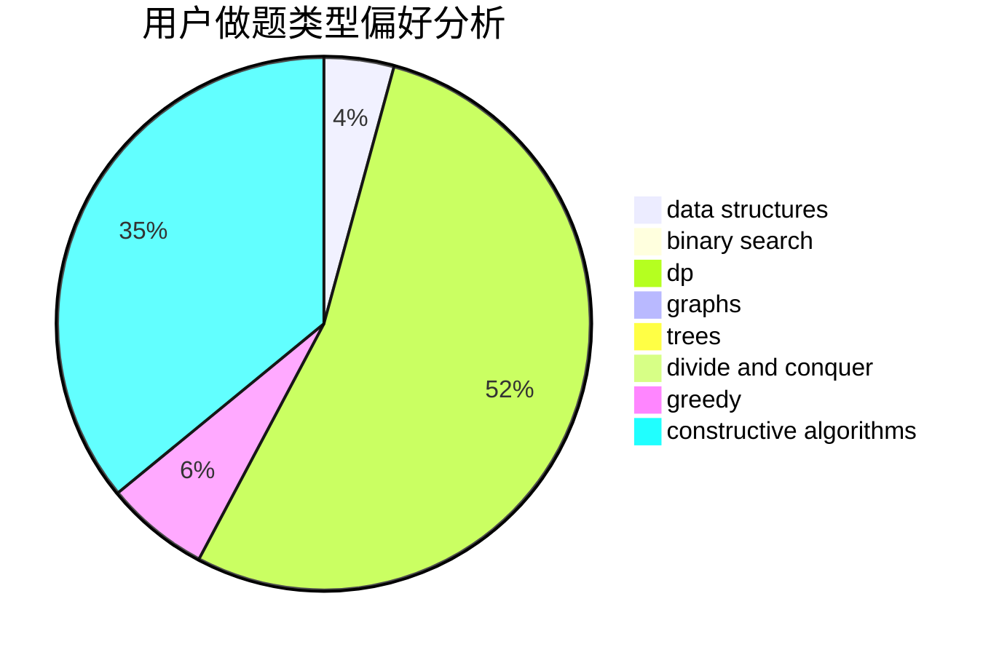

# bruce1114

<!-- tabs:start -->

#### **用户提交结果分析**

#### **用户做题类型偏好分析**

#### **用户错题知识点分析**

<!-- tabs:end -->
# 推荐题目
[999E](https://codeforces.com/contest/999/problem/E)		dfs and similar,
                        graphs,
                        greedy		  
[759D](https://codeforces.com/contest/759/problem/D)		dsu,graphs,sortings,trees		  
[22E](https://codeforces.com/contest/22/problem/E)		dfs and similar,
                        graphs,
                        trees		  
[1077A](https://codeforces.com/contest/1077/problem/A)		math		  
[653A](https://codeforces.com/contest/653/problem/A)		brute force,
                        implementation,
                        sortings		  
[1370C](https://codeforces.com/contest/1370/problem/C)		games,
                        math,
                        number theory		  
[948A](https://codeforces.com/contest/948/problem/A)		brute force,
                        dfs and similar,
                        graphs,
                        implementation		  
[175B](https://codeforces.com/contest/175/problem/B)		implementation		  
[1078D](https://codeforces.com/contest/1078/problem/D)		dsu,graphs,sortings,trees		  
[547A](https://codeforces.com/contest/547/problem/A)		brute force,
                        greedy,
                        implementation,
                        math		  
