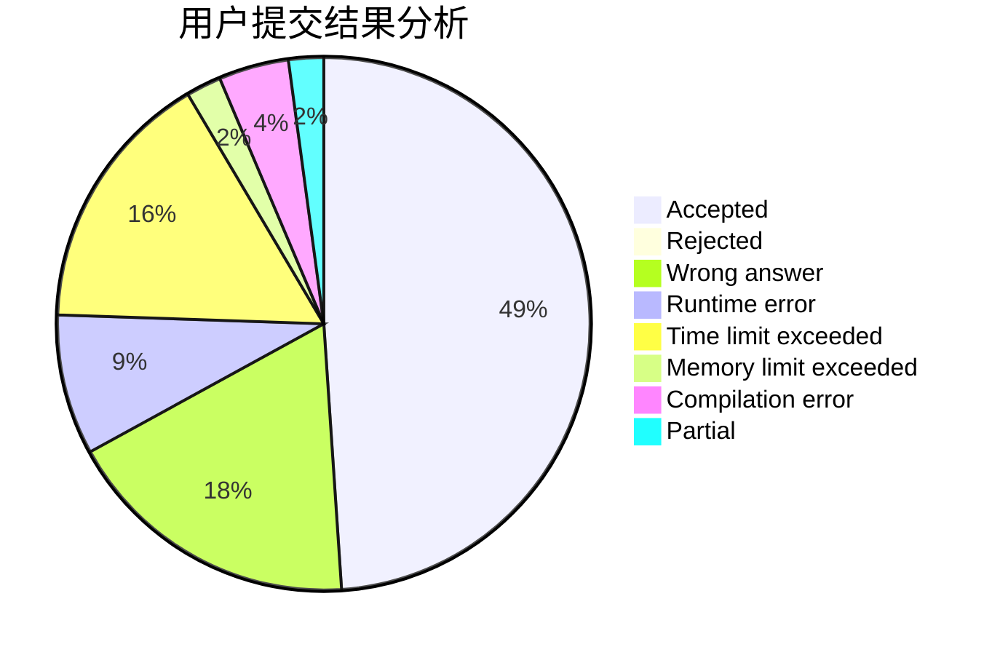
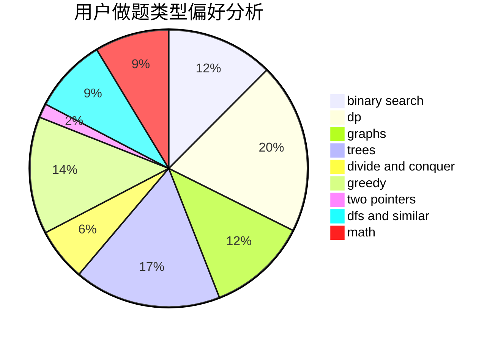

# Anonytt

<!-- tabs:start -->

#### **用户提交结果分析**

#### **用户做题类型偏好分析**

<!-- tabs:end -->
# 推荐题目
[367B](https://codeforces.com/contest/367/problem/B)
[266B](https://codeforces.com/contest/266/problem/B)
[1015D](https://codeforces.com/contest/1015/problem/D)
[1146A](https://codeforces.com/contest/1146/problem/A)
[1000G](https://codeforces.com/contest/1000/problem/G)
[36B](https://codeforces.com/contest/36/problem/B)
[1444E](https://codeforces.com/contest/1444/problem/E)
[1272A](https://codeforces.com/contest/1272/problem/A)
[1082F](https://codeforces.com/contest/1082/problem/F)
[1424J](https://codeforces.com/contest/1424/problem/J)
