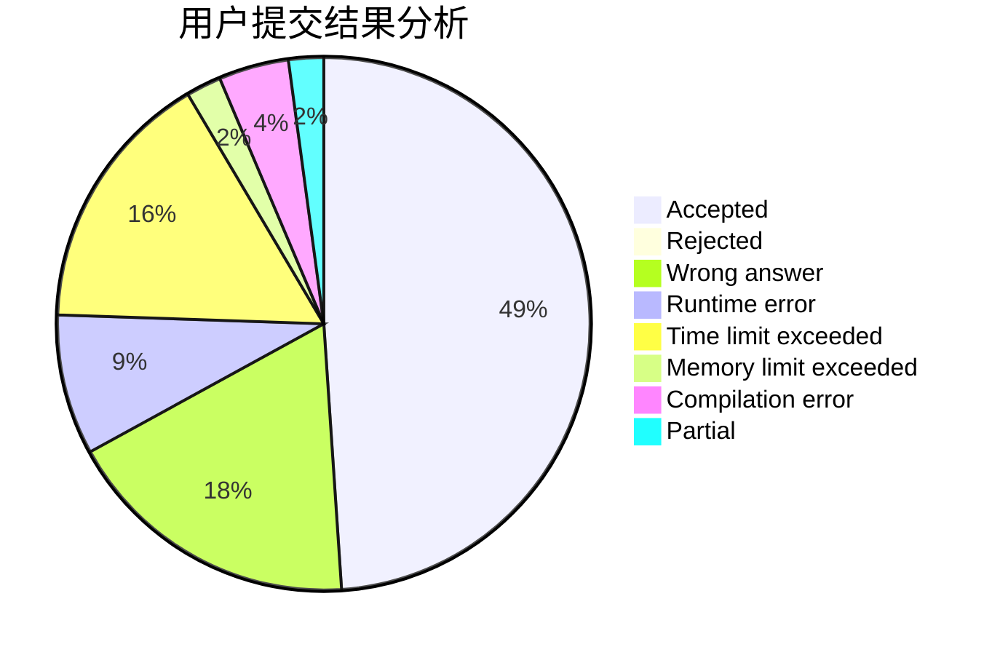
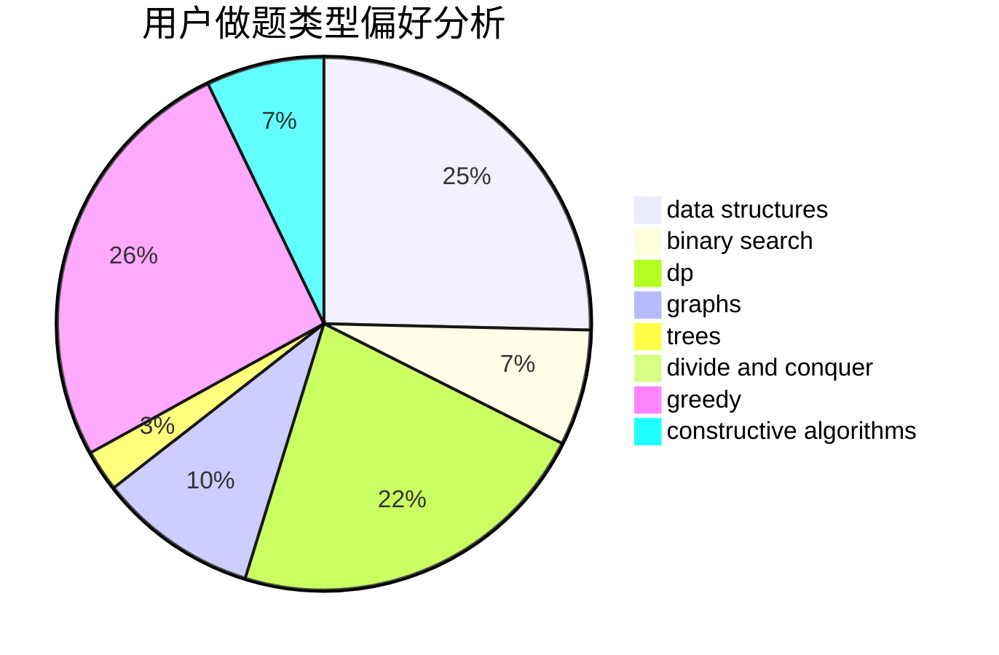
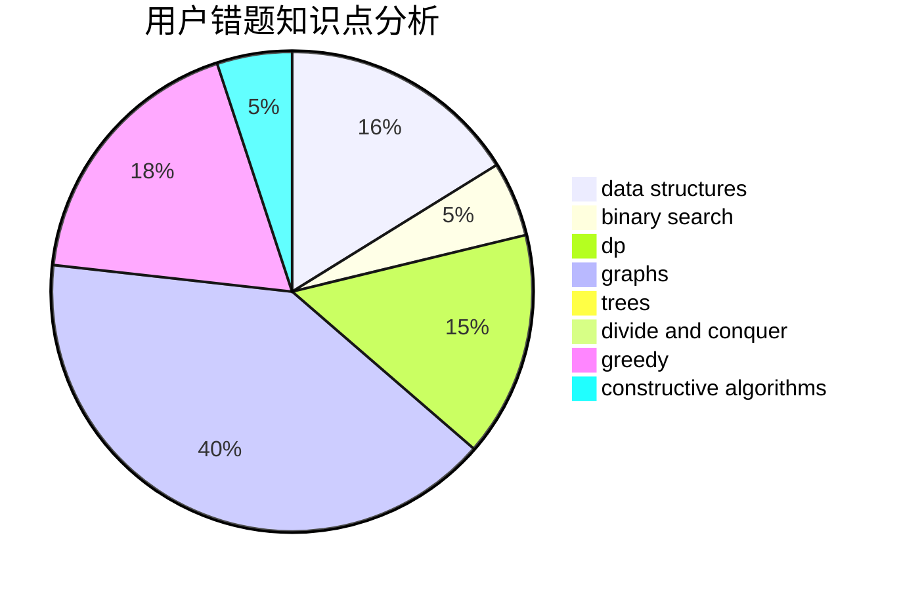

# Anonytt

<!-- tabs:start -->

#### **用户提交结果分析**

#### **用户做题类型偏好分析**

#### **用户错题知识点分析**

<!-- tabs:end -->
# 推荐题目
[33A](https://codeforces.com/contest/33/problem/A)		greedy,
                        implementation		  
[245H](https://codeforces.com/contest/245/problem/H)		dp,
                        hashing,
                        strings		  
[1015C](https://codeforces.com/contest/1015/problem/C)		sortings		  
[1143F](https://codeforces.com/contest/1143/problem/F)		dsu,graphs,sortings,trees		  
[1000G](https://codeforces.com/contest/1000/problem/G)		data structures,
                        dp,
                        trees		  
[343A](https://codeforces.com/contest/343/problem/A)		math,
                        number theory		  
[1434E](https://codeforces.com/contest/1434/problem/E)		dsu,
                        games		  
[1266F](https://codeforces.com/contest/1266/problem/F)		dfs and similar,
                        graphs		  
[1082C](https://codeforces.com/contest/1082/problem/C)		greedy,
                        sortings		  
[1417B](https://codeforces.com/contest/1417/problem/B)		greedy,
                        math,
                        sortings		  
