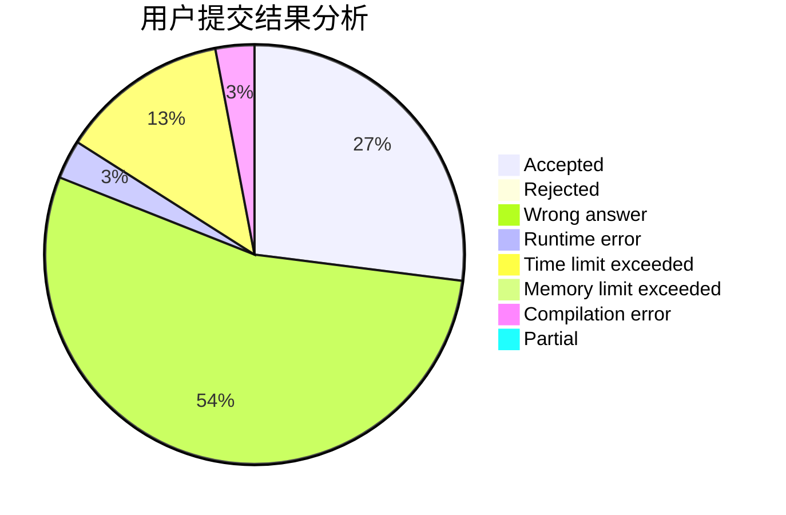
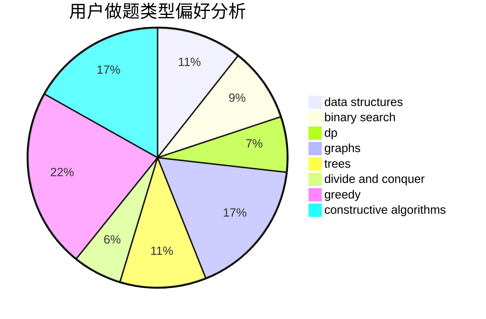
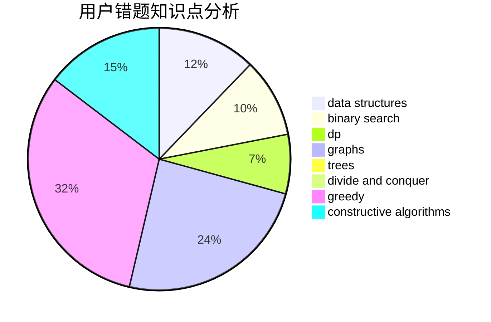

# bufang

<!-- tabs:start -->

#### **用户提交结果分析**

#### **用户做题类型偏好分析**

#### **用户错题知识点分析**

<!-- tabs:end -->
# 推荐题目
[49E](https://codeforces.com/contest/49/problem/E)		dp		  
[975E](https://codeforces.com/contest/975/problem/E)		geometry		  
[1384E](https://codeforces.com/contest/1384/problem/E)		dsu,graphs,sortings,trees		  
[219A](https://codeforces.com/contest/219/problem/A)		implementation,
                        strings		  
[315A](https://codeforces.com/contest/315/problem/A)		brute force		  
[816E](https://codeforces.com/contest/816/problem/E)		dsu,graphs,sortings,trees		  
[10151](https://codeforces.com/contest/1015/problem/1)		dsu,graphs,sortings,trees		  
[743D](https://codeforces.com/contest/743/problem/D)		dfs and similar,
                        dp,
                        graphs,
                        trees		  
[1503F](https://codeforces.com/contest/1503/problem/F)		constructive algorithms,
                        data structures,
                        divide and conquer,
                        geometry,
                        graphs,
                        implementation		  
[112A](https://codeforces.com/contest/112/problem/A)		implementation,
                        strings		  
