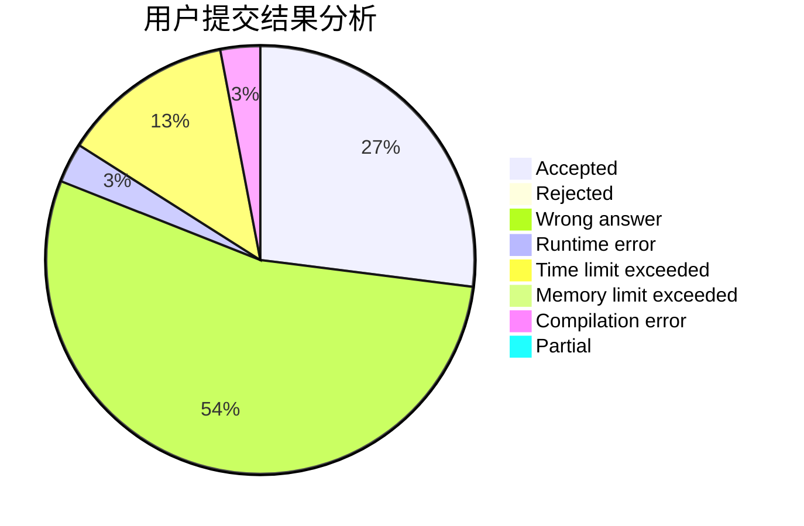
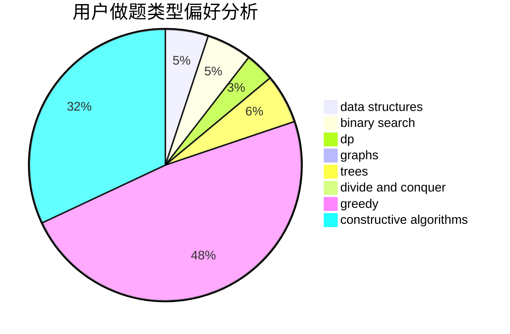
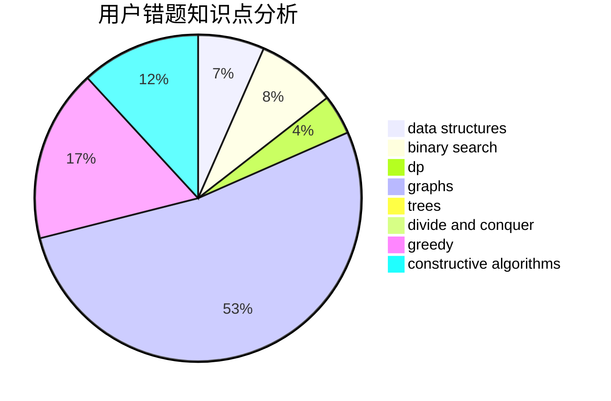

# bufang
<!-- tabs:start -->
#### **用户提交结果分析**

#### **用户做题类型偏好分析**

#### **用户错题知识点分析**

<!-- tabs:end -->
# 推荐题目
[Exams](http://codeforces.com/problemset/problem/479/C)		greedy,
                        sortings		  
[Polycarp Training](http://codeforces.com/problemset/problem/1165/B)		data structures,
                        greedy,
                        sortings		  
[2 + 2 != 4](http://codeforces.com/problemset/problem/952/F)		nan		  
[Mystic Carvings](http://codeforces.com/problemset/problem/297/E)		data structures		  
[Plate Game](http://codeforces.com/problemset/problem/197/A)		constructive algorithms,
                        games,
                        math		  
[Best Subsegment](http://codeforces.com/problemset/problem/1117/A)		implementation,
                        math		  
[Integer Game](http://codeforces.com/problemset/problem/1375/F)		constructive algorithms,
                        games,
                        interactive,
                        math		  
[Photo of The Sky](https://codeforces.com/contest/1013/problem/C)		brute force,
                        implementation,
                        math,
                        sortings		  
[Soldier and Cards](http://codeforces.com/problemset/problem/546/C)		brute force,
                        dfs and similar,
                        games		  
[Kaavi and Magic Spell](https://codeforces.com/contest/1337/problem/E)		dp,
                        strings		  
<!-- tabs:start -->
#### **data structures**
[Exams](http://codeforces.com/problemset/problem/1165/B)		data structures,
                        greedy,
                        sortings		  
[Polycarp Training](http://codeforces.com/problemset/problem/297/E)		data structures		  
[2 + 2 != 4](http://codeforces.com/problemset/problem/725/D)		data structures,
                        greedy		  
[Mystic Carvings](http://codeforces.com/problemset/problem/1139/F)		data structures,
                        divide and conquer		  
[Plate Game](http://codeforces.com/problemset/problem/187/D)		data structures		  
[Best Subsegment](http://codeforces.com/problemset/problem/1488/F)		*special problem,
                        *special problem,
                        binary search,
                        data structures		  
[Integer Game](http://codeforces.com/problemset/problem/915/F)		data structures,
                        dsu,
                        graphs,
                        trees		  
[Photo of The Sky](http://codeforces.com/problemset/problem/1492/C)		binary search,
                        data structures,
                        dp,
                        greedy,
                        two pointers		  
[Soldier and Cards](http://codeforces.com/problemset/problem/1490/G)		binary search,
                        data structures,
                        math		  
[Kaavi and Magic Spell](http://codeforces.com/problemset/problem/1479/D)		binary search,
                        bitmasks,
                        brute force,
                        data structures,
                        probabilities,
                        trees		  
#### **binary search**
[Exams](http://codeforces.com/problemset/problem/1201/D)		binary search,
                        dp,
                        greedy,
                        implementation		  
[Polycarp Training](http://codeforces.com/problemset/problem/75/C)		binary search,
                        number theory		  
[2 + 2 != 4](http://codeforces.com/problemset/problem/1488/F)		*special problem,
                        *special problem,
                        binary search,
                        data structures		  
[Mystic Carvings](http://codeforces.com/problemset/problem/1492/C)		binary search,
                        data structures,
                        dp,
                        greedy,
                        two pointers		  
[Plate Game](http://codeforces.com/problemset/problem/1463/D)		binary search,
                        constructive algorithms,
                        greedy,
                        two pointers		  
[Best Subsegment](http://codeforces.com/problemset/problem/1490/G)		binary search,
                        data structures,
                        math		  
[Integer Game](http://codeforces.com/problemset/problem/1479/D)		binary search,
                        bitmasks,
                        brute force,
                        data structures,
                        probabilities,
                        trees		  
[Photo of The Sky](http://codeforces.com/problemset/problem/1436/E)		binary search,
                        data structures,
                        two pointers		  
[Soldier and Cards](http://codeforces.com/problemset/problem/1461/D)		binary search,
                        brute force,
                        data structures,
                        divide and conquer,
                        implementation,
                        sortings		  
[Kaavi and Magic Spell](http://codeforces.com/problemset/problem/1493/C)		binary search,
                        brute force,
                        constructive algorithms,
                        greedy,
                        strings		  
#### **dp**
[Exams](https://codeforces.com/contest/1337/problem/E)		dp,
                        strings		  
[Polycarp Training](http://codeforces.com/problemset/problem/1156/F)		dp,
                        math,
                        probabilities		  
[2 + 2 != 4](http://codeforces.com/problemset/problem/1201/D)		binary search,
                        dp,
                        greedy,
                        implementation		  
[Mystic Carvings](http://codeforces.com/problemset/problem/498/B)		dp,
                        probabilities,
                        two pointers		  
[Plate Game](http://codeforces.com/problemset/problem/1285/B)		dp,
                        greedy,
                        implementation		  
[Best Subsegment](http://codeforces.com/problemset/problem/538/B)		constructive algorithms,
                        dp,
                        greedy,
                        implementation		  
[Integer Game](http://codeforces.com/problemset/problem/1492/C)		binary search,
                        data structures,
                        dp,
                        greedy,
                        two pointers		  
[Photo of The Sky](https://codeforces.com/contest/1457/problem/C)		brute force,
                        dp,
                        implementation		  
[Soldier and Cards](http://codeforces.com/problemset/problem/1491/C)		brute force,
                        data structures,
                        dp,
                        greedy,
                        implementation		  
[Kaavi and Magic Spell](http://codeforces.com/problemset/problem/1437/C)		dp,
                        flows,
                        graph matchings,
                        greedy,
                        math,
                        sortings		  
#### **graph**
[Exams](http://codeforces.com/problemset/problem/908/F)		graphs,
                        greedy,
                        implementation		  
[Polycarp Training](http://codeforces.com/problemset/problem/350/B)		graphs		  
[2 + 2 != 4](http://codeforces.com/problemset/problem/1470/D)		constructive algorithms,
                        dfs and similar,
                        graph matchings,
                        graphs,
                        greedy		  
[Mystic Carvings](http://codeforces.com/problemset/problem/1494/F)		brute force,
                        constructive algorithms,
                        dfs and similar,
                        graphs,
                        implementation		  
[Plate Game](http://codeforces.com/problemset/problem/915/F)		data structures,
                        dsu,
                        graphs,
                        trees		  
[Best Subsegment](http://codeforces.com/problemset/problem/1487/C)		brute force,
                        constructive algorithms,
                        dfs and similar,
                        graphs,
                        greedy,
                        implementation,
                        math		  
[Integer Game](http://codeforces.com/problemset/problem/1437/C)		dp,
                        flows,
                        graph matchings,
                        greedy,
                        math,
                        sortings		  
[Photo of The Sky](http://codeforces.com/problemset/problem/1470/D)		constructive algorithms,
                        dfs and similar,
                        graph matchings,
                        graphs,
                        greedy		  
[Soldier and Cards](http://codeforces.com/problemset/problem/1476/C)		dp,
                        graphs,
                        greedy		  
[Kaavi and Magic Spell](http://codeforces.com/problemset/problem/1304/D)		constructive algorithms,
                        graphs,
                        greedy,
                        two pointers		  
#### **trees**
[Exams](http://codeforces.com/problemset/problem/1118/F1)		dfs and similar,
                        trees		  
[Polycarp Training](http://codeforces.com/problemset/problem/915/F)		data structures,
                        dsu,
                        graphs,
                        trees		  
[2 + 2 != 4](http://codeforces.com/problemset/problem/1479/D)		binary search,
                        bitmasks,
                        brute force,
                        data structures,
                        probabilities,
                        trees		  
[Mystic Carvings](http://codeforces.com/problemset/problem/1511/C)		brute force,
                        data structures,
                        implementation,
                        trees		  
[Plate Game](http://codeforces.com/problemset/problem/1499/F)		combinatorics,
                        dfs and similar,
                        dp,
                        trees		  
[Best Subsegment](http://codeforces.com/problemset/problem/1491/E)		brute force,
                        dfs and similar,
                        divide and conquer,
                        number theory,
                        trees		  
[Integer Game](http://codeforces.com/problemset/problem/1466/D)		data structures,
                        greedy,
                        sortings,
                        trees		  
[Photo of The Sky](http://codeforces.com/problemset/problem/1495/D)		combinatorics,
                        dfs and similar,
                        graphs,
                        math,
                        shortest paths,
                        trees		  
[Soldier and Cards](http://codeforces.com/problemset/problem/1303/G)		data structures,
                        divide and conquer,
                        geometry,
                        trees		  
[Kaavi and Magic Spell](http://codeforces.com/problemset/problem/1454/E)		combinatorics,
                        dfs and similar,
                        graphs,
                        trees		  
#### **divide and conquer**
[Exams](http://codeforces.com/problemset/problem/1139/F)		data structures,
                        divide and conquer		  
[Polycarp Training](http://codeforces.com/problemset/problem/1461/D)		binary search,
                        brute force,
                        data structures,
                        divide and conquer,
                        implementation,
                        sortings		  
[2 + 2 != 4](http://codeforces.com/problemset/problem/1466/G)		combinatorics,
                        divide and conquer,
                        hashing,
                        math,
                        string suffix structures,
                        strings		  
[Mystic Carvings](http://codeforces.com/problemset/problem/1490/D)		dfs and similar,
                        divide and conquer,
                        implementation		  
[Plate Game](https://codeforces.com/contest/1483/problem/C)		data structures,
                        divide and conquer,
                        dp		  
[Best Subsegment](http://codeforces.com/problemset/problem/1491/E)		brute force,
                        dfs and similar,
                        divide and conquer,
                        number theory,
                        trees		  
[Integer Game](http://codeforces.com/problemset/problem/1303/G)		data structures,
                        divide and conquer,
                        geometry,
                        trees		  
[Photo of The Sky](http://codeforces.com/problemset/problem/1494/D)		constructive algorithms,
                        data structures,
                        dfs and similar,
                        divide and conquer,
                        dsu,
                        greedy,
                        sortings,
                        trees		  
[Soldier and Cards](http://codeforces.com/problemset/problem/1482/E)		data structures,
                        divide and conquer,
                        dp		  
[Kaavi and Magic Spell](http://codeforces.com/problemset/problem/566/C)		dfs and similar,
                        divide and conquer,
                        trees		  
#### **greedy**
[Exams](http://codeforces.com/problemset/problem/479/C)		greedy,
                        sortings		  
[Polycarp Training](http://codeforces.com/problemset/problem/1165/B)		data structures,
                        greedy,
                        sortings		  
[2 + 2 != 4](http://codeforces.com/problemset/problem/802/A)		greedy		  
[Mystic Carvings](http://codeforces.com/problemset/problem/908/F)		graphs,
                        greedy,
                        implementation		  
[Plate Game](http://codeforces.com/problemset/problem/725/D)		data structures,
                        greedy		  
[Best Subsegment](http://codeforces.com/problemset/problem/1470/D)		constructive algorithms,
                        dfs and similar,
                        graph matchings,
                        graphs,
                        greedy		  
[Integer Game](http://codeforces.com/problemset/problem/1201/D)		binary search,
                        dp,
                        greedy,
                        implementation		  
[Photo of The Sky](http://codeforces.com/problemset/problem/1120/B)		constructive algorithms,
                        greedy,
                        implementation,
                        math		  
[Soldier and Cards](http://codeforces.com/problemset/problem/1236/A)		brute force,
                        greedy,
                        math		  
[Kaavi and Magic Spell](http://codeforces.com/problemset/problem/1285/B)		dp,
                        greedy,
                        implementation		  
#### **constructive algorithms**
[Exams](http://codeforces.com/problemset/problem/197/A)		constructive algorithms,
                        games,
                        math		  
[Polycarp Training](http://codeforces.com/problemset/problem/1375/F)		constructive algorithms,
                        games,
                        interactive,
                        math		  
[2 + 2 != 4](http://codeforces.com/problemset/problem/1470/D)		constructive algorithms,
                        dfs and similar,
                        graph matchings,
                        graphs,
                        greedy		  
[Mystic Carvings](http://codeforces.com/problemset/problem/622/D)		constructive algorithms		  
[Plate Game](http://codeforces.com/problemset/problem/1494/F)		brute force,
                        constructive algorithms,
                        dfs and similar,
                        graphs,
                        implementation		  
[Best Subsegment](http://codeforces.com/problemset/problem/1120/B)		constructive algorithms,
                        greedy,
                        implementation,
                        math		  
[Integer Game](http://codeforces.com/problemset/problem/538/B)		constructive algorithms,
                        dp,
                        greedy,
                        implementation		  
[Photo of The Sky](http://codeforces.com/problemset/problem/1493/A)		constructive algorithms,
                        greedy		  
[Soldier and Cards](http://codeforces.com/problemset/problem/1463/D)		binary search,
                        constructive algorithms,
                        greedy,
                        two pointers		  
[Kaavi and Magic Spell](https://codeforces.com/contest/1456/problem/B)		bitmasks,
                        brute force,
                        constructive algorithms		  
#### **sortings**
[Exams](http://codeforces.com/problemset/problem/479/C)		greedy,
                        sortings		  
[Polycarp Training](http://codeforces.com/problemset/problem/1165/B)		data structures,
                        greedy,
                        sortings		  
[2 + 2 != 4](https://codeforces.com/contest/1013/problem/C)		brute force,
                        implementation,
                        math,
                        sortings		  
[Mystic Carvings](https://codeforces.com/contest/1496/problem/C)		geometry,
                        greedy,
                        math,
                        sortings		  
[Plate Game](http://codeforces.com/problemset/problem/1495/A)		geometry,
                        greedy,
                        math,
                        sortings		  
[Best Subsegment](http://codeforces.com/problemset/problem/1497/A)		brute force,
                        data structures,
                        greedy,
                        sortings		  
[Integer Game](http://codeforces.com/problemset/problem/1427/A)		math,
                        sortings		  
[Photo of The Sky](http://codeforces.com/problemset/problem/1461/D)		binary search,
                        brute force,
                        data structures,
                        divide and conquer,
                        implementation,
                        sortings		  
[Soldier and Cards](http://codeforces.com/problemset/problem/1437/C)		dp,
                        flows,
                        graph matchings,
                        greedy,
                        math,
                        sortings		  
[Kaavi and Magic Spell](http://codeforces.com/problemset/problem/1473/A)		greedy,
                        implementation,
                        math,
                        sortings		  
<!-- tabs:end -->
