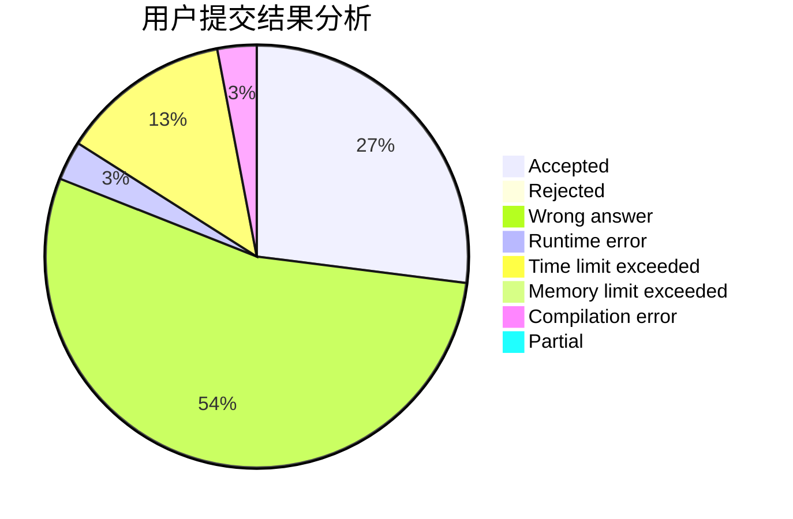
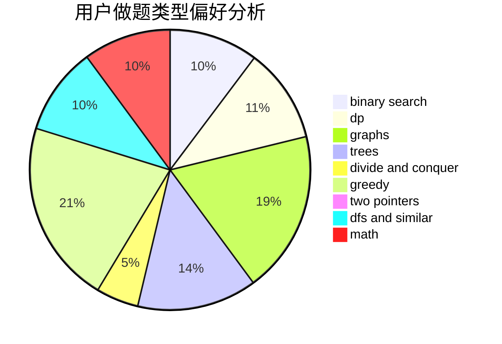

# bufang

<!-- tabs:start -->

#### **用户提交结果分析**

#### **用户做题类型偏好分析**

<!-- tabs:end -->
# 推荐题目
[49E](https://codeforces.com/contest/49/problem/E)
[975E](https://codeforces.com/contest/975/problem/E)
[1384E](https://codeforces.com/contest/1384/problem/E)
[219A](https://codeforces.com/contest/219/problem/A)
[315A](https://codeforces.com/contest/315/problem/A)
[816E](https://codeforces.com/contest/816/problem/E)
[10151](https://codeforces.com/contest/1015/problem/1)
[743D](https://codeforces.com/contest/743/problem/D)
[1503F](https://codeforces.com/contest/1503/problem/F)
[112A](https://codeforces.com/contest/112/problem/A)
