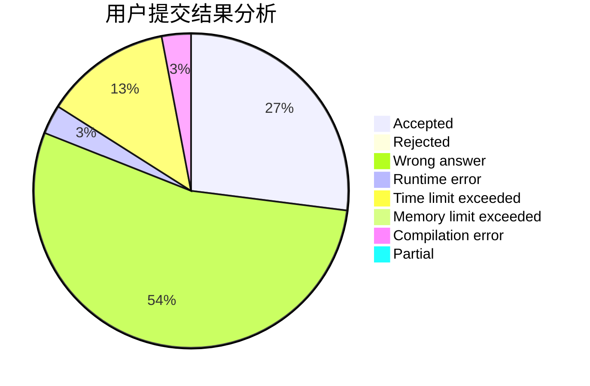
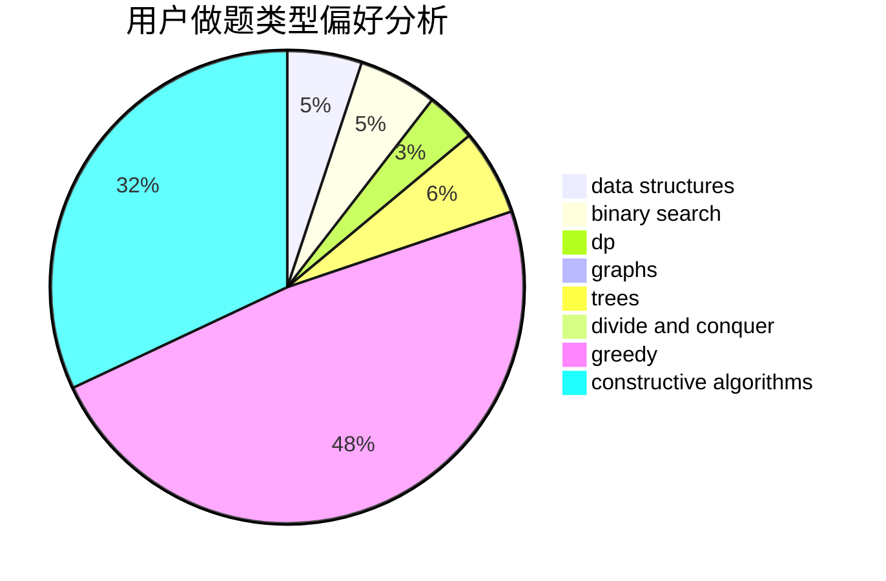
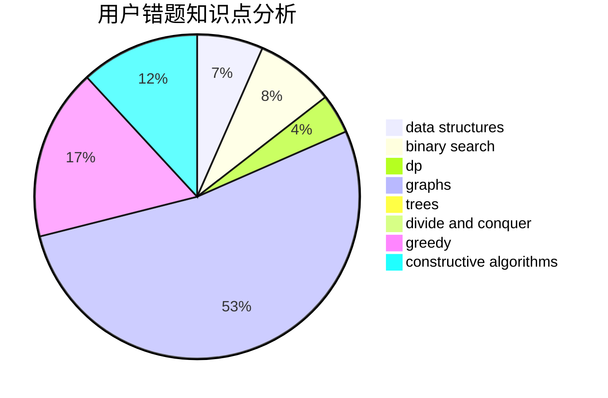

# bufang

<!-- tabs:start -->

#### **用户提交结果分析**

#### **用户做题类型偏好分析**

#### **用户错题知识点分析**

<!-- tabs:end -->
# 推荐题目
[479C](https://codeforces.com/contest/479/problem/C)		greedy,
                        sortings		  
[952F](https://codeforces.com/contest/952/problem/F)		nan		  
[1375F](https://codeforces.com/contest/1375/problem/F)		constructive algorithms,
                        games,
                        interactive,
                        math		  
[197A](https://codeforces.com/contest/197/problem/A)		constructive algorithms,
                        games,
                        math		  
[297E](https://codeforces.com/contest/297/problem/E)		data structures		  
[802A](https://codeforces.com/contest/802/problem/A)		greedy		  
[1013C](https://codeforces.com/contest/1013/problem/C)		dsu,graphs,sortings,trees		  
[725D](https://codeforces.com/contest/725/problem/D)		data structures,
                        greedy		  
[1494F](https://codeforces.com/contest/1494/problem/F)		brute force,
                        constructive algorithms,
                        dfs and similar,
                        graphs,
                        implementation		  
[1120B](https://codeforces.com/contest/1120/problem/B)		constructive algorithms,
                        greedy,
                        implementation,
                        math		  
