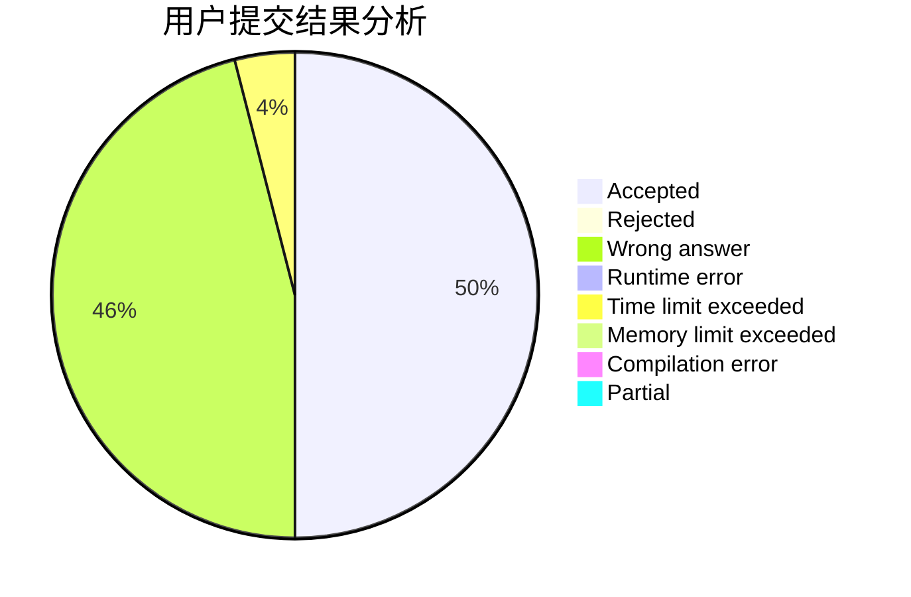
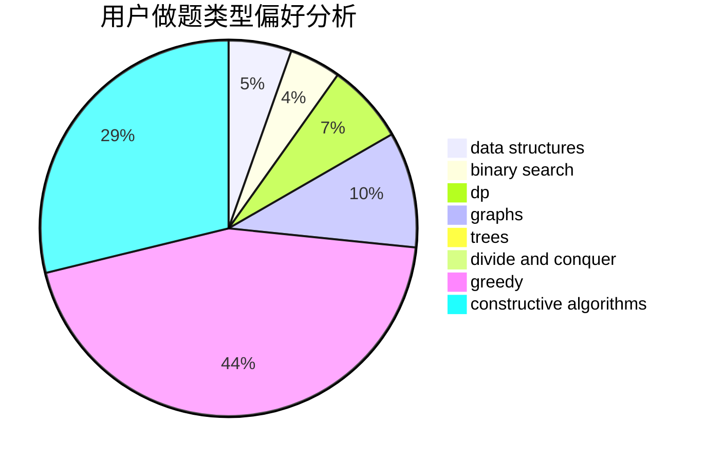
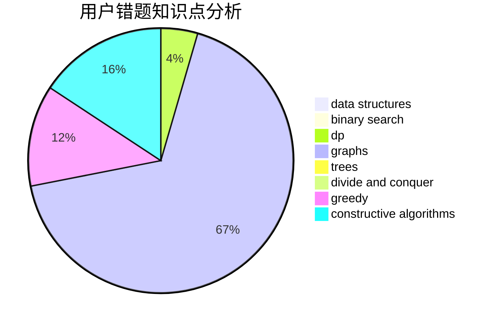

# bunH2O

<!-- tabs:start -->

#### **用户提交结果分析**

#### **用户做题类型偏好分析**

#### **用户错题知识点分析**

<!-- tabs:end -->
# 推荐题目
[1513C](https://codeforces.com/contest/1513/problem/C)		dp,
                        matrices		  
[920B](https://codeforces.com/contest/920/problem/B)		implementation		  
[1208D](https://codeforces.com/contest/1208/problem/D)		binary search,
                        data structures,
                        greedy,
                        implementation		  
[1375I](https://codeforces.com/contest/1375/problem/I)		geometry,
                        math,
                        matrices,
                        number theory		  
[1161E](https://codeforces.com/contest/1161/problem/E)		dsu,graphs,sortings,trees		  
[443D](https://codeforces.com/contest/443/problem/D)		dsu,graphs,sortings,trees		  
[1040B](https://codeforces.com/contest/1040/problem/B)		dp,
                        greedy,
                        math		  
[1361E](https://codeforces.com/contest/1361/problem/E)		dfs and similar,
                        graphs,
                        probabilities,
                        trees		  
[784G](https://codeforces.com/contest/784/problem/G)		*special problem		  
[837A](https://codeforces.com/contest/837/problem/A)		implementation		  
