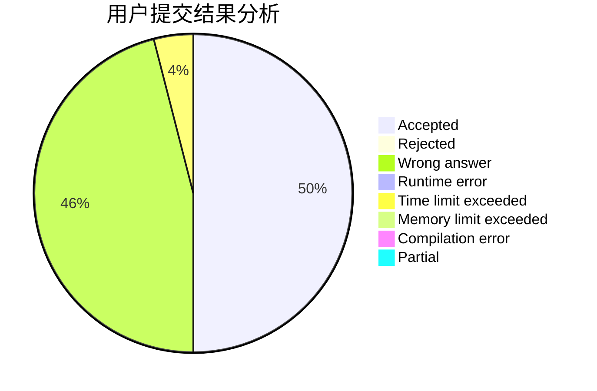
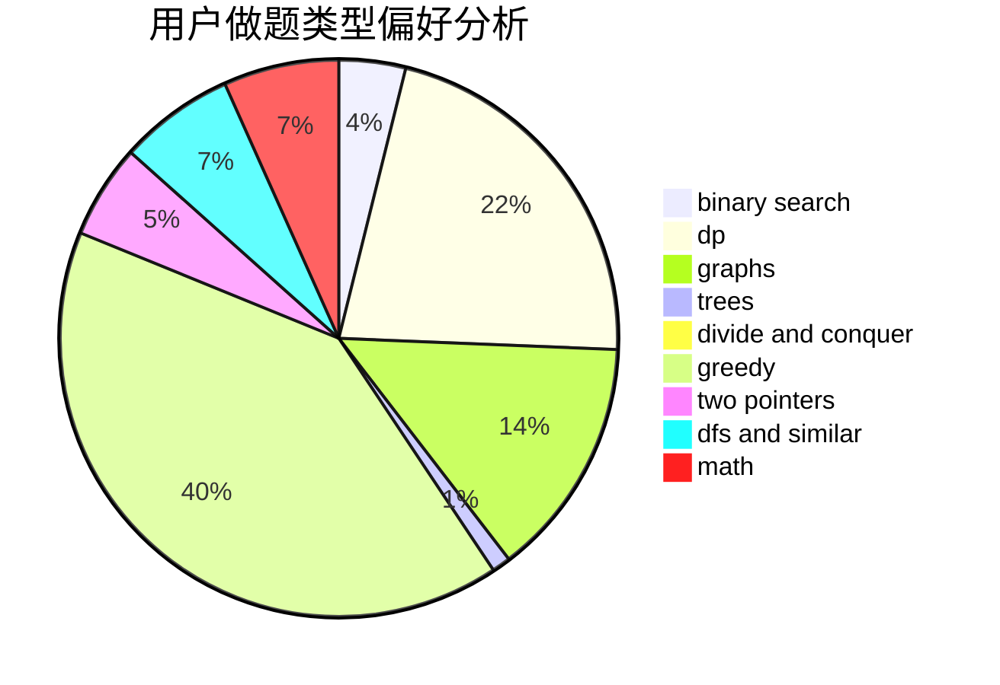

# bunH2O

<!-- tabs:start -->

#### **用户提交结果分析**

#### **用户做题类型偏好分析**

<!-- tabs:end -->
# 推荐题目
[1513C](https://codeforces.com/contest/1513/problem/C)
[920B](https://codeforces.com/contest/920/problem/B)
[1208D](https://codeforces.com/contest/1208/problem/D)
[1375I](https://codeforces.com/contest/1375/problem/I)
[1161E](https://codeforces.com/contest/1161/problem/E)
[443D](https://codeforces.com/contest/443/problem/D)
[1040B](https://codeforces.com/contest/1040/problem/B)
[1361E](https://codeforces.com/contest/1361/problem/E)
[784G](https://codeforces.com/contest/784/problem/G)
[837A](https://codeforces.com/contest/837/problem/A)
