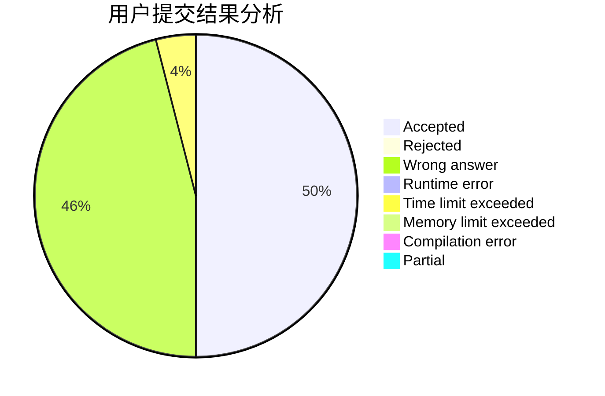
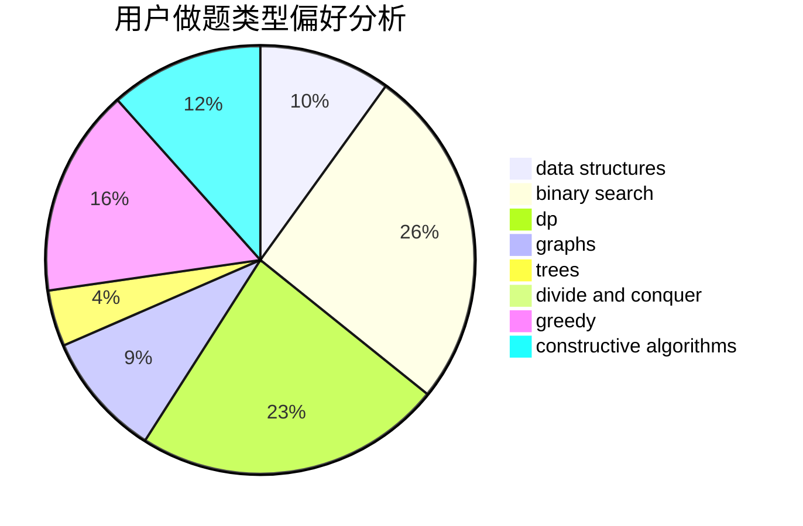
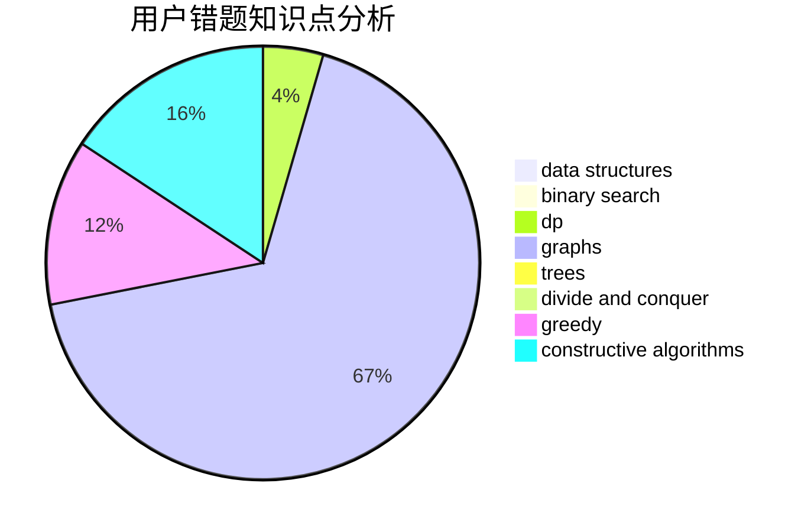

# bunH2O

<!-- tabs:start -->

#### **用户提交结果分析**

#### **用户做题类型偏好分析**

#### **用户错题知识点分析**

<!-- tabs:end -->
# 推荐题目
[1504D](https://codeforces.com/contest/1504/problem/D)		dsu,graphs,sortings,trees		  
[906D](https://codeforces.com/contest/906/problem/D)		chinese remainder theorem,
                        math,
                        number theory		  
[1203F1](https://codeforces.com/contest/1203F/problem/1)		greedy		  
[1369A](https://codeforces.com/contest/1369/problem/A)		geometry,
                        math		  
[1159A](https://codeforces.com/contest/1159/problem/A)		implementation,
                        math		  
[418C](https://codeforces.com/contest/418/problem/C)		dsu,graphs,sortings,trees		  
[103D](https://codeforces.com/contest/103/problem/D)		brute force,
                        data structures,
                        sortings		  
[1355A](https://codeforces.com/contest/1355/problem/A)		brute force,
                        implementation,
                        math		  
[765D](https://codeforces.com/contest/765/problem/D)		constructive algorithms,
                        dsu,
                        math		  
[817A](https://codeforces.com/contest/817/problem/A)		implementation,
                        math,
                        number theory		  
