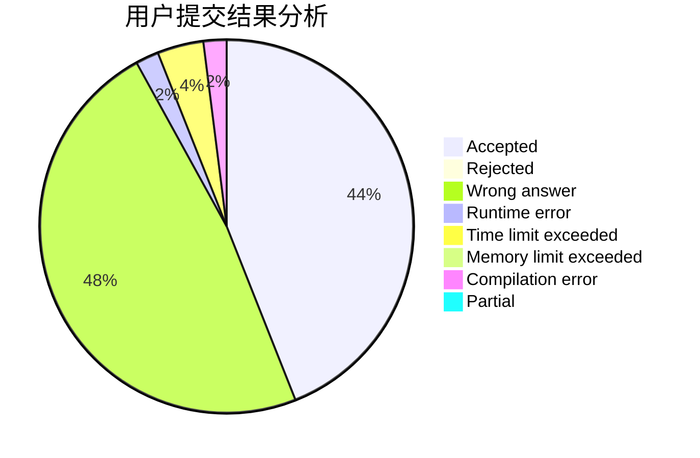
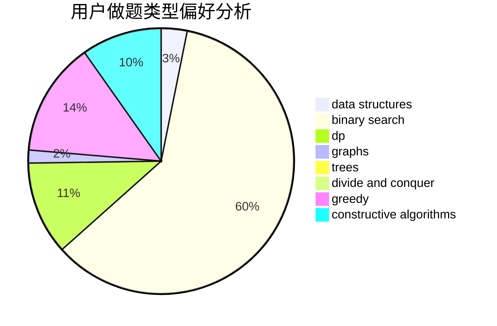
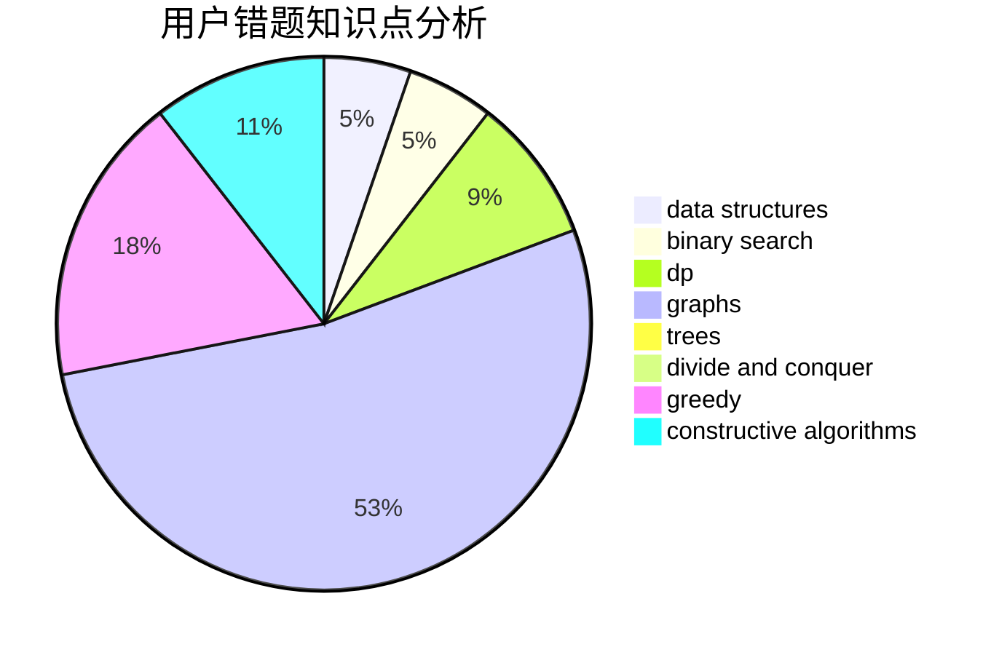

# butflfe

<!-- tabs:start -->

#### **用户提交结果分析**

#### **用户做题类型偏好分析**

#### **用户错题知识点分析**

<!-- tabs:end -->
# 推荐题目
[124A](https://codeforces.com/contest/124/problem/A)		math		  
[381B](https://codeforces.com/contest/381/problem/B)		greedy,
                        implementation,
                        sortings		  
[1055B](https://codeforces.com/contest/1055/problem/B)		dsu,
                        implementation		  
[1136D](https://codeforces.com/contest/1136/problem/D)		greedy		  
[766B](https://codeforces.com/contest/766/problem/B)		constructive algorithms,
                        geometry,
                        greedy,
                        math,
                        number theory,
                        sortings		  
[1051G](https://codeforces.com/contest/1051/problem/G)		data structures,
                        dsu,
                        greedy		  
[378B](https://codeforces.com/contest/378/problem/B)		implementation,
                        sortings		  
[946C](https://codeforces.com/contest/946/problem/C)		greedy,
                        strings		  
[1380A](https://codeforces.com/contest/1380/problem/A)		brute force,
                        data structures		  
[1017D](https://codeforces.com/contest/1017/problem/D)		bitmasks,
                        brute force,
                        data structures		  
