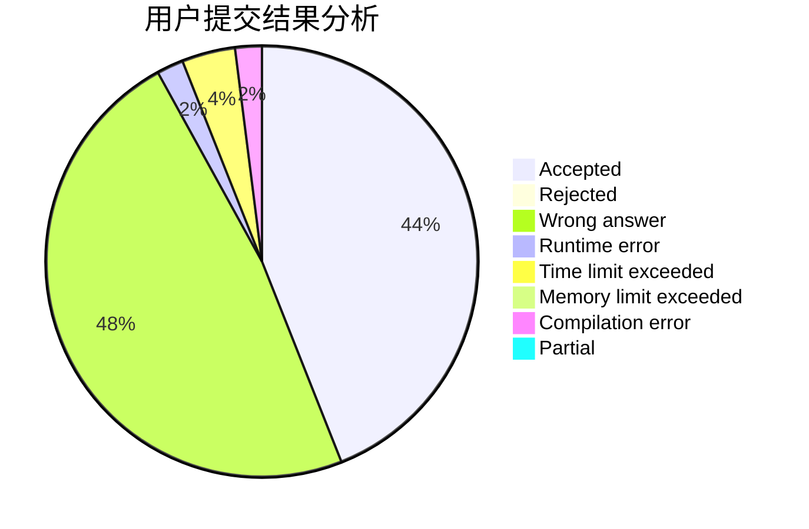
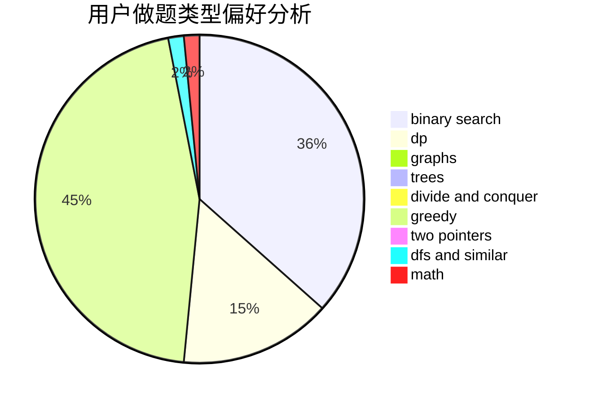

# butflfe

<!-- tabs:start -->

#### **用户提交结果分析**

#### **用户做题类型偏好分析**

<!-- tabs:end -->
# 推荐题目
[124A](https://codeforces.com/contest/124/problem/A)
[381B](https://codeforces.com/contest/381/problem/B)
[1055B](https://codeforces.com/contest/1055/problem/B)
[1136D](https://codeforces.com/contest/1136/problem/D)
[766B](https://codeforces.com/contest/766/problem/B)
[1051G](https://codeforces.com/contest/1051/problem/G)
[378B](https://codeforces.com/contest/378/problem/B)
[946C](https://codeforces.com/contest/946/problem/C)
[1380A](https://codeforces.com/contest/1380/problem/A)
[1017D](https://codeforces.com/contest/1017/problem/D)
