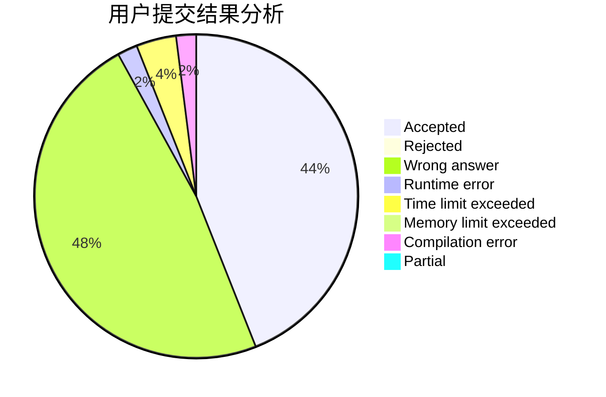
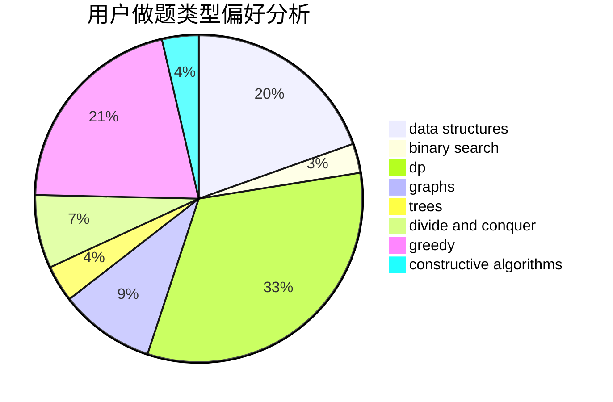
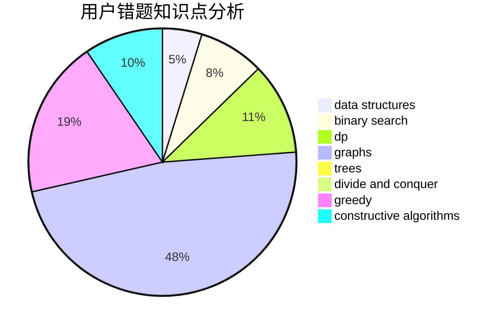

# butflfe

<!-- tabs:start -->

#### **用户提交结果分析**

#### **用户做题类型偏好分析**

#### **用户错题知识点分析**

<!-- tabs:end -->
# 推荐题目
[1244E](https://codeforces.com/contest/1244/problem/E)		binary search,
                        constructive algorithms,
                        greedy,
                        sortings,
                        ternary search,
                        two pointers		  
[356C](https://codeforces.com/contest/356/problem/C)		combinatorics,
                        constructive algorithms,
                        greedy,
                        implementation		  
[1054G](https://codeforces.com/contest/1054/problem/G)		constructive algorithms,
                        greedy,
                        math		  
[1132E](https://codeforces.com/contest/1132/problem/E)		dfs and similar,
                        dp,
                        greedy		  
[746F](https://codeforces.com/contest/746/problem/F)		data structures,
                        greedy,
                        two pointers		  
[1051D](https://codeforces.com/contest/1051/problem/D)		bitmasks,
                        dp		  
[351E](https://codeforces.com/contest/351/problem/E)		greedy		  
[922C](https://codeforces.com/contest/922/problem/C)		brute force,
                        number theory		  
[1371C](https://codeforces.com/contest/1371/problem/C)		greedy,
                        implementation,
                        math		  
[1017A](https://codeforces.com/contest/1017/problem/A)		implementation		  
