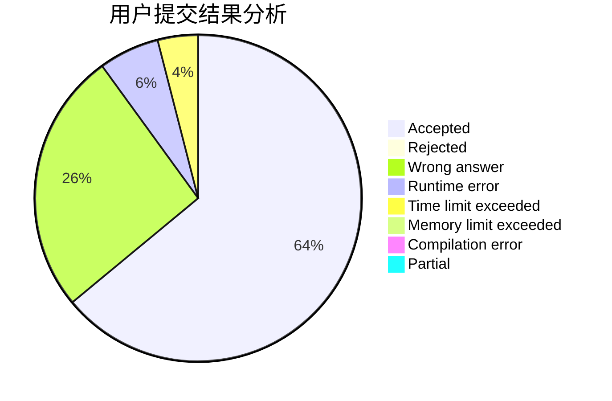
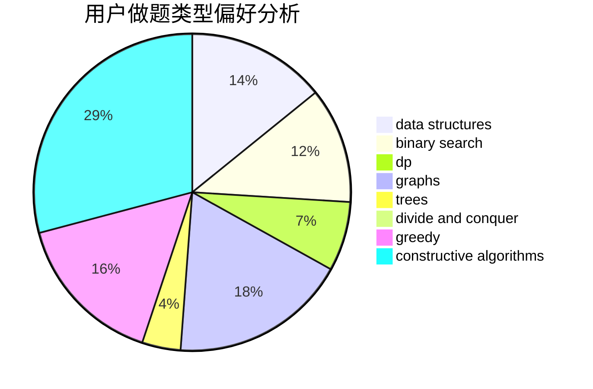
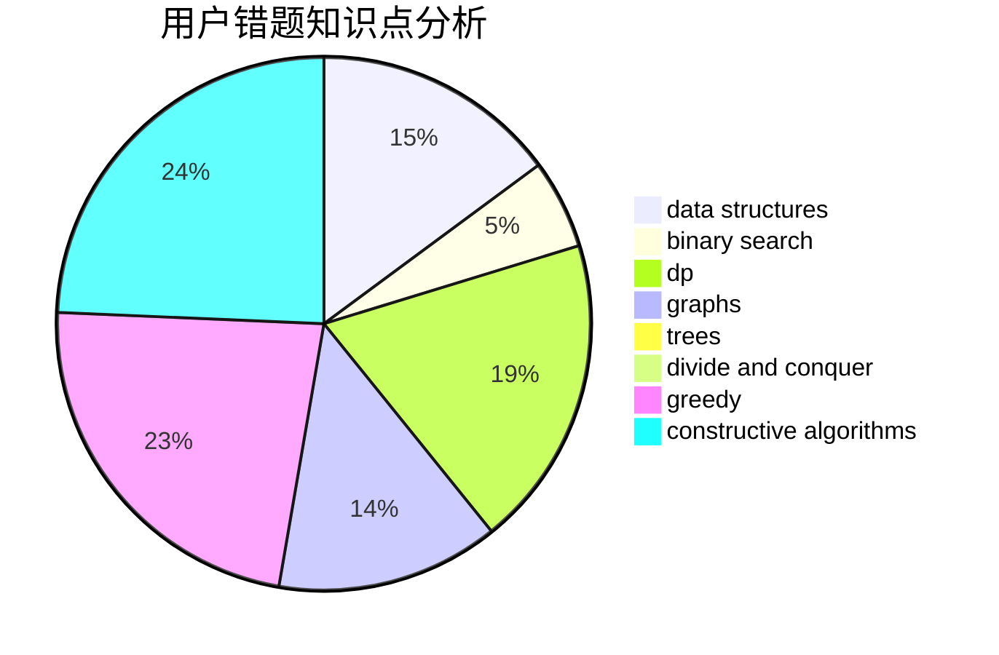

# buttersky

<!-- tabs:start -->

#### **用户提交结果分析**

#### **用户做题类型偏好分析**

#### **用户错题知识点分析**

<!-- tabs:end -->
# 推荐题目
[653C](https://codeforces.com/contest/653/problem/C)		brute force,
                        implementation		  
[1075A](https://codeforces.com/contest/1075/problem/A)		implementation,
                        math		  
[462A](https://codeforces.com/contest/462/problem/A)		brute force,
                        implementation		  
[778D](https://codeforces.com/contest/778/problem/D)		constructive algorithms		  
[412D](https://codeforces.com/contest/412/problem/D)		dfs and similar		  
[102A](https://codeforces.com/contest/102/problem/A)		brute force		  
[1276D](https://codeforces.com/contest/1276/problem/D)		dp,
                        trees		  
[1336D](https://codeforces.com/contest/1336/problem/D)		constructive algorithms,
                        interactive		  
[1042D](https://codeforces.com/contest/1042/problem/D)		data structures,
                        divide and conquer,
                        two pointers		  
[1195C](https://codeforces.com/contest/1195/problem/C)		dp		  
