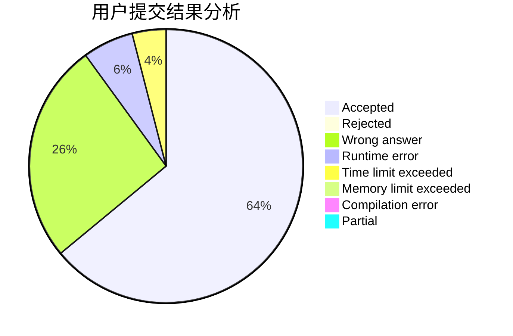
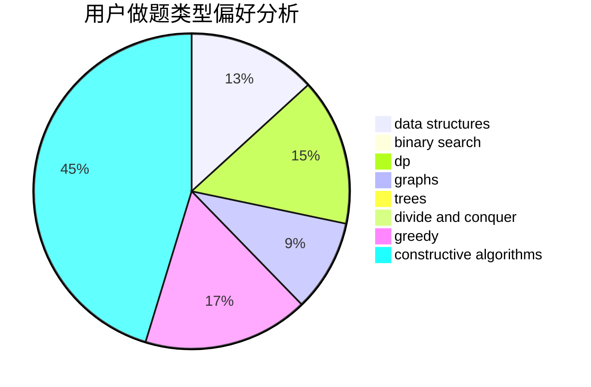
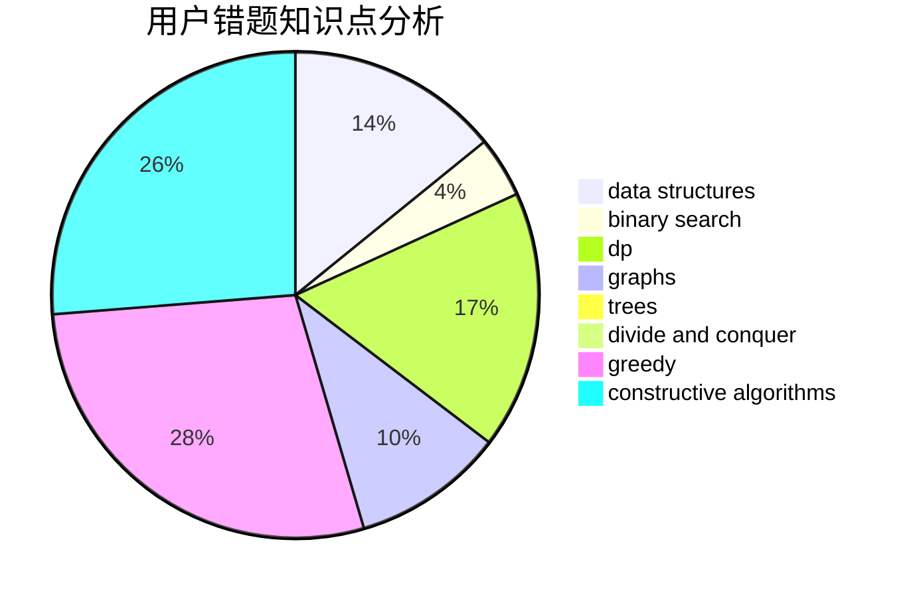

# buttersky

<!-- tabs:start -->

#### **用户提交结果分析**

#### **用户做题类型偏好分析**

#### **用户错题知识点分析**

<!-- tabs:end -->
# 推荐题目
[627C](https://codeforces.com/contest/627/problem/C)		data structures,
                        divide and conquer,
                        greedy		  
[1074A](https://codeforces.com/contest/1074/problem/A)		dsu,graphs,sortings,trees		  
[441C](https://codeforces.com/contest/441/problem/C)		constructive algorithms,
                        dfs and similar,
                        implementation		  
[759B](https://codeforces.com/contest/759/problem/B)		dsu,graphs,sortings,trees		  
[380E](https://codeforces.com/contest/380/problem/E)		data structures		  
[1029D](https://codeforces.com/contest/1029/problem/D)		implementation,
                        math		  
[1267I](https://codeforces.com/contest/1267/problem/I)		brute force,
                        constructive algorithms,
                        implementation,
                        interactive,
                        sortings		  
[1330D](https://codeforces.com/contest/1330/problem/D)		dsu,graphs,sortings,trees		  
[1042A](https://codeforces.com/contest/1042/problem/A)		binary search,
                        implementation		  
[118C](https://codeforces.com/contest/118/problem/C)		brute force,
                        greedy,
                        sortings,
                        strings		  
