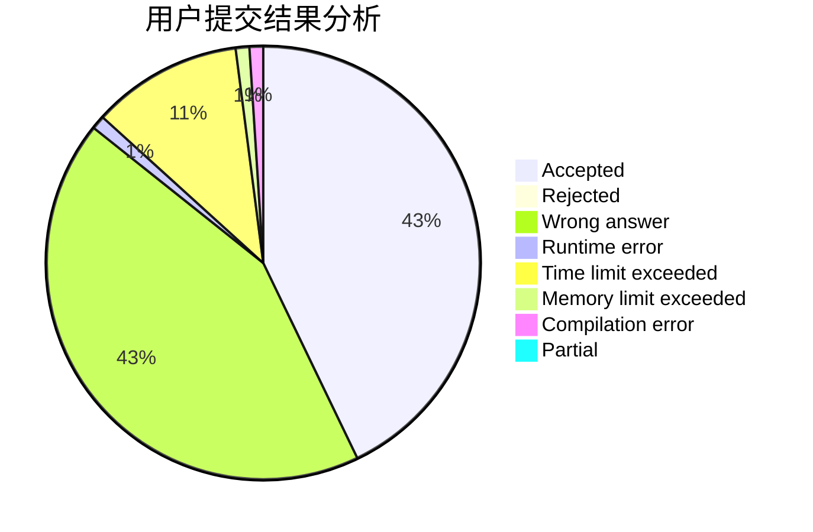
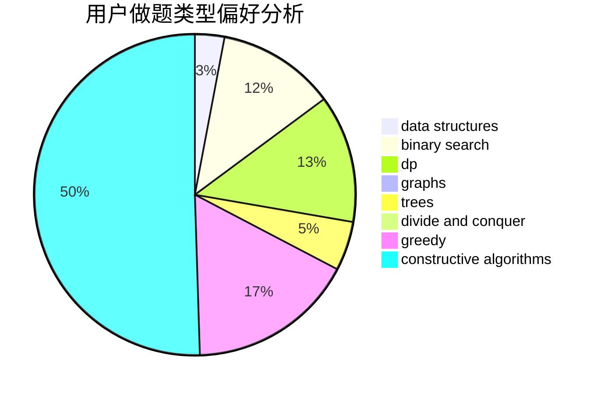
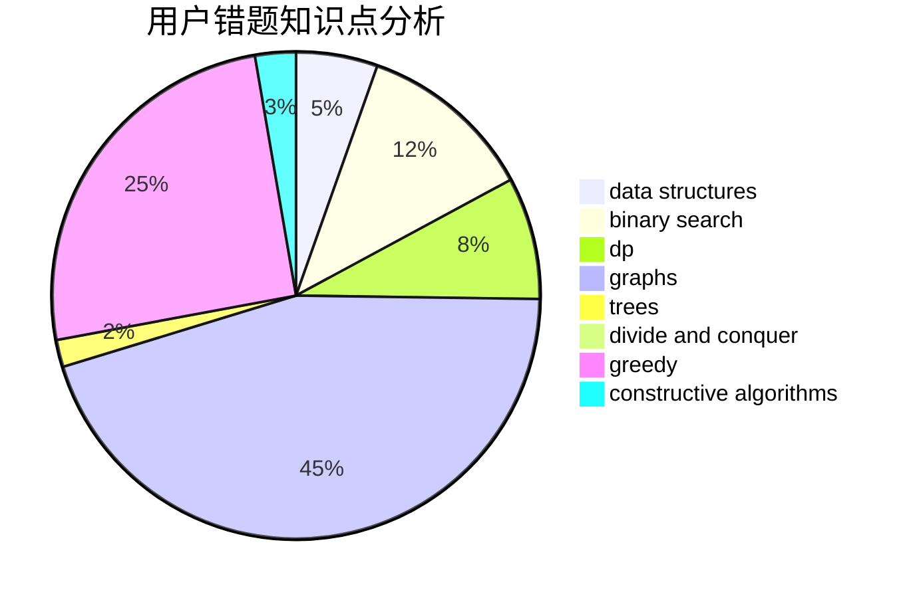

# bwxnQAQ

<!-- tabs:start -->

#### **用户提交结果分析**

#### **用户做题类型偏好分析**

#### **用户错题知识点分析**

<!-- tabs:end -->
# 推荐题目
[295C](https://codeforces.com/contest/295/problem/C)		combinatorics,
                        dp,
                        graphs,
                        shortest paths		  
[618B](https://codeforces.com/contest/618/problem/B)		constructive algorithms		  
[236D](https://codeforces.com/contest/236/problem/D)		dsu,graphs,sortings,trees		  
[1108E2](https://codeforces.com/contest/1108E/problem/2)		data structures,
                        implementation		  
[1016A](https://codeforces.com/contest/1016/problem/A)		greedy,
                        implementation,
                        math		  
[1092B](https://codeforces.com/contest/1092/problem/B)		sortings		  
[1096B](https://codeforces.com/contest/1096/problem/B)		combinatorics,
                        math,
                        strings		  
[782D](https://codeforces.com/contest/782/problem/D)		dsu,graphs,sortings,trees		  
[58C](https://codeforces.com/contest/58/problem/C)		brute force		  
[956F](https://codeforces.com/contest/956/problem/F)		dsu,graphs,sortings,trees		  
