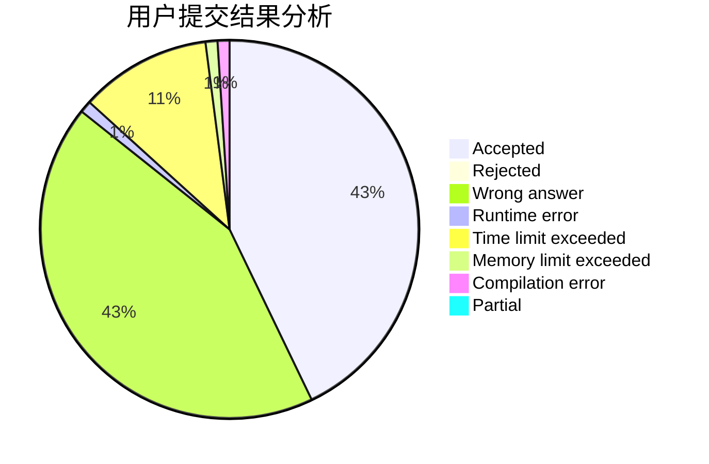
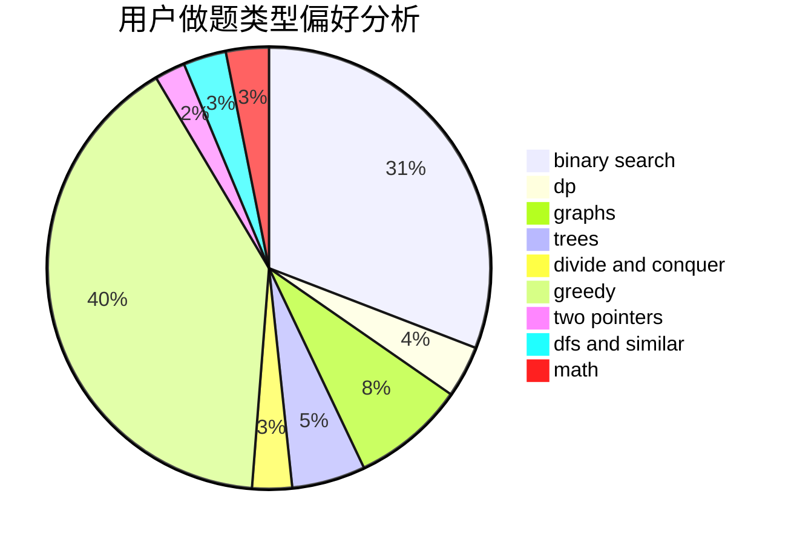

# bwxnQAQ

<!-- tabs:start -->

#### **用户提交结果分析**

#### **用户做题类型偏好分析**

<!-- tabs:end -->
# 推荐题目
[312A](https://codeforces.com/contest/312/problem/A)
[638A](https://codeforces.com/contest/638/problem/A)
[25A](https://codeforces.com/contest/25/problem/A)
[1109B](https://codeforces.com/contest/1109/problem/B)
[1016D](https://codeforces.com/contest/1016/problem/D)
[1092E](https://codeforces.com/contest/1092/problem/E)
[1096E](https://codeforces.com/contest/1096/problem/E)
[800C](https://codeforces.com/contest/800/problem/C)
[609D](https://codeforces.com/contest/609/problem/D)
[978C](https://codeforces.com/contest/978/problem/C)
