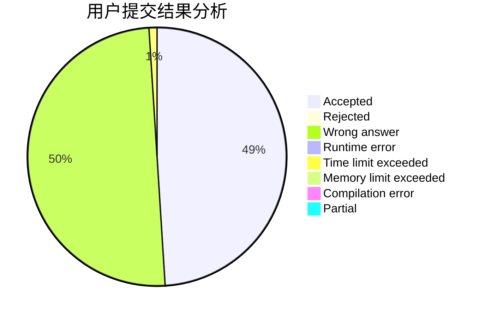
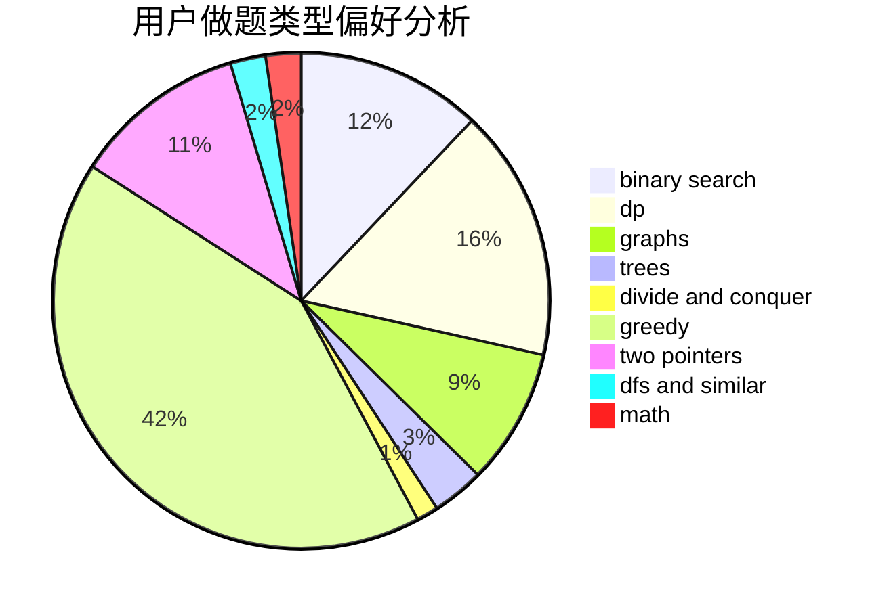

# byene

<!-- tabs:start -->

#### **用户提交结果分析**

#### **用户做题类型偏好分析**

<!-- tabs:end -->
# 推荐题目
[1471A](https://codeforces.com/contest/1471/problem/A)
[845C](https://codeforces.com/contest/845/problem/C)
[792E](https://codeforces.com/contest/792/problem/E)
[249E](https://codeforces.com/contest/249/problem/E)
[77B](https://codeforces.com/contest/77/problem/B)
[1009E](https://codeforces.com/contest/1009/problem/E)
[319A](https://codeforces.com/contest/319/problem/A)
[774C](https://codeforces.com/contest/774/problem/C)
[1314D](https://codeforces.com/contest/1314/problem/D)
[1167D](https://codeforces.com/contest/1167/problem/D)
