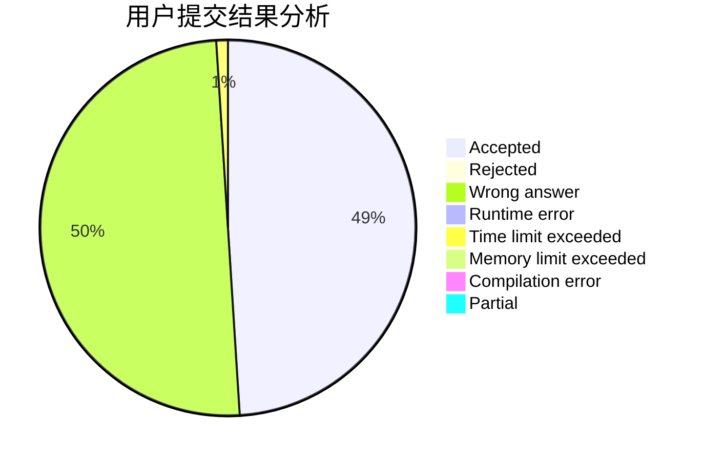
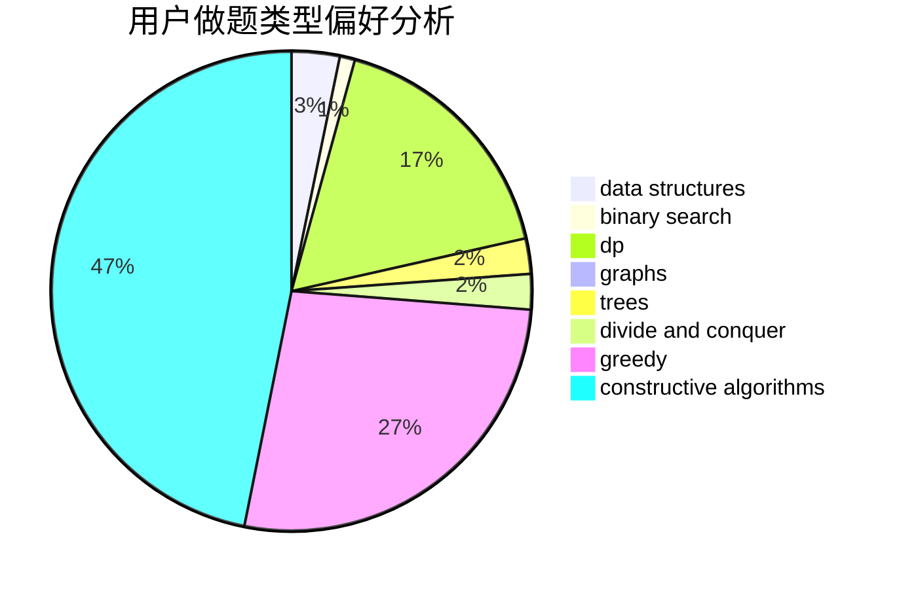
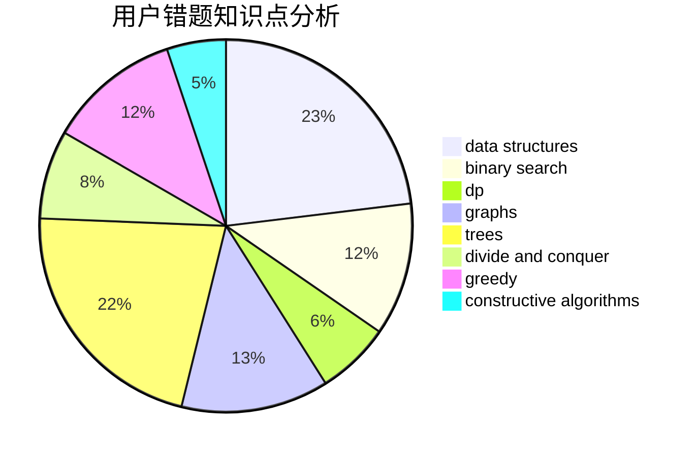

# byene

<!-- tabs:start -->

#### **用户提交结果分析**

#### **用户做题类型偏好分析**

#### **用户错题知识点分析**

<!-- tabs:end -->
# 推荐题目
[1463F](https://codeforces.com/contest/1463/problem/F)		bitmasks,
                        dp,
                        math		  
[825G](https://codeforces.com/contest/825/problem/G)		dfs and similar,
                        graphs,
                        trees		  
[773E](https://codeforces.com/contest/773/problem/E)		data structures,
                        sortings		  
[229D](https://codeforces.com/contest/229/problem/D)		dp,
                        greedy,
                        two pointers		  
[75D](https://codeforces.com/contest/75/problem/D)		data structures,
                        dp,
                        greedy,
                        implementation,
                        math,
                        trees		  
[1009B](https://codeforces.com/contest/1009/problem/B)		greedy,
                        implementation		  
[300C](https://codeforces.com/contest/300/problem/C)		brute force,
                        combinatorics		  
[755F](https://codeforces.com/contest/755/problem/F)		bitmasks,
                        dp,
                        greedy		  
[1305E](https://codeforces.com/contest/1305/problem/E)		constructive algorithms,
                        greedy,
                        implementation,
                        math		  
[1165B](https://codeforces.com/contest/1165/problem/B)		data structures,
                        greedy,
                        sortings		  
