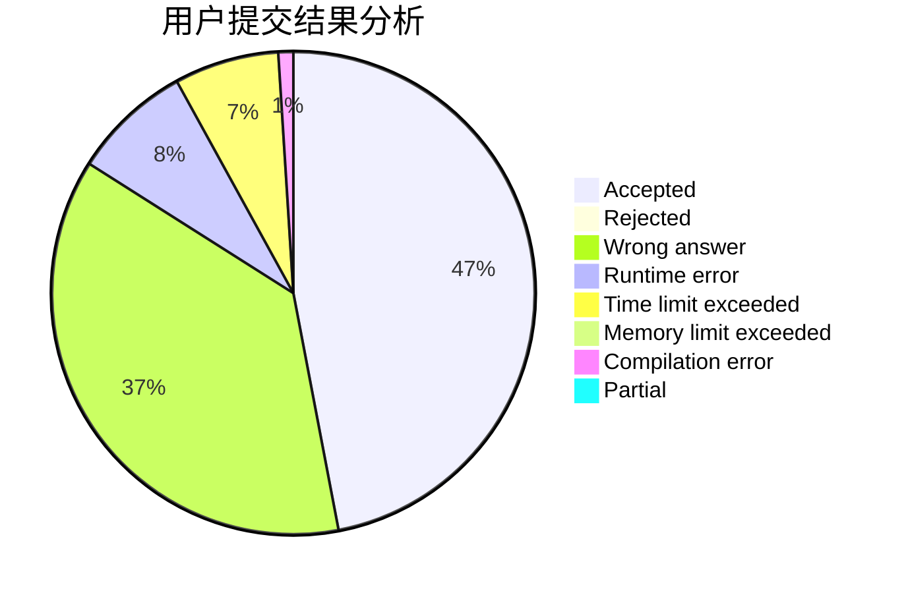
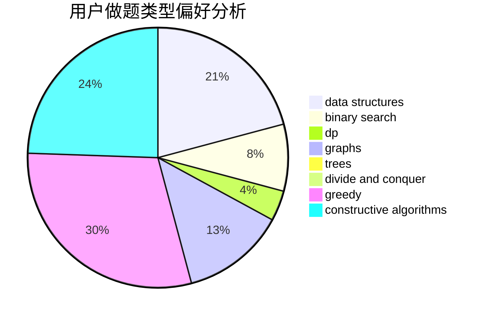
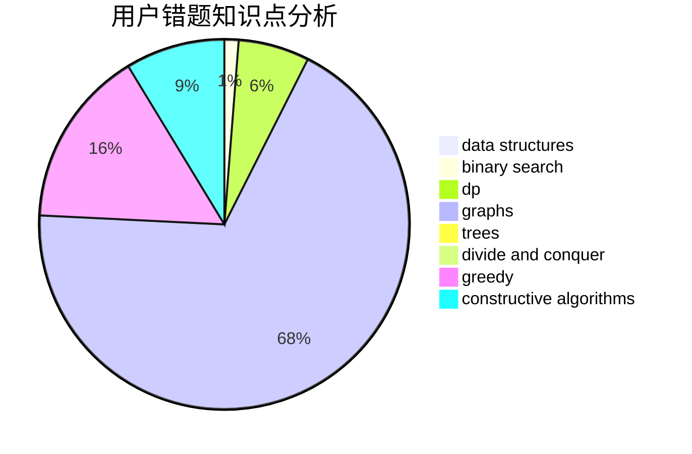

# c20201807

<!-- tabs:start -->

#### **用户提交结果分析**

#### **用户做题类型偏好分析**

#### **用户错题知识点分析**

<!-- tabs:end -->
# 推荐题目
[1472C](https://codeforces.com/contest/1472/problem/C)		dp,
                        graphs		  
[727C](https://codeforces.com/contest/727/problem/C)		constructive algorithms,
                        interactive,
                        math		  
[1300A](https://codeforces.com/contest/1300/problem/A)		implementation,
                        math		  
[1033F](https://codeforces.com/contest/1033/problem/F)		bitmasks,
                        brute force,
                        fft,
                        math		  
[1033G](https://codeforces.com/contest/1033/problem/G)		games		  
[1093C](https://codeforces.com/contest/1093/problem/C)		greedy		  
[939E](https://codeforces.com/contest/939/problem/E)		binary search,
                        greedy,
                        ternary search,
                        two pointers		  
[634B](https://codeforces.com/contest/634/problem/B)		dsu,graphs,sortings,trees		  
[139A](https://codeforces.com/contest/139/problem/A)		implementation		  
[240E](https://codeforces.com/contest/240/problem/E)		dfs and similar,
                        graphs,
                        greedy		  
