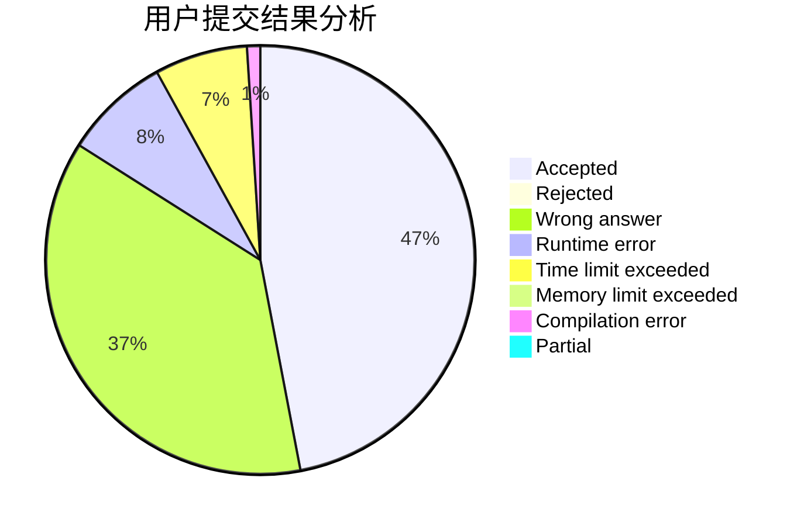
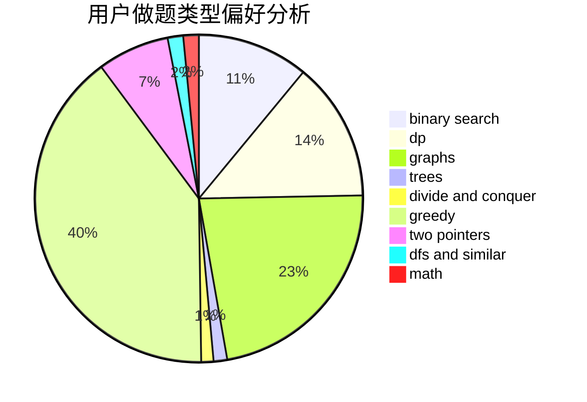

# c20201807

<!-- tabs:start -->

#### **用户提交结果分析**

#### **用户做题类型偏好分析**

<!-- tabs:end -->
# 推荐题目
[1472C](https://codeforces.com/contest/1472/problem/C)
[727C](https://codeforces.com/contest/727/problem/C)
[1300A](https://codeforces.com/contest/1300/problem/A)
[1033F](https://codeforces.com/contest/1033/problem/F)
[1033G](https://codeforces.com/contest/1033/problem/G)
[1093C](https://codeforces.com/contest/1093/problem/C)
[939E](https://codeforces.com/contest/939/problem/E)
[634B](https://codeforces.com/contest/634/problem/B)
[139A](https://codeforces.com/contest/139/problem/A)
[240E](https://codeforces.com/contest/240/problem/E)
