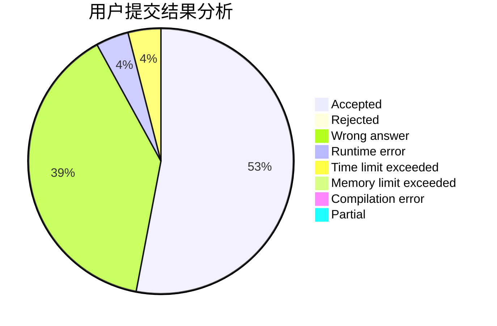
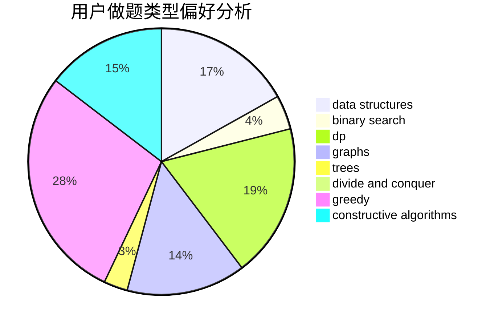
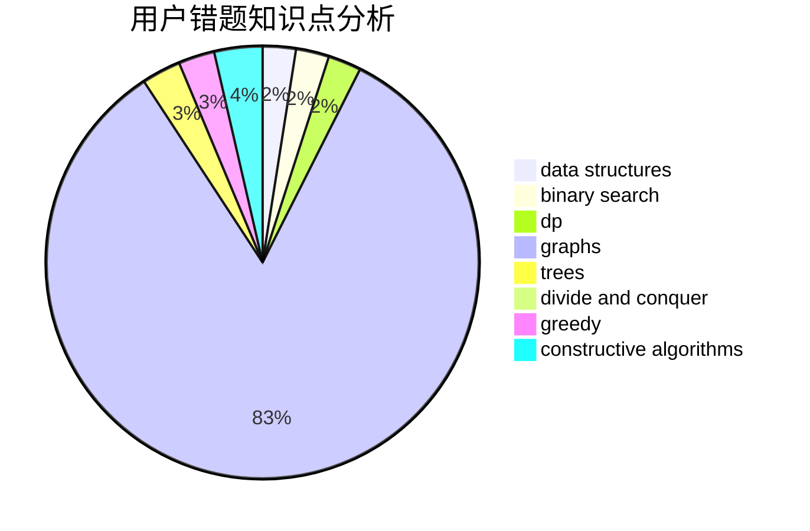

# c4Lnn

<!-- tabs:start -->

#### **用户提交结果分析**

#### **用户做题类型偏好分析**

#### **用户错题知识点分析**

<!-- tabs:end -->
# 推荐题目
[1105B](https://codeforces.com/contest/1105/problem/B)		brute force,
                        implementation,
                        strings		  
[633F](https://codeforces.com/contest/633/problem/F)		dfs and similar,
                        dp,
                        graphs,
                        trees		  
[622F](https://codeforces.com/contest/622/problem/F)		math		  
[383A](https://codeforces.com/contest/383/problem/A)		data structures,
                        greedy		  
[611C](https://codeforces.com/contest/611/problem/C)		dp,
                        implementation		  
[313E](https://codeforces.com/contest/313/problem/E)		constructive algorithms,
                        data structures,
                        dsu,
                        greedy		  
[781C](https://codeforces.com/contest/781/problem/C)		dsu,graphs,sortings,trees		  
[329E](https://codeforces.com/contest/329/problem/E)		math		  
[1184E3](https://codeforces.com/contest/1184E/problem/3)		data structures,
                        dsu,
                        graphs,
                        trees		  
[1059B](https://codeforces.com/contest/1059/problem/B)		implementation		  
