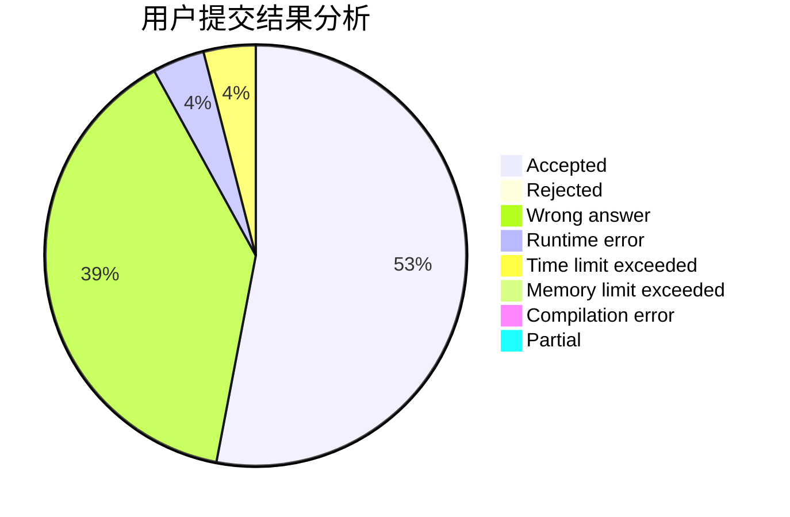
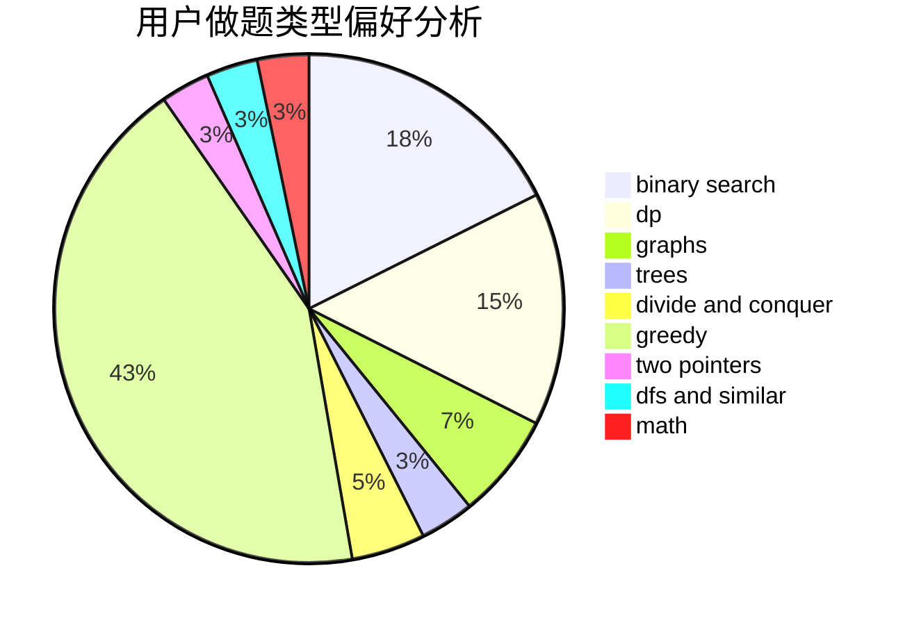

# c4Lnn

<!-- tabs:start -->

#### **用户提交结果分析**

#### **用户做题类型偏好分析**

<!-- tabs:end -->
# 推荐题目
[1105E](https://codeforces.com/contest/1105/problem/E)
[666A](https://codeforces.com/contest/666/problem/A)
[650E](https://codeforces.com/contest/650/problem/E)
[414B](https://codeforces.com/contest/414/problem/B)
[630F](https://codeforces.com/contest/630/problem/F)
[338D](https://codeforces.com/contest/338/problem/D)
[7A](https://codeforces.com/contest/7/problem/A)
[357B](https://codeforces.com/contest/357/problem/B)
[1188E](https://codeforces.com/contest/1188/problem/E)
[1059E](https://codeforces.com/contest/1059/problem/E)
