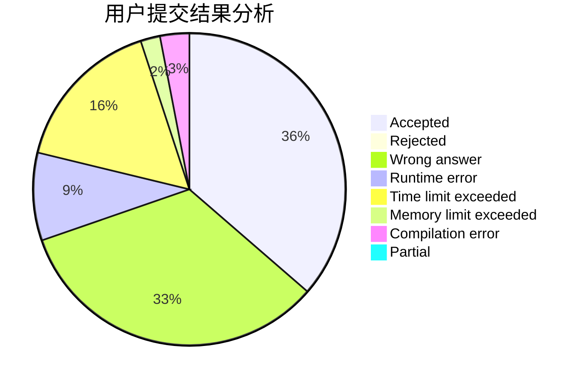
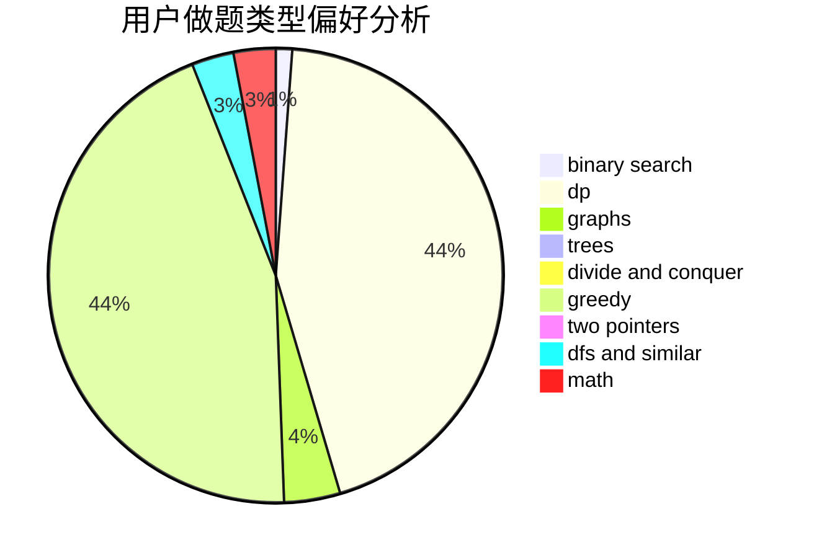

# ca0yang1123

<!-- tabs:start -->

#### **用户提交结果分析**

#### **用户做题类型偏好分析**

<!-- tabs:end -->
# 推荐题目
[1044D](https://codeforces.com/contest/1044/problem/D)
[1113D](https://codeforces.com/contest/1113/problem/D)
[1279F](https://codeforces.com/contest/1279/problem/F)
[521B](https://codeforces.com/contest/521/problem/B)
[26D](https://codeforces.com/contest/26/problem/D)
[377B](https://codeforces.com/contest/377/problem/B)
[548C](https://codeforces.com/contest/548/problem/C)
[1073B](https://codeforces.com/contest/1073/problem/B)
[884D](https://codeforces.com/contest/884/problem/D)
[477B](https://codeforces.com/contest/477/problem/B)
