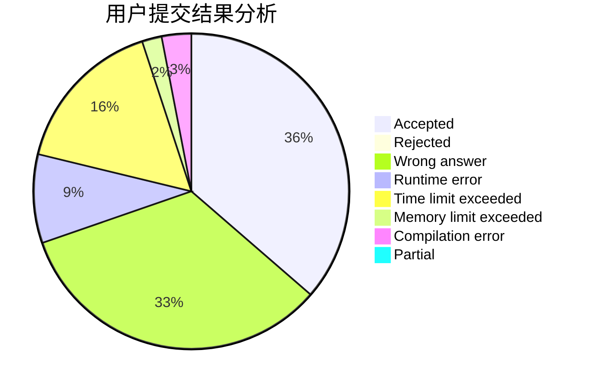
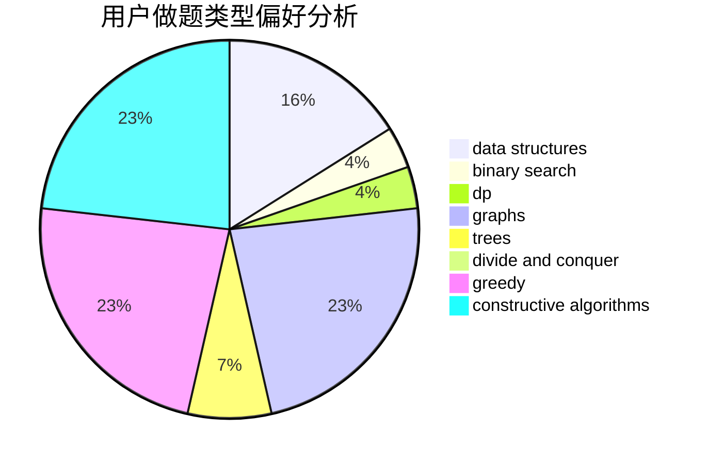

# ca0yang1123

<!-- tabs:start -->

#### **用户提交结果分析**

#### **用户做题类型偏好分析**

#### **用户错题知识点分析**

<!-- tabs:end -->
# 推荐题目
[1044D](https://codeforces.com/contest/1044/problem/D)		data structures,
                        dsu		  
[1113D](https://codeforces.com/contest/1113/problem/D)		dsu,graphs,sortings,trees		  
[1279F](https://codeforces.com/contest/1279/problem/F)		binary search,
                        dp		  
[521B](https://codeforces.com/contest/521/problem/B)		dsu,graphs,sortings,trees		  
[26D](https://codeforces.com/contest/26/problem/D)		combinatorics,
                        math,
                        probabilities		  
[377B](https://codeforces.com/contest/377/problem/B)		binary search,
                        data structures,
                        greedy,
                        sortings		  
[548C](https://codeforces.com/contest/548/problem/C)		dsu,graphs,sortings,trees		  
[1073B](https://codeforces.com/contest/1073/problem/B)		implementation,
                        math		  
[884D](https://codeforces.com/contest/884/problem/D)		data structures,
                        greedy		  
[477B](https://codeforces.com/contest/477/problem/B)		dsu,graphs,sortings,trees		  
