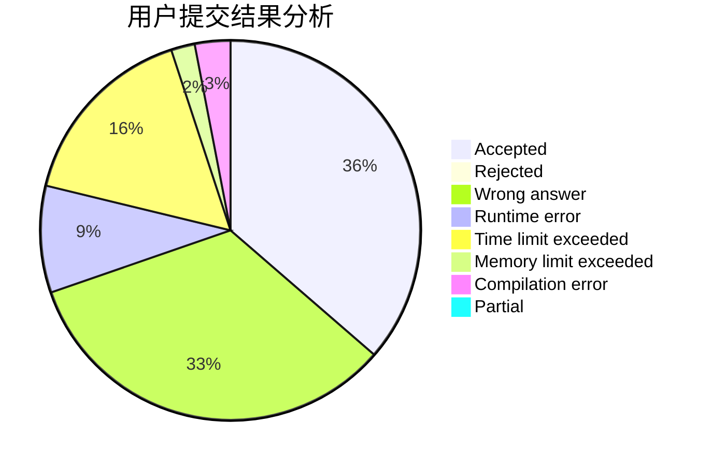
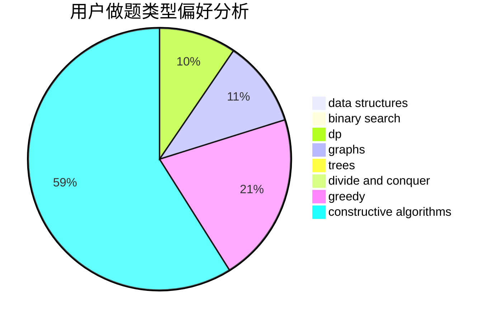

# ca0yang1123

<!-- tabs:start -->

#### **用户提交结果分析**

#### **用户做题类型偏好分析**

#### **用户错题知识点分析**

<!-- tabs:end -->
# 推荐题目
[1043G](https://codeforces.com/contest/1043/problem/G)		data structures,
                        divide and conquer,
                        hashing,
                        string suffix structures,
                        strings		  
[1113A](https://codeforces.com/contest/1113/problem/A)		dp,
                        greedy,
                        math		  
[1270F](https://codeforces.com/contest/1270/problem/F)		math,
                        strings		  
[500B](https://codeforces.com/contest/500/problem/B)		dfs and similar,
                        dsu,
                        graphs,
                        greedy,
                        math,
                        sortings		  
[253A](https://codeforces.com/contest/253/problem/A)		greedy		  
[34D](https://codeforces.com/contest/34/problem/D)		dfs and similar,
                        graphs		  
[523D](https://codeforces.com/contest/523/problem/D)		*special problem,
                        data structures,
                        implementation		  
[1072C](https://codeforces.com/contest/1072/problem/C)		dsu,graphs,sortings,trees		  
[865A](https://codeforces.com/contest/865/problem/A)		constructive algorithms		  
[456B](https://codeforces.com/contest/456/problem/B)		math,
                        number theory		  
