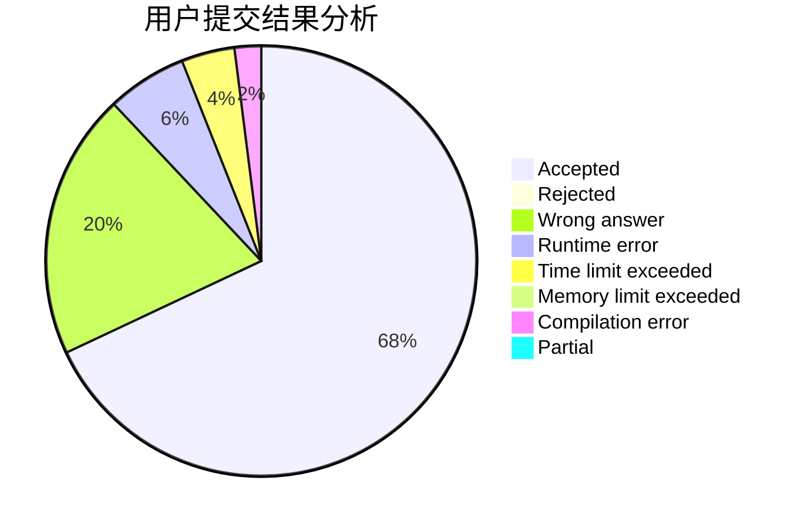
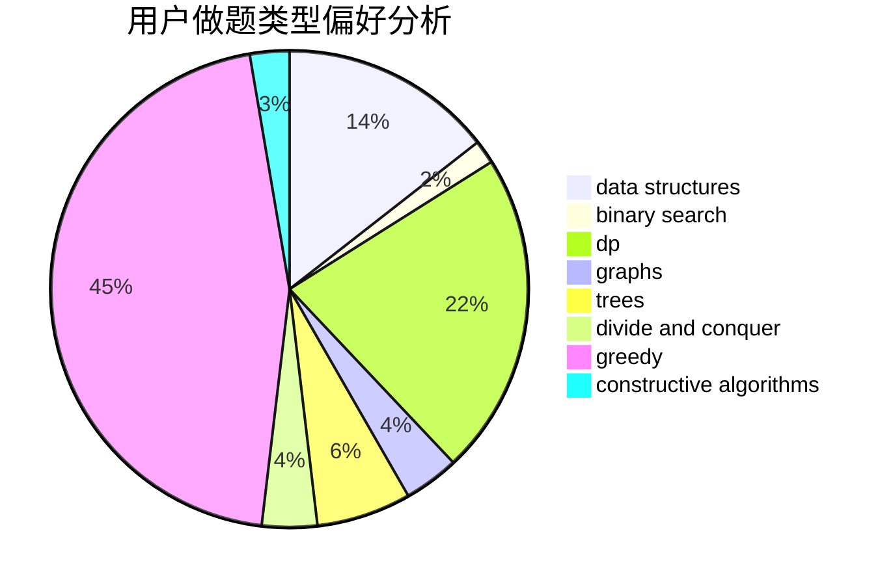
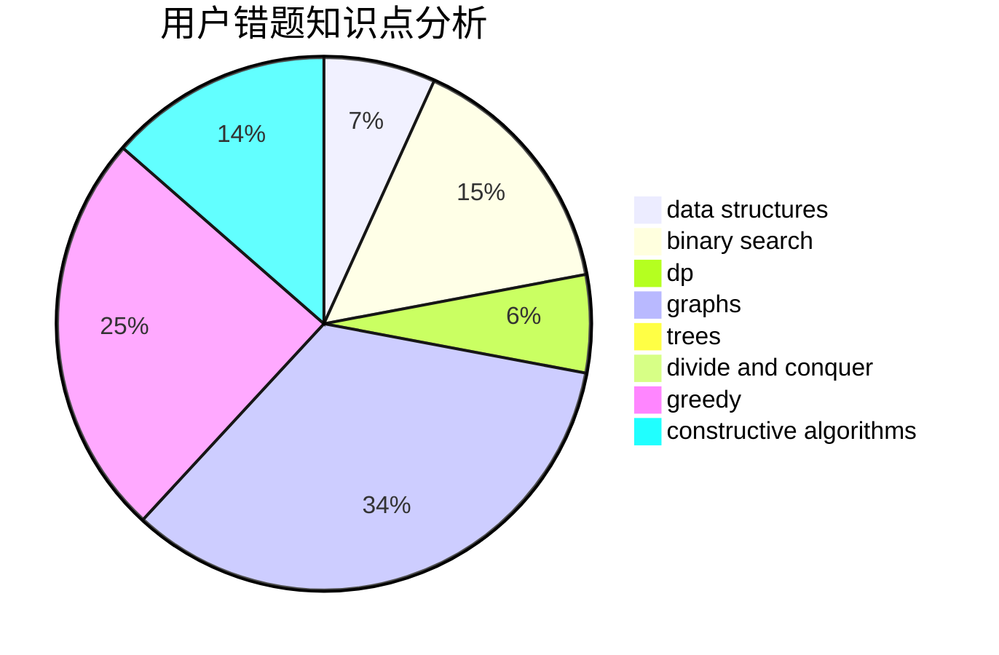

# caeious

<!-- tabs:start -->

#### **用户提交结果分析**

#### **用户做题类型偏好分析**

#### **用户错题知识点分析**

<!-- tabs:end -->
# 推荐题目
[895B](https://codeforces.com/contest/895/problem/B)		binary search,
                        math,
                        sortings,
                        two pointers		  
[827A](https://codeforces.com/contest/827/problem/A)		data structures,
                        greedy,
                        sortings,
                        strings		  
[656F](https://codeforces.com/contest/656/problem/F)		*special problem		  
[246C](https://codeforces.com/contest/246/problem/C)		brute force,
                        constructive algorithms,
                        greedy		  
[73B](https://codeforces.com/contest/73/problem/B)		binary search,
                        greedy,
                        sortings		  
[843B](https://codeforces.com/contest/843/problem/B)		brute force,
                        interactive,
                        probabilities		  
[1249F](https://codeforces.com/contest/1249/problem/F)		dp,
                        trees		  
[1334G](https://codeforces.com/contest/1334/problem/G)		bitmasks,
                        brute force,
                        fft		  
[894B](https://codeforces.com/contest/894/problem/B)		combinatorics,
                        constructive algorithms,
                        math,
                        number theory		  
[380C](https://codeforces.com/contest/380/problem/C)		data structures,
                        schedules		  
