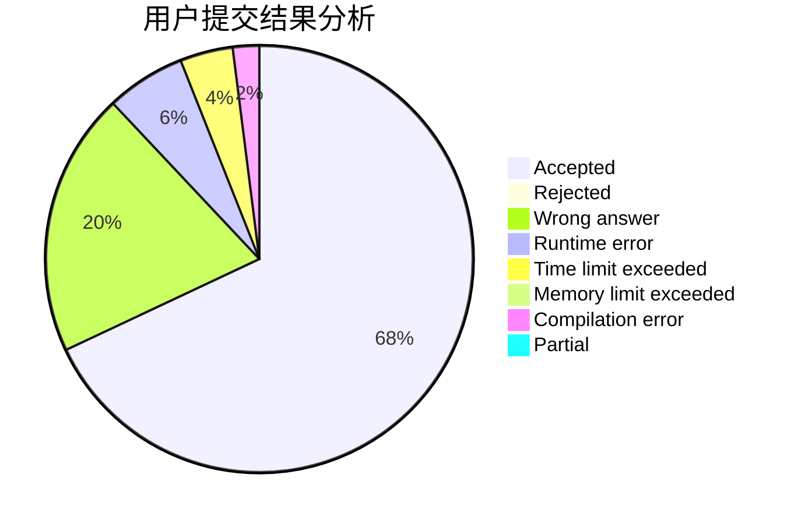
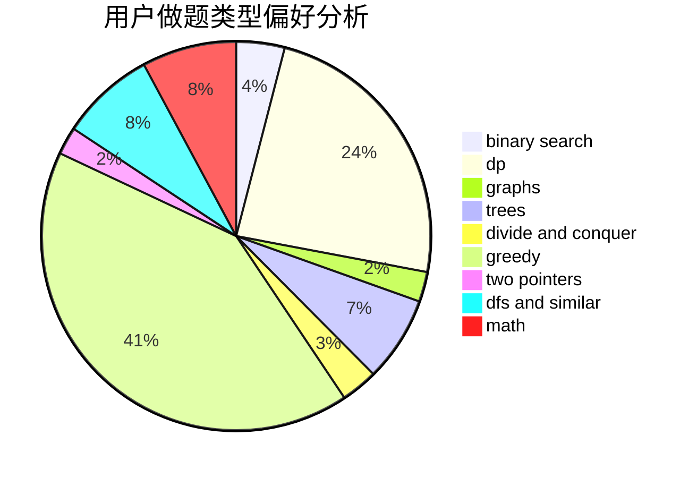

# caeious

<!-- tabs:start -->

#### **用户提交结果分析**

#### **用户做题类型偏好分析**

<!-- tabs:end -->
# 推荐题目
[912E](https://codeforces.com/contest/912/problem/E)
[845D](https://codeforces.com/contest/845/problem/D)
[678F](https://codeforces.com/contest/678/problem/F)
[266E](https://codeforces.com/contest/266/problem/E)
[760B](https://codeforces.com/contest/760/problem/B)
[862D](https://codeforces.com/contest/862/problem/D)
[1253E](https://codeforces.com/contest/1253/problem/E)
[1341F](https://codeforces.com/contest/1341/problem/F)
[912A](https://codeforces.com/contest/912/problem/A)
[411A](https://codeforces.com/contest/411/problem/A)
