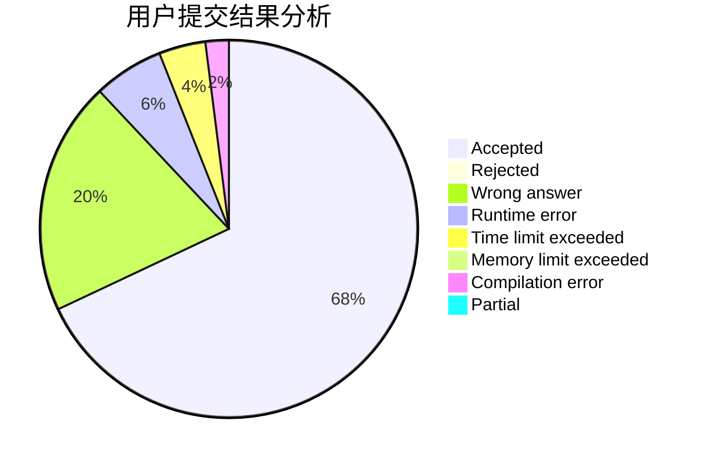
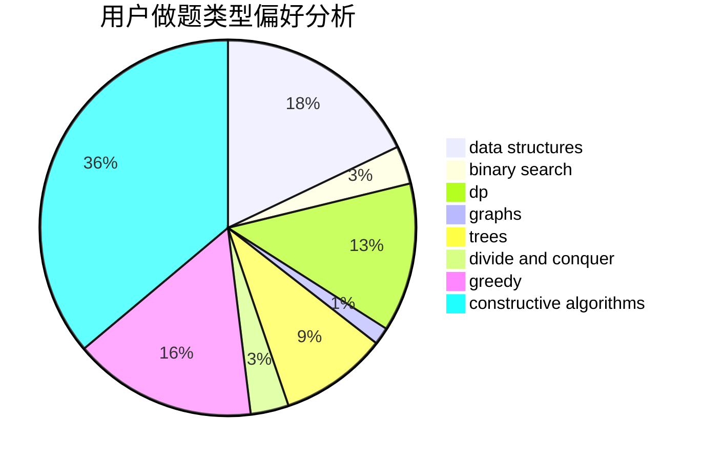

# caeious

<!-- tabs:start -->

#### **用户提交结果分析**

#### **用户做题类型偏好分析**

#### **用户错题知识点分析**

<!-- tabs:end -->
# 推荐题目
[912E](https://codeforces.com/contest/912/problem/E)		binary search,
                        dfs and similar,
                        math,
                        meet-in-the-middle,
                        number theory,
                        two pointers		  
[845D](https://codeforces.com/contest/845/problem/D)		data structures,
                        dp,
                        greedy		  
[678F](https://codeforces.com/contest/678/problem/F)		data structures,
                        divide and conquer,
                        geometry		  
[266E](https://codeforces.com/contest/266/problem/E)		data structures,
                        math		  
[760B](https://codeforces.com/contest/760/problem/B)		binary search,
                        greedy		  
[862D](https://codeforces.com/contest/862/problem/D)		binary search,
                        divide and conquer,
                        interactive		  
[1253E](https://codeforces.com/contest/1253/problem/E)		data structures,
                        dp,
                        greedy,
                        sortings		  
[1341F](https://codeforces.com/contest/1341/problem/F)		dsu,graphs,sortings,trees		  
[912A](https://codeforces.com/contest/912/problem/A)		implementation		  
[411A](https://codeforces.com/contest/411/problem/A)		*special problem,
                        implementation		  
