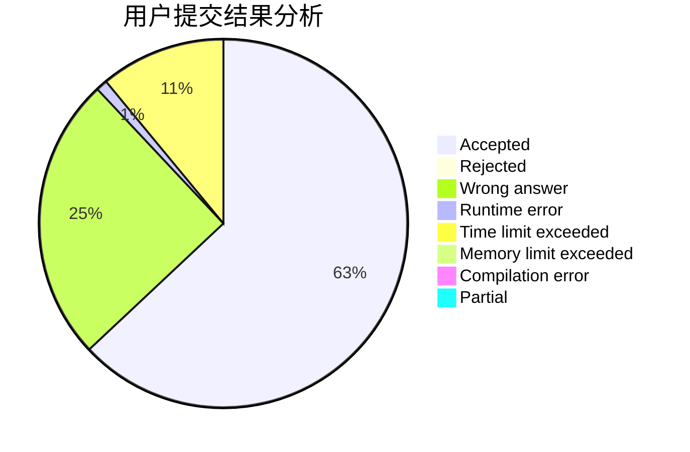
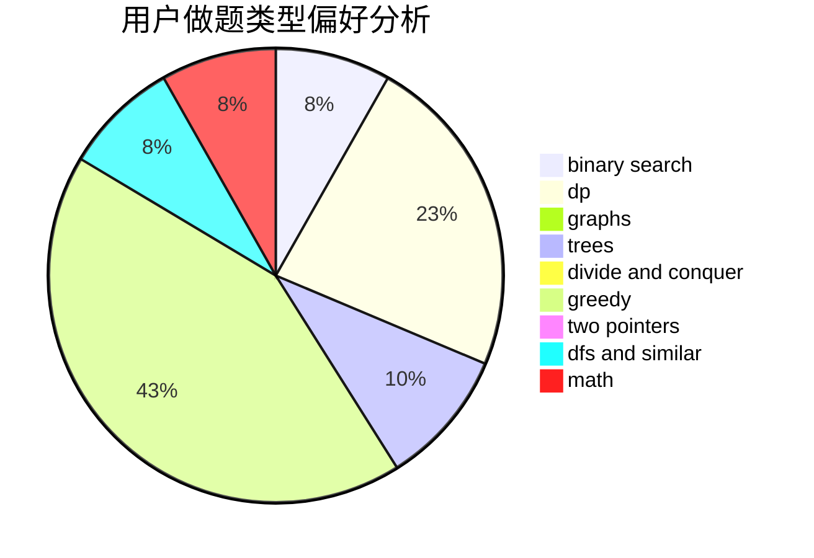

# Antimony

<!-- tabs:start -->

#### **用户提交结果分析**

#### **用户做题类型偏好分析**

<!-- tabs:end -->
# 推荐题目
[1391B](https://codeforces.com/contest/1391/problem/B)
[11301](https://codeforces.com/contest/1130/problem/1)
[1091D](https://codeforces.com/contest/1091/problem/D)
[1442E](https://codeforces.com/contest/1442/problem/E)
[1490C](https://codeforces.com/contest/1490/problem/C)
[1497B](https://codeforces.com/contest/1497/problem/B)
[1491C](https://codeforces.com/contest/1491/problem/C)
[1484C](https://codeforces.com/contest/1484/problem/C)
[1480A](https://codeforces.com/contest/1480/problem/A)
[1513C](https://codeforces.com/contest/1513/problem/C)
