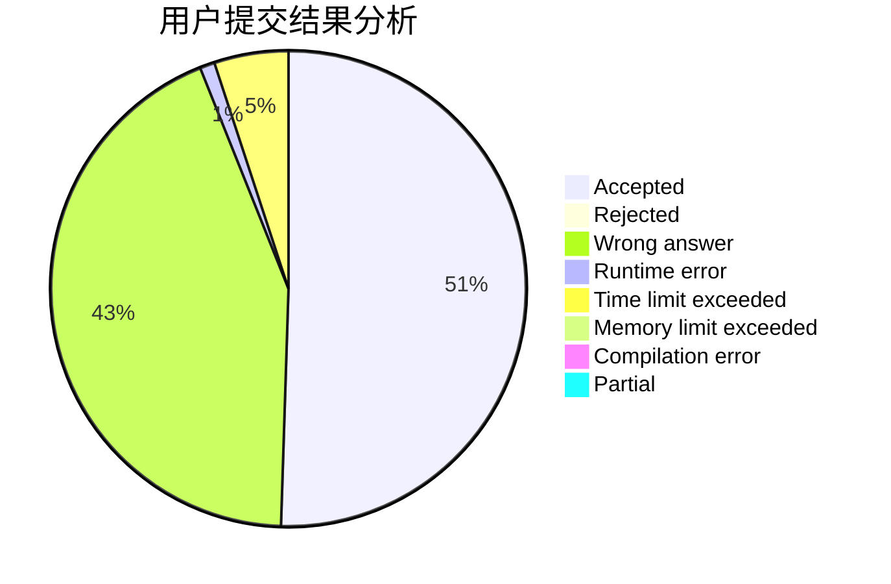
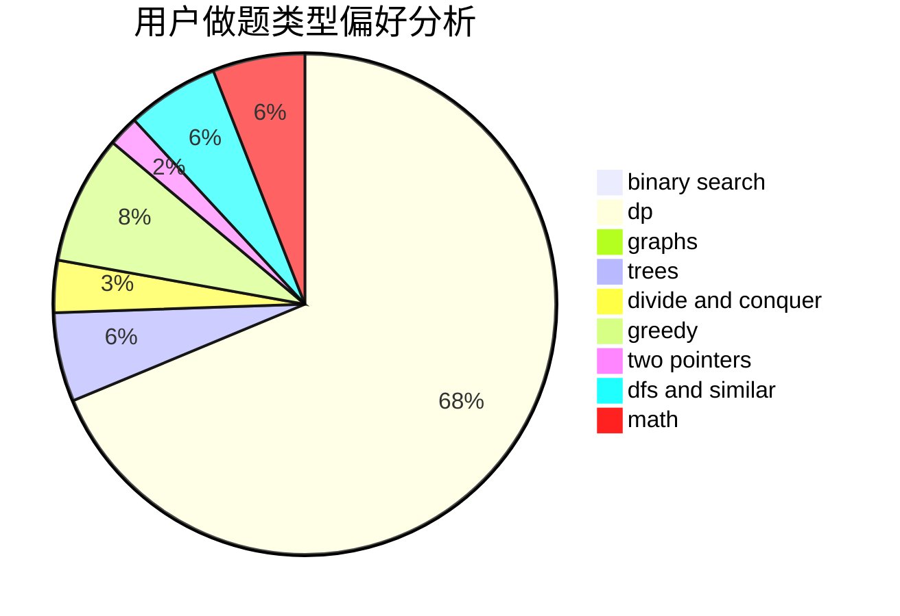

# caidd

<!-- tabs:start -->

#### **用户提交结果分析**

#### **用户做题类型偏好分析**

<!-- tabs:end -->
# 推荐题目
[1017G](https://codeforces.com/contest/1017/problem/G)
[1336D](https://codeforces.com/contest/1336/problem/D)
[955B](https://codeforces.com/contest/955/problem/B)
[318D](https://codeforces.com/contest/318/problem/D)
[1146E](https://codeforces.com/contest/1146/problem/E)
[626F](https://codeforces.com/contest/626/problem/F)
[1136D](https://codeforces.com/contest/1136/problem/D)
[798A](https://codeforces.com/contest/798/problem/A)
[271D](https://codeforces.com/contest/271/problem/D)
[12492](https://codeforces.com/contest/1249/problem/2)
