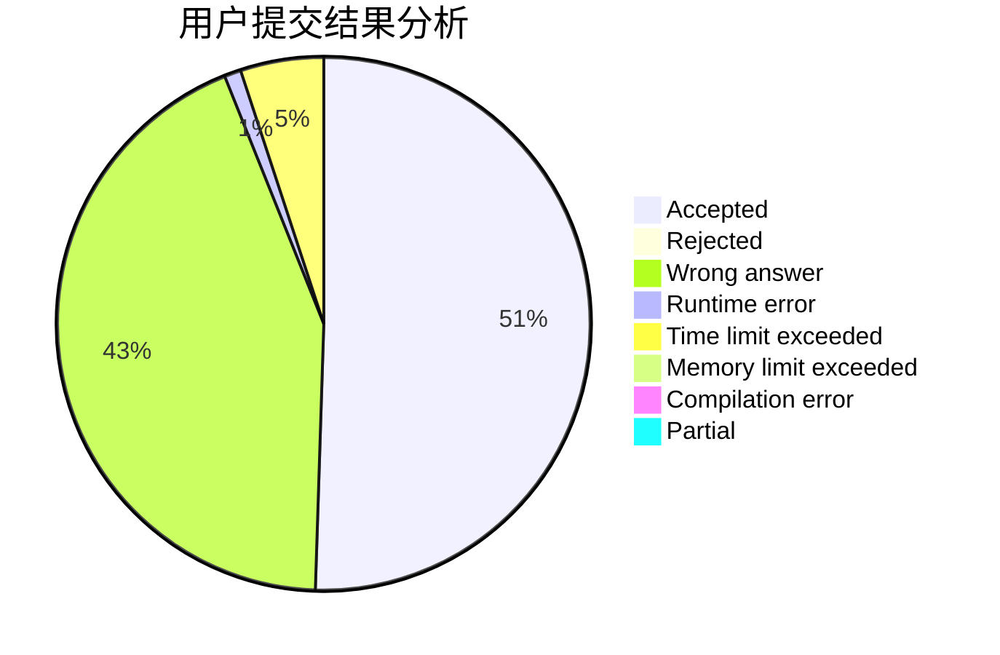
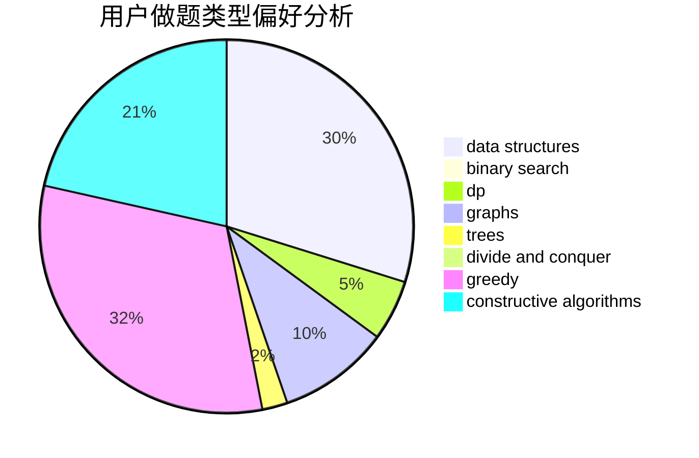
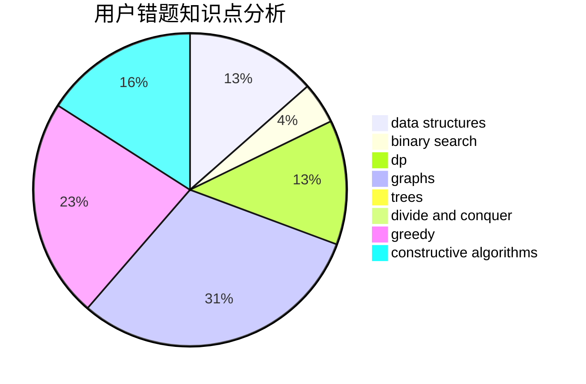

# caidd

<!-- tabs:start -->

#### **用户提交结果分析**

#### **用户做题类型偏好分析**

#### **用户错题知识点分析**

<!-- tabs:end -->
# 推荐题目
[1017D](https://codeforces.com/contest/1017/problem/D)		bitmasks,
                        brute force,
                        data structures		  
[1330D](https://codeforces.com/contest/1330/problem/D)		dsu,graphs,sortings,trees		  
[933B](https://codeforces.com/contest/933/problem/B)		math		  
[300B](https://codeforces.com/contest/300/problem/B)		brute force,
                        dfs and similar,
                        graphs		  
[1144D](https://codeforces.com/contest/1144/problem/D)		constructive algorithms,
                        greedy		  
[607E](https://codeforces.com/contest/607/problem/E)		binary search,
                        geometry		  
[1132E](https://codeforces.com/contest/1132/problem/E)		dfs and similar,
                        dp,
                        greedy		  
[779E](https://codeforces.com/contest/779/problem/E)		dsu,graphs,sortings,trees		  
[253D](https://codeforces.com/contest/253/problem/D)		brute force,
                        two pointers		  
[1244A](https://codeforces.com/contest/1244/problem/A)		math		  
