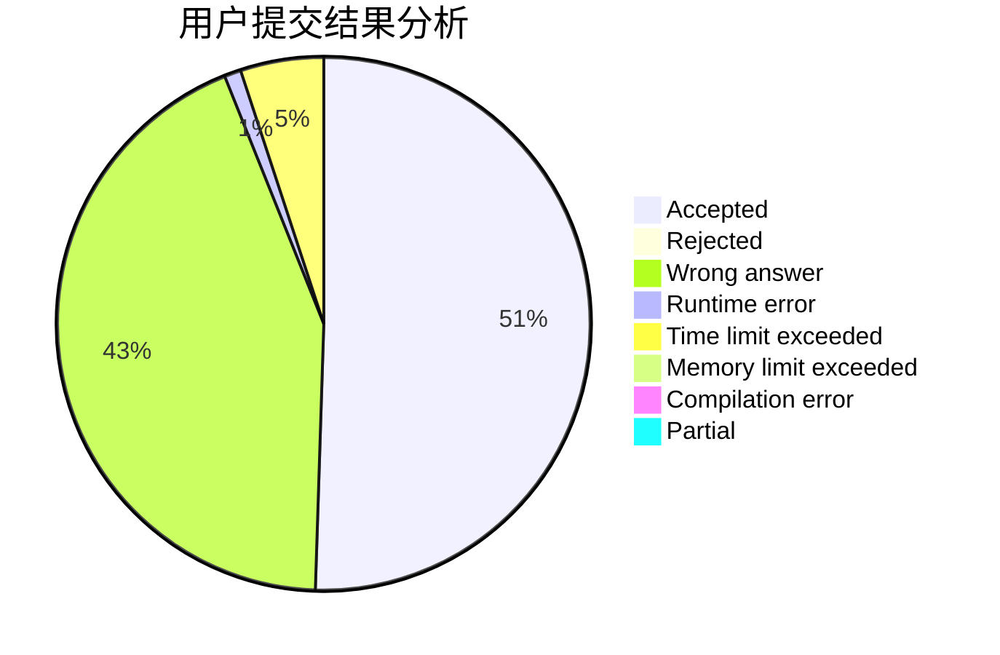
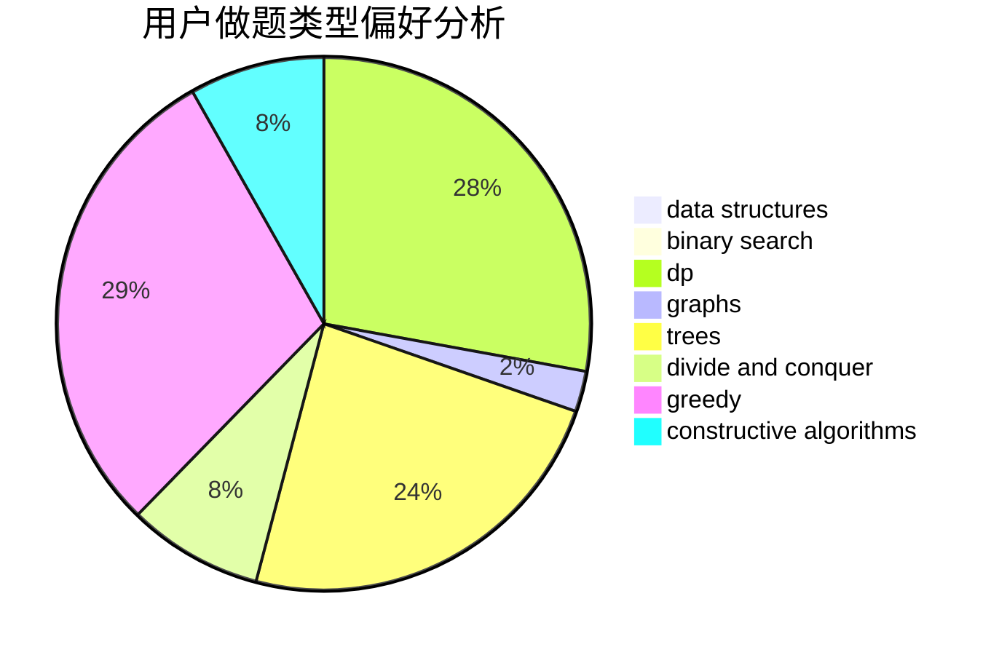
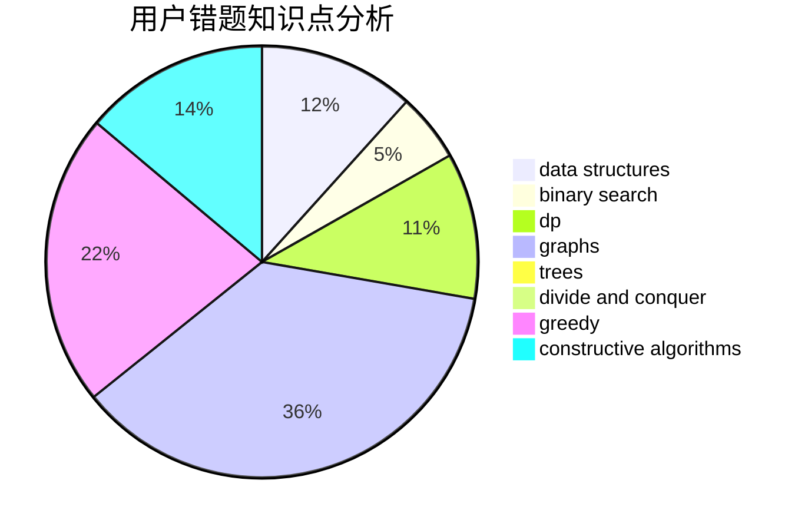

# caidd

<!-- tabs:start -->

#### **用户提交结果分析**

#### **用户做题类型偏好分析**

#### **用户错题知识点分析**

<!-- tabs:end -->
# 推荐题目
[1017G](https://codeforces.com/contest/1017/problem/G)		data structures		  
[1336D](https://codeforces.com/contest/1336/problem/D)		constructive algorithms,
                        interactive		  
[955B](https://codeforces.com/contest/955/problem/B)		implementation		  
[318D](https://codeforces.com/contest/318/problem/D)		dsu,graphs,sortings,trees		  
[1146E](https://codeforces.com/contest/1146/problem/E)		bitmasks,
                        data structures,
                        divide and conquer,
                        implementation		  
[626F](https://codeforces.com/contest/626/problem/F)		dp		  
[1136D](https://codeforces.com/contest/1136/problem/D)		greedy		  
[798A](https://codeforces.com/contest/798/problem/A)		brute force,
                        constructive algorithms,
                        strings		  
[271D](https://codeforces.com/contest/271/problem/D)		data structures,
                        strings		  
[12492](https://codeforces.com/contest/1249/problem/2)		dsu,graphs,sortings,trees		  
